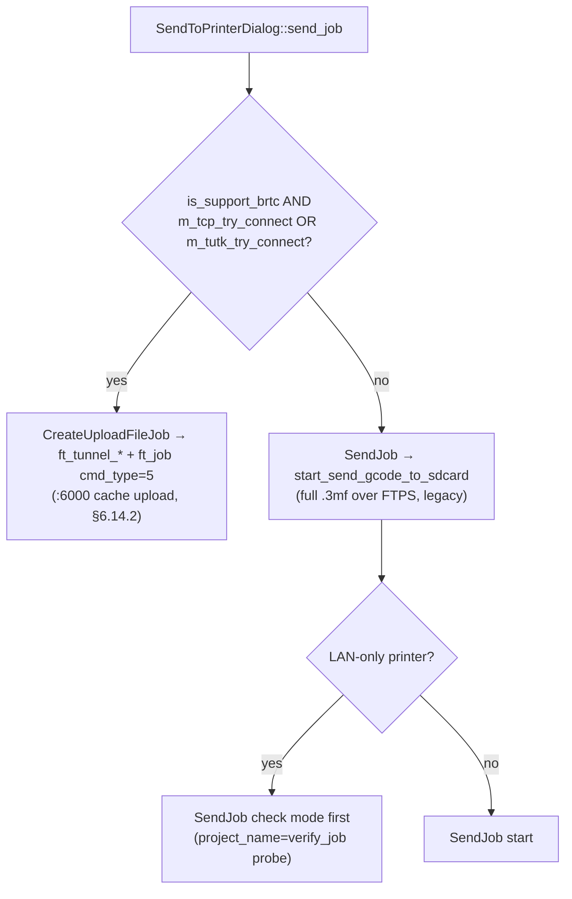
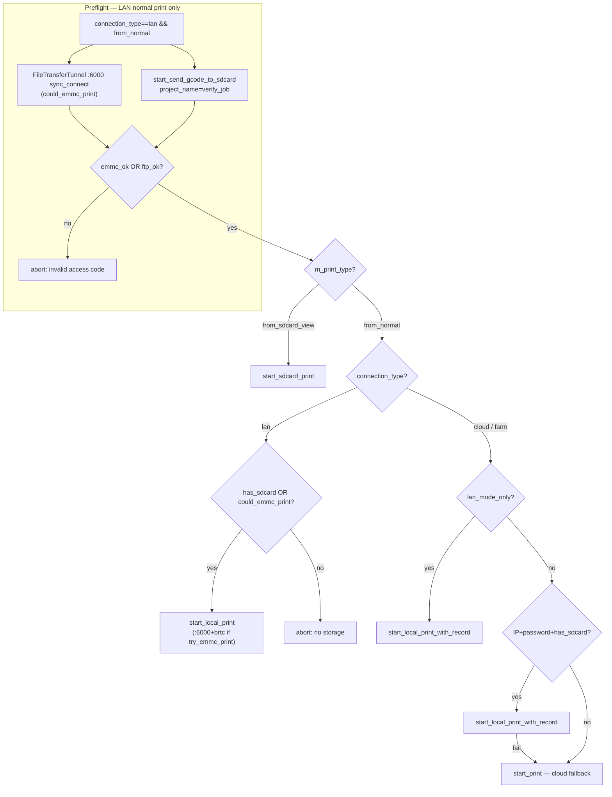

# Bambu Studio Network Plugin — full reference

This document describes how Bambu Studio integrates with its proprietary **Network Plugin** (`bambu_networking`) — where it is downloaded from, where it is installed, how it is validated, and the exact C ABI contract it must implement. The goal is to document how the plugin is integrated, loaded, validated and invoked, based purely on the Bambu Studio source code.

The reference is derived from three independent sources, none of them involving binary disassembly:

1. A read-through of the upstream [bambulab/BambuStudio](https://github.com/bambulab/BambuStudio) (and the closely related [SoftFever/OrcaSlicer](https://github.com/SoftFever/OrcaSlicer)) trees — every Studio-side claim in this document is backed by a concrete file and line range in those sources.
2. **MITM captures** of the stock `libbambu_networking.so` against `api.bambulab.com`, MakerWorld and the printer's LAN MQTT / FTPS / RTSPS endpoints, used to reverse the wire format the closed-source `bambu_networking` binary actually produces (HTTPS bodies, MQTT JSON envelopes, FTPS dialect quirks, etc.).
3. **Cross-ABI matrix runs** against the stock plugin in versions `02.05.00` … `02.06.01` to track how a given `BBL::PrintParams` value is rendered onto the LAN MQTT `print:project_file` payload, and how that mapping shifts as fields are added to `PrintParams` over time.

Where a claim originates from MITM or matrix runs rather than Studio source it is marked accordingly (see "Evidence" tags in §6.10.2 and the per-field tables in §6.8.2). Behaviour that has not been confirmed against either source is flagged as such.

**Source path convention:** every `src/slic3r/…` path below is relative to the upstream [bambulab/BambuStudio](https://github.com/bambulab/BambuStudio) tree. These files are **not** vendored in open-bambu-networking (`3rd_party/` is gitignored local tooling). [SoftFever/OrcaSlicer](https://github.com/SoftFever/OrcaSlicer) shares almost all of the same paths; camera-widget and Windows back-end divergences are called out inline (§7.4).

---

## 1. Architecture overview

Bambu Studio is a wxWidgets/C++ application. All networking code (Bambu Lab cloud, MQTT/SSDP to printers, print/upload jobs, authentication, OSS, tracking, and so on) lives in a separate **dynamically-loaded library** (`.dll` / `.so` / `.dylib`). Studio talks to it through a single C ABI whose symbols all start with `bambu_network_…`.

Key players:

| Role | Source |
|------|--------|
| C ABI declarations (`dlsym` typedefs) | `src/slic3r/Utils/NetworkAgent.hpp` |
| Symbol resolver and method wrappers | `src/slic3r/Utils/NetworkAgent.cpp` |
| Shared protocol structures / constants | `src/slic3r/Utils/bambu_networking.hpp` |
| `ft_*` File Transfer ABI | `src/slic3r/Utils/FileTransferUtils.{hpp,cpp}` |
| Module signature verification | `src/slic3r/Utils/CertificateVerify.{hpp,cpp}` |
| Lifecycle (URL, download, install, version) | `src/slic3r/GUI/GUI_App.cpp` |
| OTA synchronization | `src/slic3r/Utils/PresetUpdater.cpp` |
| UI job "download & install" | `src/slic3r/GUI/Jobs/UpgradeNetworkJob.{hpp,cpp}` |
| **`libBambuSource` C ABI** (`Bambu_*`) | `src/slic3r/GUI/Printer/BambuTunnel.h` |
| **`libBambuSource` loader / shim** | `src/slic3r/GUI/Printer/PrinterFileSystem.cpp` (`StaticBambuLib`) |
| **GStreamer source element (Linux only)** | `src/slic3r/GUI/Printer/gstbambusrc.{c,h}` |
| **macOS native player wrapper** | `src/slic3r/GUI/wxMediaCtrl2.mm`, `src/slic3r/GUI/BambuPlayer/BambuPlayer.h` |
| **Linux wxMediaCtrl shim (gstbambusrc registration)** | `src/slic3r/GUI/wxMediaCtrl2.{cpp,h}` (`__LINUX__` branch) |
| **Windows / Linux camera widget — Studio (current)** | `src/slic3r/GUI/wxMediaCtrl3.{cpp,h}` (BambuStudio commit `94d91be60`, June 2024). Drives `Bambu_*` C ABI directly + decodes via `AVVideoDecoder` (FFmpeg). |
| **Windows / Linux camera widget — Orca (and pre-`94d91be6` Studio)** | `src/slic3r/GUI/wxMediaCtrl2.{cpp,h}` Windows branch. Drives wxWidgets DirectShow backend → `bambu:` URL scheme → CLSID `{233E64FB-…}` source filter |
| **Camera UI panel** | `src/slic3r/GUI/MediaPlayCtrl.{cpp,h}` |
| **File browser UI / CTRL protocol consumer** | `src/slic3r/GUI/Printer/PrinterFileSystem.{cpp,h}`, `src/slic3r/GUI/MediaFilePanel.{cpp,h}` |

> Note: the code occasionally refers to two further libraries, **`BambuSource`** and **`live555`**. These are the camera/player and the RTSP stack; they are fetched and installed through the exact same mechanism and live next to the main library. The "Network Plugin" contract proper is `bambu_networking`, but a usable Studio installation ALSO needs a working `libBambuSource` for the camera live view *and* the printer file browser. The `libBambuSource` ABI is its own beast (different symbol prefix `Bambu_*`, different loader, per-platform back-ends) — it is documented separately in **§7**.

The current Studio version pinned in sources (tag `v02.06.00.51`) is `SLIC3R_VERSION = "02.06.00.51"` (`version.inc`); the expected agent version is `BAMBU_NETWORK_AGENT_VERSION = "02.06.00.50"` (`src/slic3r/Utils/bambu_networking.hpp:100`).

---

## 2. Where the plugin is downloaded from

### 2.1. Base API

The URL is built by `GUI_App::get_http_url` based on the `country_code` stored in `app_config`:

```1469:1505:src/slic3r/GUI/GUI_App.cpp
std::string GUI_App::get_http_url(std::string country_code, std::string path)
{
    std::string url;
    if (country_code == "US") {
        url = "https://api.bambulab.com/";
    }
    else if (country_code == "CN") {
        url = "https://api.bambulab.cn/";
    }
    // ENV_CN_DEV  -> https://api-dev.bambu-lab.com/
    // ENV_CN_QA   -> https://api-qa.bambu-lab.com/
    // ENV_CN_PRE  -> https://api-pre.bambu-lab.com/
    // NEW_ENV_DEV_HOST -> https://api-dev.bambulab.net/
    // NEW_ENV_QAT_HOST -> https://api-qa.bambulab.net/
    // NEW_ENV_PRE_HOST -> https://api-pre.bambulab.net/
    else {
        url = "https://api.bambulab.com/";
    }
    url += path.empty() ? "v1/iot-service/api/slicer/resource" : path;
    return url;
}
```

The resulting base is `https://api.bambulab.com/v1/iot-service/api/slicer/resource` (or its regional equivalent).

### 2.2. Manifest request

`GUI_App::get_plugin_url` assembles the query parameter `slicer/plugins/cloud=<ver>`:

```1545:1556:src/slic3r/GUI/GUI_App.cpp
std::string GUI_App::get_plugin_url(std::string name, std::string country_code)
{
    std::string url = get_http_url(country_code);
    std::string curr_version = SLIC3R_VERSION;
    std::string using_version = curr_version.substr(0, 9) + "00";
    if (name == "cameratools")
        using_version = curr_version.substr(0, 6) + "00.00";
    url += (boost::format("?slicer/%1%/cloud=%2%") % name % using_version).str();
    return url;
}
```

For the networking plugin the helper is called with `name == "plugins"`. For `SLIC3R_VERSION = "02.06.00.51"` the request becomes:

```
GET https://api.bambulab.com/v1/iot-service/api/slicer/resource?slicer/plugins/cloud=02.06.00.00
```

### 2.3. Response format (JSON manifest)

The response is parsed in `GUI_App::download_plugin` (see `src/slic3r/GUI/GUI_App.cpp` around lines 1617–1649). The expected shape:

```json
{
  "message": "success",
  "resources": [
    {
      "type": "slicer/plugins/cloud",
      "version": "02.05.03.xx",
      "description": "…changelog…",
      "url": "https://<cdn>/<path>/plugin.zip",
      "force_update": false
    }
  ]
}
```

Studio consumes only `version`, `description`, `url` and `force_update`. `url` points at a ZIP archive that is fetched next.

### 2.4. Special HTTP headers

- **`X-BBL-OS-Type`** is temporarily set to `"windows_arm"` when downloading the plugin on Windows ARM64 and restored to `"windows"` after the request: `src/slic3r/GUI/GUI_App.cpp` 1597–1605, 1665–1672 and `src/slic3r/Utils/PresetUpdater.cpp` 1209–1237.
- All other "sticky" headers (User-Agent etc.) are registered through `Slic3r::Http::set_extra_headers` and forwarded into the plugin via `bambu_network_set_extra_http_header`.

### 2.5. Background synchronization (OTA)

`PresetUpdater::priv::sync_plugins` hits the same HTTP API, but its purpose is to populate the OTA cache rather than install the plugin immediately:

```1165:1253:src/slic3r/Utils/PresetUpdater.cpp
void PresetUpdater::priv::sync_plugins(std::string http_url, std::string plugin_version)
{
    ...
    std::string using_version = curr_version.substr(0, 9) + "00";
    auto cache_plugin_folder = cache_path / PLUGINS_SUBPATH;        // data_dir/ota/plugins
    ...
    std::map<std::string, Resource> resources {
        {"slicer/plugins/cloud", { using_version, "", "", "", false, cache_plugin_folder.string()}}
    };
    sync_resources(http_url, resources, true, plugin_version, "network_plugins.json");
    ...
    if (result) {
        if (force_upgrade) {
            app_config->set("update_network_plugin", "true");
        } else {
            // push notification BBLPluginUpdateAvailable
        }
    }
}
```

`sync_resources` builds the final URL like this:

```581:583:src/slic3r/Utils/PresetUpdater.cpp
    std::string url = http_url;
    url += query_params;
    Slic3r::Http http = Slic3r::Http::get(url);
```

i.e. identically to `get_plugin_url`.

### 2.6. Download entry points

- **Background**: `GUI_App::on_init` → `CallAfter` → `preset_updater->sync(http_url, lang, network_ver, ...)` (`src/slic3r/GUI/GUI_App.cpp` 1333–1340).
- **"Download Bambu Network Plug-in" dialog**: `GUI_App::updating_bambu_networking()` (line 1975) → `DownloadProgressDialog` → `UpgradeNetworkJob::process()` (`src/slic3r/GUI/Jobs/UpgradeNetworkJob.cpp` 48–130).
- **Manual trigger from the WebView**: event `begin_network_plugin_download` (`src/slic3r/GUI/GUI_App.cpp` ~4078–4090) and `ShowDownNetPluginDlg`.
- User-facing wiki article shown on failure: `https://wiki.bambulab.com/en/software/bambu-studio/failed-to-get-network-plugin` (`src/slic3r/GUI/DownloadProgressDialog.cpp` 32–33).

---

## 3. Where it is stored and how it is installed

### 3.1. Working directory (active plugin)

Studio loads the binary from **`<data_dir>/plugins/`**. The file name varies by OS:

| Platform | Path |
|----------|------|
| Windows  | `<data_dir>\plugins\bambu_networking.dll` |
| Windows  | `<data_dir>\plugins\BambuSource.dll` (optional, camera) |
| Windows  | `<data_dir>\plugins\live555.dll` (RTSP/media) |
| macOS    | `<data_dir>/plugins/libbambu_networking.dylib` |
| macOS    | `<data_dir>/plugins/libBambuSource.dylib` |
| macOS    | `<data_dir>/plugins/liblive555.dylib` |
| Linux    | `<data_dir>/plugins/libbambu_networking.so` |
| Linux    | `<data_dir>/plugins/libBambuSource.so` |
| Linux    | `<data_dir>/plugins/liblive555.so` |

On Linux `<data_dir>` is usually `~/.config/BambuStudio/` (wxWidgets XDG path), on macOS `~/Library/Application Support/BambuStudio/`, on Windows `%AppData%\BambuStudio\`.

The path is computed in `NetworkAgent::initialize_network_module`:

```183:245:src/slic3r/Utils/NetworkAgent.cpp
    auto plugin_folder = data_dir_path / "plugins";
    if (using_backup) plugin_folder = plugin_folder/"backup";
    ...
#if defined(_MSC_VER) || defined(_WIN32)
    library = plugin_folder.string() + "\\" + std::string(BAMBU_NETWORK_LIBRARY) + ".dll";
    ...
    networking_module = LoadLibrary(lib_wstr);
#else
    #if defined(__WXMAC__)
    library = plugin_folder.string() + "/" + std::string("lib") + std::string(BAMBU_NETWORK_LIBRARY) + ".dylib";
    #else
    library = plugin_folder.string() + "/" + std::string("lib") + std::string(BAMBU_NETWORK_LIBRARY) + ".so";
    #endif
    networking_module = dlopen(library.c_str(), RTLD_LAZY);
#endif
```

The constant `BAMBU_NETWORK_LIBRARY = "bambu_networking"` lives in `src/slic3r/Utils/bambu_networking.hpp:97`.

### 3.2. Backup copy

After a successful unpack `install_plugin` copies every top-level file from `<data_dir>/plugins/` into **`<data_dir>/plugins/backup/`**. If at startup the primary plugin fails to load or is version-incompatible, Studio makes a second attempt with `using_backup=true` — the path then becomes `<data_dir>/plugins/backup/`:

```1874:1905:src/slic3r/GUI/GUI_App.cpp
    fs::path dir_path(plugin_folder);
    if (fs::exists(dir_path) && fs::is_directory(dir_path)) {
        ...
        for (fs::directory_iterator it(dir_path); it != fs::directory_iterator(); ++it) {
            if (it->path().string() == backup_folder) continue;
            auto dest_path = backup_folder.string() + "/" + it->path().filename().string();
            if (fs::is_regular_file(it->status())) {
                ... CopyFileResult cfr = copy_file(it->path().string(), dest_path, error_message, false);
            } else {
                copy_framework(it->path().string(), dest_path);
            }
        }
    }
```

The retry logic is in `GUI_App::on_init_network` (`src/slic3r/GUI/GUI_App.cpp` 3421–3459).

### 3.3. OTA cache (staging)

All background downloads land in **`<data_dir>/ota/plugins/`** (the constant `PLUGINS_SUBPATH` defined at `PresetUpdater.cpp:57`). That folder is expected to contain **all three** libraries plus a JSON manifest:

```1137:1160:src/slic3r/Utils/PresetUpdater.cpp
    network_library = cache_folder.string() + "/bambu_networking.dll";      // or .dylib / .so
    player_library  = cache_folder.string() + "/BambuSource.dll";
    live555_library = cache_folder.string() + "/live555.dll";
    std::string changelog_file = cache_folder.string() + "/network_plugins.json";
    if (fs::exists(network_library)
        && fs::exists(player_library)
        && fs::exists(live555_library)
        && fs::exists(changelog_file))
    {
        has_plugins = true;
        parse_ota_files(changelog_file, cached_version, force, description);
    }
```

If any of the files is missing, the cache is considered incomplete.

### 3.4. `network_plugins.json` format

The JSON is produced by `sync_resources` after unpacking the archive:

```712:723:src/slic3r/Utils/PresetUpdater.cpp
    json j;
    j["version"]     = resource_update->second.version;
    j["description"] = resource_update->second.description;
    j["force"]       = resource_update->second.force;
    boost::nowide::ofstream c;
    c.open(changelog_file, std::ios::out | std::ios::trunc);
    c << std::setw(4) << j << std::endl;
```

Minimal valid file:

```json
{
  "version": "02.06.00.50",
  "description": "…",
  "force": false
}
```

### 3.5. The "download -> install" flow

1. `UpgradeNetworkJob` (with `name="plugins"` and `package_name="networking_plugins.zip"`, `src/slic3r/GUI/Jobs/UpgradeNetworkJob.cpp:19-20`) calls:
   - `GUI_App::download_plugin("plugins", "networking_plugins.zip", ...)` — drops the ZIP into `temp_directory_path()/networking_plugins.zip` (a parallel branch in `WebDownPluginDlg` / `GuideFrame` uses the name `network_plugin.zip`).
   - `GUI_App::install_plugin("plugins", "networking_plugins.zip", ...)` — extracts the archive into **`<data_dir>/plugins/`** while preserving its internal directory hierarchy.
2. On success a flag is written: `app_config["app"]["installed_networking"] = "1"` (`src/slic3r/GUI/GUI_App.cpp` 1906–1909).
3. `restart_networking()` (`src/slic3r/GUI/GUI_App.cpp` 1914–1957) restarts the agent: it calls `on_init_network(try_backup=true)`, resets `StaticBambuLib`, re-registers callbacks and kicks off discovery.

### 3.6. Applying OTA at startup

If `update_network_plugin == "true"`, on the next launch — **before** network initialization — Studio copies the freshly downloaded libraries in:

```3359:3418:src/slic3r/GUI/GUI_App.cpp
void GUI_App::copy_network_if_available()
{
    if (app_config->get("update_network_plugin") != "true") return;
    auto plugin_folder = data_dir_path / "plugins";
    auto cache_folder  = data_dir_path / "ota" / "plugins";
#if defined(_MSC_VER) || defined(_WIN32)
    const char* library_ext = ".dll";
#elif defined(__WXMAC__)
    const char* library_ext = ".dylib";
#else
    const char* library_ext = ".so";
#endif
    for (auto& dir_entry : boost::filesystem::directory_iterator(cache_folder)) {
        if (boost::algorithm::iends_with(file_path, library_ext)) {
            copy_file(file_path, (plugin_folder / file_name).string(), error_message, false);
            fs::permissions(dest_path, fs::owner_read|fs::owner_write|fs::group_read|fs::others_read);
        }
    }
    fs::remove_all(cache_folder);
    app_config->set("update_network_plugin", "false");
}
```

Note: only **top-level files whose extension matches the library extension** are copied. Subdirectories and auxiliary files (e.g. certificates) are ignored. The shipped plugin must therefore be "flat" — just the library binary (`bambu_networking.{dll|so|dylib}`) plus, optionally, `BambuSource` and `live555`.

### 3.7. Removal

`GUI_App::remove_old_networking_plugins` wipes the **whole** `<data_dir>/plugins/` tree:

```1959:1973:src/slic3r/GUI/GUI_App.cpp
void GUI_App::remove_old_networking_plugins()
{
    auto plugin_folder = data_dir_path / "plugins";
    if (boost::filesystem::exists(plugin_folder)) {
        fs::remove_all(plugin_folder);
    }
}
```

---

## 4. What the plugin is, physically

It is a plain native dynamic library with C exports. The calling convention is `cdecl` on Windows (`FT_CALL __cdecl` in `FileTransferUtils.hpp:15`) and the standard System V AMD64 ABI on Linux/macOS.

- The main module is **`bambu_networking`** — it implements the entire networking API (`bambu_network_*`) and the file-transfer ABI (`ft_*`). **Both symbol sets live in the same library**: immediately after loading, `NetworkAgent::initialize_network_module` calls `InitFTModule(networking_module)` (`src/slic3r/Utils/NetworkAgent.cpp:276`).
- Optional companion modules Studio knows how to pick up:
  - `BambuSource` — the wrapper for the printer camera stream. Loaded separately through `NetworkAgent::get_bambu_source_entry()` (`src/slic3r/Utils/NetworkAgent.cpp:523-575`); if it fails to load, `m_networking_compatible = false` is set and the user sees "please update the plugin" (`src/slic3r/GUI/GUI_App.cpp:3430-3437`).
  - `live555` — the classic RTSP library used internally by `BambuSource`. Studio never calls it directly but requires it to be present in the OTA cache (see § 3.3).

The ZIP is usually a few MiB. Studio imposes no formal size limit; `install_plugin` simply extracts every file through `miniz` (`mz_zip_…`).

No `plugins.json`/`manifest.xml` inside the archive is required. After extraction Studio only reads:
- the library itself — via `LoadLibrary`/`dlopen`;
- `network_plugins.json` **in the OTA cache** (not in the installed folder);
- the symbol `bambu_network_get_version` to determine the version.

---

## 5. Validation

### 5.1. Studio <-> plugin version compatibility

The main check is that the first **8 characters** of the version string match, i.e. `MAJOR.MINOR.PATCH` without the build suffix:

```1982:1998:src/slic3r/GUI/GUI_App.cpp
bool GUI_App::check_networking_version()
{
    std::string network_ver = Slic3r::NetworkAgent::get_version();
    std::string studio_ver = SLIC3R_VERSION;   // "02.06.00.51"
    if (network_ver.length() >= 8) {
        if (network_ver.substr(0,8) == studio_ver.substr(0,8)) {  // "02.06.00"
            m_networking_compatible = true;
            return true;
        }
    }
    m_networking_compatible = false;
    return false;
}
```

For `SLIC3R_VERSION = "02.06.00.51"` the plugin must return **a string starting with `"02.06.00"`** (e.g. `"02.06.00.50"`). Otherwise Studio marks it incompatible, sets `m_networking_need_update=true` and pops up the update dialog.

> Observation: on Linux this version check is effectively the **only** formal compatibility gate — see § 5.2, where the signature check is a no-op on that platform.

The plugin exposes its version through the symbol `bambu_network_get_version` (`func_get_version` typed as `std::string(*)(void)`). See `NetworkAgent::get_version`:

```583:603:src/slic3r/Utils/NetworkAgent.cpp
std::string NetworkAgent::get_version()
{
    bool consistent = true;
    if (check_debug_consistent_ptr) {
#if defined(NDEBUG)
        consistent = check_debug_consistent_ptr(false);
#else
        consistent = check_debug_consistent_ptr(true);
#endif
    }
    if (!consistent) return "00.00.00.00";
    if (get_version_ptr) return get_version_ptr();
    return "00.00.00.00";
}
```

A separate consistency check is `bambu_network_check_debug_consistent(bool is_debug)` — it lets the plugin reject a mismatched debug/release build. If it returns `false`, Studio treats the version as `"00.00.00.00"` and refuses to proceed.

### 5.2. Binary signature

Before calling `LoadLibrary`/`dlopen` Studio compares the module's publisher with Studio's own publisher:

```190:267:src/slic3r/Utils/NetworkAgent.cpp
    std::optional<SignerSummary> self_cert_summary, module_cert_summary;
    if (validate_cert) self_cert_summary = SummarizeSelf();
    ...
    if (self_cert_summary) {
        module_cert_summary = SummarizeModule(library);
        if (module_cert_summary) {
            if (IsSamePublisher(*self_cert_summary, *module_cert_summary))
                networking_module = LoadLibrary(lib_wstr);   // (or dlopen)
            else
                BOOST_LOG_TRIVIAL(info) << "module is from another publisher...";
        }
    } else {
        networking_module = LoadLibrary(lib_wstr);           // self cert unknown -> load as is
    }
```

`IsSamePublisher`:

```294:300:src/slic3r/Utils/CertificateVerify.cpp
bool IsSamePublisher(const SignerSummary& a, const SignerSummary& b)
{
    if (!a.team_id.empty() && a.team_id == b.team_id) return true;   // macOS TeamID
    if (a.spki_sha256 == b.spki_sha256) return true;                 // same SPKI
    if (a.cert_sha256 == b.cert_sha256) return true;                 // same certificate
    return false;
}
```

- **Windows**: the Authenticode signature of the main `bambu-studio.exe` and of `bambu_networking.dll` must share either an SPKI or a certificate. If the plugin is unsigned, `SummarizeModule` returns `nullopt`, the "error" branch is logged, `networking_module` stays `nullptr`, and the module **will not be loaded**.
- **macOS**: the comparison uses the `team_id` (Developer ID).
- **Linux**: `SummarizeSelf` / `SummarizeModule` **always return `std::nullopt`** — see:

```289:291:src/slic3r/Utils/CertificateVerify.cpp
#else
    std::optional<SignerSummary> SummarizeSelf() { return std::nullopt; }
    std::optional<SignerSummary> SummarizeModule(const std::string&) { return std::nullopt; }
#endif
```

Therefore on Linux `if (self_cert_summary)` is false and Studio takes the "load as is" branch — **the signature is effectively not verified on Linux**.

### 5.3. Bypassing the signature check

`AppConfig` exposes a flag **`ignore_module_cert`**, which is forwarded to the `validate_cert` parameter:

```3423:3423:src/slic3r/GUI/GUI_App.cpp
    int load_agent_dll = Slic3r::NetworkAgent::initialize_network_module(false, !app_config->get_bool("ignore_module_cert"));
```

Setting `ignore_module_cert = 1` in `BambuStudio.conf` disables the publisher check on Windows/macOS entirely.

### 5.4. What "plugin installed" looks like to Studio

- A boolean **`installed_networking`** key in `app_config` (section `app`) — set to `"1"` after a successful `install_plugin` (`src/slic3r/GUI/GUI_App.cpp:1906-1909`). This flag drives the "show install/update dialog" logic.
- The actual "the plugin works" check is this chain:
  1. `LoadLibrary`/`dlopen` returns non-null;
  2. `bambu_network_check_debug_consistent` returns `true` for the appropriate build flavor;
  3. `bambu_network_get_version` returns a string at least 8 chars long with the right version prefix;
  4. `BambuSource` also loaded successfully.

### 5.5. Archive integrity (MD5/SHA)

**Not checked.** There is no hash verification of the ZIP anywhere in `download_plugin` / `install_plugin` / `sync_resources` (`src/slic3r/GUI/GUI_App.cpp`, `src/slic3r/Utils/PresetUpdater.cpp`). The only defense-in-depth measure is the binary's own signature.

Error codes of the form `BAMBU_NETWORK_ERR_CHECK_MD5_FAILED` (see `src/slic3r/Utils/bambu_networking.hpp:29, 54, 70`) belong to MD5 checks **inside the plugin** during print-job uploads, not to verification of the plugin itself.

---

## 6. The full C ABI contract

All symbols are resolved through `GetProcAddress` (Windows) / `dlsym` (Linux, macOS) in `NetworkAgent::get_network_function`:

```564:581:src/slic3r/Utils/NetworkAgent.cpp
void* NetworkAgent::get_network_function(const char* name)
{
    if (!networking_module) return nullptr;
#if defined(_MSC_VER) || defined(_WIN32)
    return GetProcAddress(networking_module, name);
#else
    return dlsym(networking_module, name);
#endif
}
```

Symbol names are not mangled — every function must be declared `extern "C"`.

> ABI note: even though this is a C-style interface, the signatures use C++ types (`std::string`, `std::vector`, `std::map`, `std::function`, and custom structs `PrintParams`/`BBLModelTask`/…). The plugin must therefore be built with the same compiler and libstdc++/libc++ standard-library ABI as Bambu Studio itself. It is **not** a pure C ABI — mixing compilers/linkers (e.g. GCC vs. MSVC) is not safe.

### 6.1. Initialization and lifecycle

| Symbol | Typedef | Description |
|--------|---------|-------------|
| `bambu_network_check_debug_consistent` | `bool(*)(bool is_debug)` | Returns `true` if the plugin build matches Studio's build flavor (debug/release). Called before `get_version`. |
| `bambu_network_get_version` | `std::string(*)(void)` | Returns the version formatted as `NN.NN.NN.NN`. The first 8 characters must match `SLIC3R_VERSION`. |
| `bambu_network_create_agent` | `void*(*)(std::string log_dir)` | Creates an agent instance and returns an opaque handle (`void* agent`). |
| `bambu_network_destroy_agent` | `int(*)(void* agent)` | Destroys the agent. |
| `bambu_network_init_log` | `int(*)(void* agent)` | Initializes the internal log. |
| `bambu_network_set_config_dir` | `int(*)(void*, std::string)` | Configures directory (equal to `data_dir()`). |
| `bambu_network_set_cert_file` | `int(*)(void*, std::string folder, std::string filename)` | Studio passes `resources_dir()/cert` and `slicer_base64.cer`. |
| `bambu_network_set_country_code` | `int(*)(void*, std::string)` | `"US"`, `"CN"`, … |
| `bambu_network_start` | `int(*)(void*)` | Starts the agent's event loop / worker threads. |

#### Initialization sequence

The Studio-side call order after `create_agent` is deterministic and lives in `GUI_App::on_init_network` (`src/slic3r/GUI/GUI_App.cpp:3461-3510`):

1. `set_config_dir(data_dir())`
2. `init_log()`
3. `set_cert_file(resources_dir()+"/cert", "slicer_base64.cer")`
4. `init_http_extra_header` → `set_extra_http_header(...)`
5. the full `set_on_*_fn(...)` battery (see § 6.2)
6. `set_country_code(country_code)`
7. `start()`
8. `start_discovery(true, false)`

The plugin must tolerate this exact order (in particular, no networking work should happen before `start()`).

#### 6.1.1. Certificate files (`set_cert_file`)

Studio ships **two PEM files** next to each other under `<resources>/cert/` inside the AppImage / install tree:

| File | What it is (observed) | Role (reverse-engineered / observed) |
|------|------------------------|--------------------------------------|
| **`slicer_base64.cer`** | BBL / RapidSSL-style bundle for **Bambu cloud** hostnames (`*.bambulab.com`, MakerWorld HTTPS, etc.). This is the file Studio **names** in the ABI call. | Passed to stock plugin via `set_cert_file`; stock almost certainly uses it for **cloud** TLS. Not referenced for LAN printer TLS in Studio's public sources. |
| **`printer.cer`** | BBL **CA** bundle (root + intermediate CAs such as `BBL CA`, `BBL CA2 RSA/ECC`). **Not** the printer's device leaf. Observed **5** CA certs in Studio v02.07.0.55; **does not** include per-model device issuers such as `BBL Device CA N7-V2`. | Shipped alongside `slicer_base64.cer` under `<resources>/cert/`. Stock closed-source plugin behaviour for LAN trust is **not** observable from Studio source alone; see LAN observations below. |

**Why Studio passes `slicer_base64.cer` in the API:** the stock closed-source plugin uses that second argument as its cloud trust bundle. The ABI is fixed; Studio always calls `set_cert_file(resources_dir()+"/cert", "slicer_base64.cer")`.

**LAN TLS — what the printer sends (verified on P2S, firmware 02.07.x):**

- TLS handshake carries **one certificate**: the **device leaf** (`subject=CN=<serial>`, e.g. `CN=22E8BJ610801473`).
- **No DNS/IP SAN** on the leaf; clients connect by LAN IP but must check **CN = serial** (SNI is set to the serial).
- Leaf **issuer** on N7/P2S: `CN=BBL Device CA N7-V2` (other models may use other `BBL Device CA …` names).
- **`printer.cer` alone does not chain-verify** that leaf on N7/P2S — the issuer CA is missing from the Studio bundle (confirmed with `openssl s_client` / `openssl verify`).

**Stock plugin LAN TLS policy:** not reverse-engineered from the closed binary. Any LAN client must cope with leaf-only chains and CN=serial hostname checks as observed above.

### 6.2. Callbacks (registration)

All take a `void* agent` and an `std::function<…>`:

| Symbol | Callback type (from `bambu_networking.hpp`) |
|--------|---------------------------------------------|
| `bambu_network_set_on_ssdp_msg_fn` | `OnMsgArrivedFn = std::function<void(std::string dev_info_json_str)>` |
| `bambu_network_set_on_user_login_fn` | `OnUserLoginFn = std::function<void(int online_login, bool login)>` |
| `bambu_network_set_on_printer_connected_fn` | `OnPrinterConnectedFn = std::function<void(std::string topic_str)>` |
| `bambu_network_set_on_server_connected_fn` | `OnServerConnectedFn = std::function<void(int return_code, int reason_code)>` |
| `bambu_network_set_on_http_error_fn` | `OnHttpErrorFn = std::function<void(unsigned http_code, std::string http_body)>` |
| `bambu_network_set_get_country_code_fn` | `GetCountryCodeFn = std::function<std::string()>` |
| `bambu_network_set_on_subscribe_failure_fn` | `GetSubscribeFailureFn = std::function<void(std::string topic)>` |
| `bambu_network_set_on_message_fn` | `OnMessageFn = std::function<void(std::string dev_id, std::string msg)>` |
| `bambu_network_set_on_user_message_fn` | `OnMessageFn` |
| `bambu_network_set_on_local_connect_fn` | `OnLocalConnectedFn = std::function<void(int status, std::string dev_id, std::string msg)>` |
| `bambu_network_set_on_local_message_fn` | `OnMessageFn` |
| `bambu_network_set_queue_on_main_fn` | `QueueOnMainFn = std::function<void(std::function<void()>)>` — "run this lambda on the GUI thread" |
| `bambu_network_set_server_callback` | `OnServerErrFn = std::function<void(std::string url, int status)>` |

### 6.3. Cloud — connection and subscriptions

| Symbol | Signature |
|--------|-----------|
| `bambu_network_connect_server` | `int(void*)` |
| `bambu_network_is_server_connected` | `bool(void*)` |
| `bambu_network_refresh_connection` | `int(void*)` |
| `bambu_network_start_subscribe` | `int(void*, std::string module)` |
| `bambu_network_stop_subscribe` | `int(void*, std::string module)` |
| `bambu_network_add_subscribe` | `int(void*, std::vector<std::string> dev_list)` |
| `bambu_network_del_subscribe` | `int(void*, std::vector<std::string> dev_list)` |
| `bambu_network_enable_multi_machine` | `void(void*, bool)` |
| `bambu_network_send_message` | `int(void*, std::string dev_id, std::string json_str, int qos, int flag)` — MQTT-style call |

### 6.4. Local printer connection (LAN)

| Symbol | Signature |
|--------|-----------|
| `bambu_network_connect_printer` | `int(void*, std::string dev_id, std::string dev_ip, std::string username, std::string password, bool use_ssl)` |
| `bambu_network_disconnect_printer` | `int(void*)` |
| `bambu_network_send_message_to_printer` | `int(void*, std::string dev_id, std::string json_str, int qos, int flag)` |
| `bambu_network_update_cert` | `int(void* agent)` — `func_check_cert`; refreshes certificates at runtime |
| `bambu_network_install_device_cert` | `void(void*, std::string dev_id, bool lan_only)` |
| `bambu_network_start_discovery` | `bool(void*, bool start, bool sending)` — SSDP |

### 6.5. Authentication and user

| Symbol | Signature |
|--------|-----------|
| `bambu_network_change_user` | `int(void*, std::string user_info)` |
| `bambu_network_is_user_login` | `bool(void*)` |
| `bambu_network_user_logout` | `int(void*, bool request)` |
| `bambu_network_get_user_id` | `std::string(void*)` |
| `bambu_network_get_user_name` | `std::string(void*)` |
| `bambu_network_get_user_avatar` | `std::string(void*)` |
| `bambu_network_get_user_nickanme` | `std::string(void*)` *(the "nickanme" typo is part of the actual ABI!)* |
| `bambu_network_build_login_cmd` | `std::string(void*)` |
| `bambu_network_build_logout_cmd` | `std::string(void*)` |
| `bambu_network_build_login_info` | `std::string(void*)` |
| `bambu_network_get_my_profile` | `int(void*, std::string token, unsigned int* http_code, std::string* http_body)` |
| `bambu_network_get_my_token`   | `int(void*, std::string ticket, unsigned int* http_code, std::string* http_body)` |
| `bambu_network_get_user_info`  | `int(void*, int* identifier)` |

> Known Studio bug (`src/slic3r/Utils/NetworkAgent.cpp:368`): the `get_my_token_ptr` pointer is mistakenly resolved via the string `"bambu_network_get_my_profile"` instead of `"bambu_network_get_my_token"`. Studio still tries to read the `bambu_network_get_my_token` symbol as well, so a compatible plugin must export **both**. Through that pointer Studio will in practice execute the `get_my_profile` body — the two functions must therefore share identical signatures, and any real token-fetching logic ends up running from `get_my_profile`.

### 6.6. Binding / bind

| Symbol | Signature |
|--------|-----------|
| `bambu_network_ping_bind` | `int(void*, std::string ping_code)` |
| `bambu_network_bind_detect` | `int(void*, std::string dev_ip, std::string sec_link, detectResult& detect)` |
| `bambu_network_bind` | `int(void*, std::string dev_ip, std::string dev_id, std::string sec_link, std::string timezone, bool improved, OnUpdateStatusFn update_fn)` |
| `bambu_network_unbind` | `int(void*, std::string dev_id)` |
| `bambu_network_request_bind_ticket` | `int(void*, std::string* ticket)` |
| `bambu_network_query_bind_status` | `int(void*, std::vector<std::string> query_list, unsigned int* http_code, std::string* http_body)` |

The `detectResult` struct (`src/slic3r/Utils/bambu_networking.hpp:180-189`):

```cpp
struct detectResult {
    std::string result_msg, command, dev_id, model_id, dev_name, version, bind_state, connect_type;
};
```

### 6.7. Printer selection and metadata

| Symbol | Signature |
|--------|-----------|
| `bambu_network_get_bambulab_host` | `std::string(void*)` |
| `bambu_network_get_user_selected_machine` | `std::string(void*)` |
| `bambu_network_set_user_selected_machine` | `int(void*, std::string dev_id)` |
| `bambu_network_modify_printer_name` | `int(void*, std::string dev_id, std::string dev_name)` |
| `bambu_network_get_printer_firmware` | `int(void*, std::string dev_id, unsigned* http_code, std::string* http_body)` |

`get_printer_firmware` is invoked from `MachineObject::get_firmware_info` (`src/slic3r/GUI/DeviceManager.cpp:3764`) on a background thread when the user opens **Device → Update**. A return value `< 0` makes Studio silently hide the firmware list (`m_firmware_valid = false`). Otherwise `http_body` is parsed as JSON with the following schema:

```json
{
  "devices": [{
    "dev_id": "<printer serial>",
    "firmware": [
      {
        "version": "01.08.02.00",
        "url": "https://public-cdn.bblmw.com/upgrade/.../ota.zip",
        "description": "optional release notes text (plain/markdown)"
      }
    ],
    "ams": [{
      "firmware": [
        { "version": "00.00.07.89", "url": "https://.../ams.bin", "description": "..." }
      ]
    }]
  }]
}
```

Studio creates a `FirmwareInfo item` per entry in `firmware[]` / `ams[].firmware[]` and derives the file name from the tail of `url` (`item.name = url.substr(url.find_last_of('/') + 1)`). If the name cannot be extracted, the entry is skipped. The `description` field is the text displayed in the **Release Notes** dialog.

Important: Studio does **not** read the currently installed version from this response — that arrives separately, through the MQTT `info.command=get_version` payload (array `info.module[]`, field `sw_ver`) and `push_status.upgrade_state.new_ver_list`. This ABI call answers only "what can be flashed" (plus, optionally, release notes for those versions). The **Update** button ultimately publishes `{"upgrade":{"command":"upgrade_confirm"}}` over LAN MQTT — the printer itself downloads the firmware from the CDN, and Studio uses the URL in `firmware[].url` only for the displayed file name.

When `devices[0].firmware[]` is empty (the currently installed firmware is already the newest one known to the printer), the Release Notes dialog opens empty — this is normal stock behaviour, not a bug.

### 6.8. Submitting a print job

Types:
- `OnUpdateStatusFn = std::function<void(int status, int code, std::string msg)>`
- `WasCancelledFn   = std::function<bool()>`
- `OnWaitFn         = std::function<bool(int status, std::string job_info)>`

The `PrintParams` struct (`src/slic3r/Utils/bambu_networking.hpp:192-241`) carries these fields: `dev_id`, `task_name`, `project_name`, `preset_name`, `filename`, `config_filename`, `plate_index`, `ftp_folder`, `ftp_file`, `ftp_file_md5`, `nozzle_mapping`, `ams_mapping`, `ams_mapping2`, `ams_mapping_info`, `nozzles_info`, `connection_type`, `comments`, `origin_profile_id`, `stl_design_id`, `origin_model_id`, `print_type`, `dst_file`, `dev_name`, `dev_ip`, `use_ssl_for_ftp`, `use_ssl_for_mqtt`, `username`, `password`, `task_bed_leveling`, `task_flow_cali`, `task_vibration_cali`, `task_layer_inspect`, `task_record_timelapse`, `task_timelapse_use_internal`, `task_use_ams`, `task_bed_type`, `extra_options`, `auto_bed_leveling`, `auto_flow_cali`, `auto_offset_cali`, `extruder_cali_manual_mode`, `task_ext_change_assist`, `try_emmc_print`.

| Symbol | Signature |
|--------|-----------|
| `bambu_network_start_print` | `int(void*, PrintParams, OnUpdateStatusFn, WasCancelledFn, OnWaitFn)` — cloud |
| `bambu_network_start_local_print_with_record` | `int(void*, PrintParams, OnUpdateStatusFn, WasCancelledFn, OnWaitFn)` — LAN + metadata upload |
| `bambu_network_start_send_gcode_to_sdcard` | `int(void*, PrintParams, OnUpdateStatusFn, WasCancelledFn, OnWaitFn)` — FTPS upload of `filename` to printer storage; **destination name = `project_name`** (sanitized). No MQTT print command. See §6.14.3 for Studio callers |
| `bambu_network_start_local_print` | `int(void*, PrintParams, OnUpdateStatusFn, WasCancelledFn)` — LAN only |
| `bambu_network_start_sdcard_print` | `int(void*, PrintParams, OnUpdateStatusFn, WasCancelledFn)` |

Print-job stages — the `SendingPrintJobStage` enum (`bambu_networking.hpp:146-156`): `Create=0, Upload=1, Waiting=2, Sending=3, Record=4, WaitPrinter=5, Finished=6, ERROR=7, Limit=8`.

#### 6.8.0. End-to-end print flows (Studio-side orchestration)

This section documents **what Bambu Studio itself calls** when the user starts a print or upload — not what the stock/open plugin does internally ([STATUS.md §6.8](STATUS.md#open-plugin-abi--internal-implementation) covers our plugin). All paths below are traced from `PrintJob.cpp`, `SendJob.cpp`, `SendToPrinter.cpp`, and `SelectMachine.cpp` in upstream BambuStudio.

##### UI entry points → worker classes

| User action | Studio dialog / job | `PrintParams.print_type` / notes |
|---|---|---|
| **Slice → Print plate** (normal send) | `SelectMachineDialog` → `PrintJob` | `"from_normal"` |
| **Device → Files → Print** on an existing `.3mf` | `SelectMachineDialog` → `PrintJob` | `"from_sdcard_view"`; `dst_file` = path on printer storage |
| **Send to Printer** (upload to cache/USB, no print) | `SendToPrinterDialog` | **`ft_*`** when `is_support_brtc` + LAN/TUTK tunnel (`SendToPrinter.cpp:947`); else fallback **`SendJob`** → `start_send_gcode_to_sdcard` (FTPS, pre-brtc printers) |
| **Access-code / IP validation** | `PrintJob` preflight, `SendJob` check mode (`ReleaseNote.cpp` IP dialog) | Same ABI with `project_name="verify_job"` and a tiny temp file — see §6.14.3 |

Studio wraps every `bambu_network_start_*` call through `NetworkAgent::{start_print,start_local_print,…}` (`NetworkAgent.cpp:1363-1425`), which forwards to the loaded plugin unchanged.

##### Printer capability flags (`print.fun` / `print.fun2`)

Studio does **not** pass these booleans into `PrintParams`. They live on `MachineObject`, parsed from MQTT `push_status.print` on every status update (`DeviceManager.cpp:4266-4308`). They **gate UI and orchestration** before any plugin call.

| Field | MQTT source | Meaning in Studio | Affects print flow? |
|---|---|---|---|
| **`is_support_brtc`** | `print.fun` **bit 31** | Firmware supports the **`:6000` binary file-transfer tunnel** (`ft_*` ABI) and related **`brtc://`** print-start URLs. Comment in `DeviceManager.hpp:540`: *“support tcp and upload protocol”*. | **Send to Printer only** — chooses `ft_*` upload vs legacy FTPS `SendJob`. **Not** read in `PrintJob::process()`. |
| **`is_support_print_with_emmc`** | `print.fun2` **bit 0** | Printer can print from **internal model cache** without a removable SD card. | **`PrintJob` / Select Machine** — copied to `PrintJob::could_emmc_print` (`SelectMachine.cpp:3114`); enables `:6000` connect probe in LAN preflight and allows `start_local_print` when `!has_sdcard`. |
| **`is_support_model_internal_storage`** | `print.fun2` **bit 17** | Internal **model cache** tab in Device → Storage → Model (`storage=internal` on `LIST_INFO`). | **`MediaFilePanel`** — `updateStorageTabVisibility()` when `F_MODEL` is selected. P2S firmware often omits bit 17 on unbound LAN; stock hides the tab. |
| **`is_support_send_to_sdcard`** | (separate flag) | “Send to Printer” feature enabled for this model. | `SendToPrinterDialog` entry guard (`SendToPrinter.cpp:1297`). |

**What “brtc” means here.** In Studio sources the name covers two layers that appeared together (~2025-10, commits `76e45bde2` / `662b7fdac`, §6.14.3):

1. **Upload wire** — `FileTransferTunnel` / `ft_tunnel_*` on TCP port **`:6000`** (LAN IP or TUTK relay), chunked `cmd_type=5` (§6.14.2).
2. **Print-start URL** — MQTT `project_file` with `url` like `brtc://emmc/<filename>` so firmware resolves the file in model cache (§6.8.2 **URL schemes**).

P2S-class printers set **`is_support_brtc=true`**; classic LAN printers often do not and keep the FTPS **`SendJob`** fallback.

##### `SendToPrinterDialog` branch (uses `is_support_brtc`, not `PrintJob`)

When the user clicks **Send** in Send to Printer, Studio picks the upload channel **before** any `bambu_network_start_*` call:



On dialog open, brtc printers **prefer TCP/TUTK** over FTP for the connection handshake (`SendToPrinter.cpp:1304-1342`): if `is_support_brtc && !m_ftp_try_connect`, Studio calls `GetConnection()` instead of showing the old FTP-only ready state.

**Contrast with `PrintJob` LAN preflight** (`PrintJob.cpp:224-252`): always runs **`start_send_gcode_to_sdcard(verify_job)`** (FTPS write probe). Optionally **also** opens a `:6000` tunnel when `could_emmc_print` (`is_support_print_with_emmc`), but that flag is independent of `is_support_brtc`. Normal slice→print ends in **`start_local_print`** / hybrid cloud paths — **not** the Send-to-Printer `ft_*` pipeline (see decision tree below).

##### Decision tree: `PrintJob::process()` (`PrintJob.cpp:149-624`)

**Note:** The Send-to-Printer mermaid above is upload-only. Print jobs use the tree below; open plugin upload inside `start_local_print` / `_with_record` mirrors stock P2S when Studio sets `try_emmc_print` (`:6000` emmc + MQTT `brtc://emmc/`).

After `SelectMachineDialog::on_send_print()` exports the plate `.3mf` (and, for cloud-bound printers, a config `.3mf`), it fills `PrintParams` and starts the background `PrintJob`.



**`connection_type`** on `MachineObject` is `"lan"` for Developer Mode / LAN-only printers, `"cloud"` for cloud-paired devices, `"farm"` for farm mode. Pure LAN mode (`AppConfig::lan_mode_only`) forces the `_with_record` path even when the device object is cloud-typed, but still requires IP + access code.

##### Three upload/print channels Studio actually uses

| Channel | Who calls it | Upload transport | Print start | Starts a print? |
|---|---|---|---|:---:|
| **`bambu_network_start_*`** | `PrintJob` (print paths), `SendJob` (Send-to-Printer fallback only) | Inside plugin (stock: cloud S3 + optional FTPS, or LAN FTPS / `:6000` depending on entry point — see STATUS) | Plugin publishes MQTT `project_file` (except upload-only / probe entries) | PrintJob yes; SendJob / verify_job no |
| **`ft_*` ABI** | `SendToPrinterDialog`, `FileTransferTunnel` in `PrintJob` preflight | Studio → `ft_tunnel_*` + `ft_job_create` / `ft_tunnel_start_job` (`FileTransferUtils.cpp`) | **Never** — upload completes with `get_send_finished_event()` | No |
| **`bambu_network_send_message_to_printer`** | `MachineObject::publish_json()` | N/A (opaque JSON passthrough) | Timelapse preflight, AMS queries, user commands — **not** the print job itself | No |

**Important:** On **brtc-capable** printers (P2S, etc.) the **Send to Printer** dialog uploads the `.3mf` via **`ft_*` `cmd_type=5`** when `MachineObject::is_support_brtc` and the dialog connected over LAN TCP or TUTK (`SendToPrinter.cpp:947-962`). That path does not call `start_send_gcode_to_sdcard` for the model. **`start_send_gcode_to_sdcard`** is still the FTPS upload ABI; on current Studio it is mostly invoked with **`project_name="verify_job"`** (write probe) plus a rare **`SendJob` fallback** when `!is_support_brtc` (`SendToPrinter.cpp:977-1027`). The plugin must **not** treat `"verify_job"` as magic — it is only the destination filename Studio set (§6.14.3).

##### Scenario reference

| Scenario | Plugin calls (in order) | Required for firmware to start printing | Tracking / UI only |
|---|---|---|---|
| **LAN print** (`connection_type=="lan"`, normal) | Preflight: optional `:6000` tunnel test + `start_send_gcode_to_sdcard(verify_job)` → **`start_local_print`** (`:6000`+`brtc://` when `try_emmc_print`, else FTPS+`ftp://`) | Plugin upload + MQTT `project_file` (§6.8.2) | Preflight probes; `update_fn` progress |
| **Cloud print** (no LAN credentials) | **`start_print`** | Cloud S3 upload + signed cloud MQTT `project_file` | `wait_fn` waits for `job_id` / printing status; `Record` stage = cloud task metadata |
| **Hybrid** (cloud device + LAN IP/code) | **`start_local_print_with_record`** → on failure **`start_print`** | Same LAN upload as above; cloud REST + task record if LAN leg succeeds | `wait_fn` on hybrid path; `params.comments` records fallback reason |
| **`lan_mode_only` config** | **`start_local_print_with_record`** only | LAN `:6000`/FTPS + MQTT + best-effort cloud `create_task` | Same as hybrid LAN leg |
| **Print existing file** (`from_sdcard_view`) | **`start_sdcard_print`** | MQTT `project_file` with `url=file:///<path>` | UI labels it “cloud service” but plugin call is the same ABI |
| **Upload only** (Send to Printer, brtc printers) | `ft_tunnel_*` + `ft_job` **`cmd_type=7`** → **`cmd_type=5`** | Nothing | Progress via `ft_job` `msg_cb` |
| **Upload only** (Send to Printer, **no** `is_support_brtc`) | `verify_job` probe → **`SendJob`** → **`start_send_gcode_to_sdcard`** (full `.3mf` over FTPS) | Nothing | Legacy fallback; not P2S |

##### Before `PrintJob` — Studio-side steps (no print ABI)

These run in `SelectMachineDialog` **before** any `bambu_network_start_*` call:

1. **Export plate `.3mf`** — `Plater::send_gcode()` packs the sliced plate (`on_send_print`, `SelectMachine.cpp:3005`).
2. **Export config `.3mf`** — `Plater::export_config_3mf()` for **non-LAN** printers only (`SelectMachine.cpp:3026`) — feeds cloud `create_task` / project APIs inside `start_print` / `_with_record`.
3. **AMS / nozzle mapping** — MQTT queries on `MachineObject` (e.g. `get_auto_nozzle_mapping`); results copied into `PrintParams.ams_mapping*` / `nozzle_mapping`. Not part of the print-plugin ABI.
4. **Timelapse storage preflight** (optional) — when timelapse is enabled and `is_support_internal_timelapse`, Studio sends `camera.ipcam_get_media_info` via **`bambu_network_send_message_to_printer`** (LAN) or **`bambu_network_send_message`** (cloud) **before** `on_send_print()` (§6.8.3). Failure or timeout → print proceeds anyway.

##### Callback contract Studio passes into every print job

All five `bambu_network_start_*` symbols share the same callback typedefs (§6.8 above). Studio builds them in `PrintJob::process()` (`PrintJob.cpp:405-548`):

| Callback | Passed to | Purpose |
|---|---|---|
| **`OnUpdateStatusFn update_fn`** | All print paths except `verify_job` preflight (`nullptr`) | Drive progress bar + status text. **`stage`** = `SendingPrintJobStage`; **`code`** = 0–100 upload percent when `stage==Upload` or `Record`; negative / `>100` = error code (`BAMBU_NETWORK_ERR_*`). **`info`** = auxiliary string (upload size hint, or countdown seconds on `Finished`). |
| **`WasCancelledFn cancel_fn`** | All paths that show cancel | Polls `PrintJob::was_canceled()`. Plugin must abort and return `BAMBU_NETWORK_ERR_CANCELED`. |
| **`OnWaitFn wait_fn`** | **`start_print`**, **`start_local_print_with_record`** only | **Not** passed to `start_local_print`, `start_sdcard_print`, or `start_send_gcode_to_sdcard`. After plugin returns success, plugin may invoke `wait_fn(state, job_info_json)`; Studio parses `job_id` and polls **`MachineObject::job_id_`** / **`print_status`** for up to `PRINT_JOB_SENDING_TIMEOUT` seconds (`PrintJob.cpp:497-547`). Pure LAN print skips this — Studio navigates away on `Finished` alone. |

**Stage → progress bar mapping** (`PrintJob.cpp:392-399`): `Create=20%`, `Upload=30%`, `Waiting=70%`, `Record=75%`, `Sending=97%`, `Finished=100%`. Upload/Record sub-percent interpolates from `code`.

**Success contract:** plugin returns `0` and fires `update_fn(PrintingStageFinished, 0, "<seconds>")` where `<seconds>` is the post-send countdown (stock uses `"3"`). Studio then posts `get_print_finished_event()` and jumps to the device page.

##### After the job — monitoring (separate from print submission)

Print submission and ongoing status are **different ABI groups**:

| Need | Studio mechanism | Plugin ABI |
|---|---|---|
| Live progress, temperatures, HMS | `MachineObject` state updated from MQTT **`push_status`** | **`bambu_network_connect_printer`** + **`set_on_printer_connected_fn`** / **`set_on_message_fn`** (LAN), or cloud **`set_user_message_fn`** + implicit subscribe from **`get_user_print_info`** |
| Match cloud task to printer | `wait_fn` + `job_id_` from `push_status` | Only during `start_print` / `_with_record` |
| Thumbnail / subtask panel | **`bambu_network_get_subtask_info`** | After print starts; unrelated to `start_*` return |
| Cancel / pause | `MachineObject::command_task_*` → **`send_message_to_printer`** | Not via print-job API |

Studio opens the LAN MQTT session through **`connect_printer`** when the user selects a LAN device in the UI — not inside `PrintJob`. The print plugin must publish `project_file` on that **already-connected** session (`send_message_to_printer` under the hood on LAN).

##### `PrintParams` fields Studio sets vs what the plugin must consume

Studio fills `PrintParams` in `PrintJob::process()` (`PrintJob.cpp:214-386`) from the select-machine dialog checkboxes and `MachineObject` capabilities. Fields that **directly affect the print wire** end up in MQTT `project_file` (§6.8.2) or the cloud REST bodies (§6.8.1). Fields Studio sets but **does not embed in `project_file`**: `nozzles_info`, `ams_mapping_info`, `extra_options`, `task_ext_change_assist`, `try_emmc_print`, `comments` — they feed cloud task creation or diagnostics only.

Notable `PrintParams` cases:

- **`project_name="verify_job"`** — Studio's name for the FTPS write probe (`PrintJob.cpp:236`, `SendJob.cpp:134`). Same ABI as any other upload; not a separate plugin code path.
- **`print_type=="from_sdcard_view"`** — sets **`dst_file`** instead of local **`filename`**; triggers **`start_sdcard_print`** only.
- **`ftp_folder`** — passed through but **never assigned by Studio** in the public tree (`PrintJob.cpp:256` reads `obj_->get_ftp_folder()` which is usually empty); stock plugin uploads to FTPS root when empty.
- **`try_emmc_print` / `could_emmc_print`** — gates the `:6000` preflight tunnel test; does not appear on the MQTT wire.

Open-plugin mapping of each ABI entry point: [STATUS.md §6.8 — Open plugin: ABI → internal implementation](STATUS.md#open-plugin-abi--internal-implementation).

#### 6.8.1. Cloud upload flow (stock plugin, MITM)

Studio exposes two cloud-facing print entry points — `bambu_network_start_print` (pure cloud channel) and `bambu_network_start_local_print_with_record` (same cloud-side bookkeeping, but the final `project_file` goes out over the LAN MQTT session and the printer may pull the `.3mf` via FTPS). Both drive the same HTTPS project lifecycle on the stock plugin; only the last-mile MQTT/FTPS leg differs. **How the open plugin maps these ABI symbols internally** (`Agent::run_cloud_print_job`, FTPS vs `:6000`, planned LAN-only refactor) is documented in [STATUS.md §6.8 — Open plugin: ABI → internal implementation](STATUS.md#open-plugin-abi--internal-implementation), not here.

Observed cloud-side sequence (stock `libbambu_networking.so`, MITM):

1. `POST /v1/iot-service/api/user/project`  
   returns `project_id`, `model_id`, `profile_id`, plus the first presigned `upload_url` and `upload_ticket`.
2. `PUT <upload_url>`  
   uploads the config 3mf.
3. `PUT /v1/iot-service/api/user/notification` and poll  
   `GET /v1/iot-service/api/user/notification?action=upload&ticket=<ticket>`.
4. `PATCH /v1/iot-service/api/user/project/<project_id>`  
   first patch with placeholder `ftp://...` URL (mirrors stock plugin behaviour).
5. `GET /v1/iot-service/api/user/upload?models=<model_id>_<profile_id>_<plate>.3mf`  
   returns the second presigned URL for the main print-ready 3mf.
6. `PUT <second presigned URL>`  
   uploads the main 3mf.
7. `PATCH /v1/iot-service/api/user/project/<project_id>`  
   second patch with the real uploaded URL.
8. `POST /v1/user-service/my/task`, then MQTT `project_file` publish.

Terminology note:

- ABI names still use `OSS` in several places (`bambu_network_get_oss_config`, `...UPLOAD_3MF_TO_OSS...` error codes), but the observed cloud print upload transport in this implementation is presigned object-storage `PUT` URLs (S3-style semantics in code/comments), not a plugin-side fixed OSS endpoint.

#### 6.8.2. The MQTT `project_file` command (wire format)

The print-job submission ends with a single MQTT command published to the printer's request channel (`device/<dev_id>/request` on LAN, identical envelope on the cloud forwarder). The frame the firmware actually parses lives under the `print` object. The example below was captured on a real P2S running stock firmware paired with the stock Studio + plugin; X1 / P1S share the schema with a few extra optional members.

```json
{
  "print": {
    "sequence_id":             "20006",
    "command":                 "project_file",
    "param":                   "Metadata/plate_1.gcode",
    "project_id":              "0",
    "profile_id":              "0",
    "task_id":                 "0",
    "subtask_id":              "0",
    "subtask_name":            "test",
    "file":                    "test.gcode.3mf",
    "url_enc":                 "bcXiq4/uHGqgb4DXVihrpQOR…",
    "md5":                     "7947606528CE6E00219496B51D5D13D1",
    "bed_type":                "textured_plate",
    "bed_leveling":            false,
    "flow_cali":               false,
    "vibration_cali":          false,
    "layer_inspect":           true,
    "timelapse":               true,
    "use_ams":                 true,
    "ams_mapping":             [3,-1,-1],
    "ams_mapping2":            [{"ams_id":0,"slot_id":3},{"ams_id":255,"slot_id":255},{"ams_id":255,"slot_id":255}],
    "auto_bed_leveling":       0,
    "cfg":                     "4",
    "extrude_cali_flag":       0,
    "extrude_cali_manual_mode":0,
    "nozzle_offset_cali":      2
  }
}
```

| Field | Type | Source in `PrintParams` (Studio -> ABI) | Notes |
|---|---|---|---|
| `sequence_id` | string (decimal) | plugin-generated | Wall-clock millisecond counter; the printer echoes it on the matching ack. |
| `command` | string | constant `"project_file"` | Selects the firmware handler. |
| `param` | string | derived from `plate_index` | Always `Metadata/plate_<N>.gcode`; resolves to a path inside the uploaded 3mf. |
| `project_id`, `profile_id`, `task_id`, `subtask_id` | strings | cloud task IDs from `POST /v1/user-service/my/task` (cloud) or `"0"` placeholder (LAN / Developer Mode) | Sent as **strings**, not numbers. |
| `subtask_name` | string | `project_name` (falls back to `task_name`) | Shown on the printer screen. |
| `file` | string | `opts.file_path` | Basename or path of the `.3mf` on the printer side. Usually mirrors the trailing segment of `url` (without the scheme). See **URL schemes** below. |
| `url` / `url_enc` | string | `opts.url` | Tells firmware **how to locate** the `.3mf`. Cleartext `url` uses one of several schemes (`ftp://`, `brtc://emmc/`, `file://`, presigned `https://…` for cloud); `url_enc` is the same URL encrypted (AES + RSA-OAEP). Non-Developer-Mode firmware requires `url_enc`; Developer Mode accepts plain `url`. Full scheme semantics: see **URL schemes** below. |
| `md5` | string | `opts.md5` (uppercase hex) | Printer cross-checks the 3mf integrity before slicing it. |
| `bed_type` | string | `task_bed_type` (defaults to `"auto"`) | One of the `MachineBedTypeString` values. |
| `bed_leveling`, `flow_cali`, `vibration_cali`, `layer_inspect`, `timelapse`, `use_ams` | bool | matching `task_*` flags | Per-print toggles from the `SelectMachineDialog` checkboxes. |
| `ams_mapping` | int array | `ams_mapping` (Studio passes a JSON array string `[0,-1,...]`) | Index = filament slot in the 3mf, value = AMS tray id (`-1` = no mapping, `255` = virtual tray). Legacy single-AMS shape. |
| `ams_mapping2` | object array | `ams_mapping2` (Studio passes a JSON-array string of `{ams_id, slot_id}` objects) | Newer multi-AMS schema, one entry per filament. `255/255` means "external spool / not via AMS". Required for printers with >1 AMS unit; firmware that supports both fields prefers `ams_mapping2` over `ams_mapping`. |
| `nozzle_mapping` | int array | `nozzle_mapping` (Studio passes a JSON-array string of ints, e.g. `"[0,1]"`) | Index = filament slot in the 3mf, value = physical nozzle/extruder position id. **Emitted only on multi-extruder printers** — Studio gates every assignment to `task_nozzle_mapping` on `MachineObject::GetNozzleRack()->IsSupported()` (see `SelectMachine.cpp:3107` and `CalibUtils.cpp:2225`/`2358`), so on single-nozzle hardware (P2S, X1C, A1, etc.) the field is omitted entirely from `project_file`. The Studio-side value is sourced verbatim from the printer's reply to the `get_auto_nozzle_mapping` MQTT query (`DevMappingNozzle.cpp:277-282` deserialises the `mapping` field into `std::vector<int>`), so the type is **always** a flat `int` array — no objects, no string-wrapped numbers, no `[0,-1,…]` sentinels analogous to `ams_mapping`. Stock-plugin observation: when Studio hands it a string with whitespace (e.g. `"[0,1, 2]"`), the stock plugin re-emits it as canonical `"[0,1,2]"`; this normalization is cosmetic and not required for firmware acceptance. |
| `auto_bed_leveling` | int | `auto_bed_leveling` | Bed-leveling option as an int (0 = off, 1 = on, 2 = auto). Coexists with the boolean `bed_leveling`: the boolean is the user toggle, the int is the resolved policy after taking firmware capabilities into account. |
| `nozzle_offset_cali` | int | `auto_offset_cali` (**name mismatch is intentional in upstream**) | Nozzle-offset calibration option (0 = off, 2 = auto). |
| `extrude_cali_manual_mode` | int | `extruder_cali_manual_mode` (**`extrude` vs `extruder` asymmetry is intentional in upstream**) | PA calibration mode (0 = automatic, 1 = manual). **Field is gated on the value, not the ABI** — the stock plugin emits it only when `extruder_cali_manual_mode != -1` (the `PrintParams` default). With the default sentinel it is omitted entirely from `project_file`. Confirmed across ABI `02.05.00`, `02.05.03`, `02.06.01`. |
| `cfg` | string (decimal int) | derived from `task_timelapse_use_internal` (other bits unknown) | Bitmask the stock plugin builds from `PrintParams` flags that don't have a dedicated MQTT field. **Bit 2 (`0x4`) = use internal storage for timelapse**, driven by `task_timelapse_use_internal` (`task_timelapse_use_internal=true` -> `"4"`, `false` -> `"0"`). Always emitted as a string, not a number. **Field is present in `project_file` for *every* observed ABI from `02.05.00` upwards** — but on builds older than `02.05.03` (where `PrintParams::task_timelapse_use_internal` does not exist yet) the value is permanently `"0"` and the plugin has no way to surface a `"4"`. Cross-ABI confirmation: `02.05.00`/`02.05.01`/`02.05.02` always emit `cfg="0"`; `02.05.03`/`02.06.00`/`02.06.01` emit `cfg="4"` when `task_timelapse_use_internal=true` and `cfg="0"` otherwise. **`task_record_timelapse` does NOT influence `cfg`** — only the `timelapse` boolean in the same payload. No other bit values have been observed in the wild yet — a future capture showing e.g. `"1"`, `"2"` or `"5"` would identify another flag's meaning. |
| `extrude_cali_flag` | int | derived from `auto_flow_cali` (1 = enabled, 0 = disabled) | Stock-plugin-only field present in every observed `project_file`. **The value is taken straight from `PrintParams::auto_flow_cali`**: setting `auto_flow_cali=1` flips `extrude_cali_flag` from `0` to `1` across ABI `02.05.00` and `02.06.01`. Captured Studio sessions almost always ship `auto_flow_cali=0`, which is why the field looks hardcoded at first glance. Likely a "PA cali requested" guard the firmware uses to short-circuit redundant calibration runs. |

##### URL schemes for model location (`file` / `url`)

The MQTT command is always `project_file`; there is **no** separate `storage: emmc|udisk` field that selects where the model lives. Instead, firmware interprets the **`url` prefix** (and the matching `file` basename/path). Observed / reverse-engineered on **P2S** (May 2026):

| URL prefix | Example | Firmware behaviour (inferred) |
|---|---|---|
| `ftp://` | `ftp://skadis_spool-Body.gcode.3mf` | **Legacy LAN print.** Observed on classic `start_local_print` / cloud `_with_record` FTPS legs on N7-class hardware in older captures. P2S Send-to-Printer print-start in recent stock traffic uses `brtc://emmc/` instead (see row above). Current open-plugin behaviour per entry point: [STATUS.md §6.8](STATUS.md#open-plugin-abi--internal-implementation). |
| `brtc://emmc/` | `brtc://emmc/skadis_spool-Body.gcode.3mf` | **Send-to-Printer model-cache lookup.** Despite the `emmc` token in the scheme, resolution mirrors the dual-volume upload path in §6.14.2: the firmware searches the **external (udisk) model cache first**, then the **internal (emmc) cache** — first hit wins, external has priority. No absolute path is required; only the filename after the prefix matters. |
| `file://` | `file:///media/usb0/cache/skadis_spool-Body.gcode.3mf` | **Explicit filesystem path.** No cache heuristics — open exactly that file. Typical for **Print from Device** when the `.3mf` is already on storage. Paths observed under `/media/usb0/` with or without a `/cache/` segment (e.g. `file:///media/usb0/skadis_spool-Body.gcode.3mf`). |
| `https://` | presigned object URL | **Cloud print.** Printer downloads from Bambu object storage; unrelated to local emmc/udisk caches. |

**Upload vs print-start:** choosing Cache vs External in Send to Printer sets `dest_storage` (`"emmc"` / `"udisk"`) in the `:6000` `cmdtype=5` upload (§6.14.2) — that decides **where the file is written**. The `url` scheme at print-start decides **how firmware finds** the file afterward (`brtc://emmc/` = search both caches; `file://` = fixed path).

**Not model storage:** the `cfg` bitmask (`"4"` when `task_timelapse_use_internal=true`) and the `ipcam_get_media_info` preflight (§6.8.3) govern **timelapse video recording** destination, not which `.3mf` is printed.

Sibling `header` object the stock plugin wraps the command in (cloud and LAN alike when paired against signature-checking firmware):

```json
{
  "header": {
    "cert_id":     "a4e8faaa…CN=GLOF3813734089.bambulab.com",
    "payload_len": 1313,
    "sign_alg":    "RSA_SHA256",
    "sign_string": "ycWyeOUZFB…==",
    "sign_ver":    "v1.0"
  },
  "print": { … }
}
```

`cert_id` identifies the device certificate used for signing (its Subject DN includes `CN=<dev_id>.bambulab.com`); `payload_len` is the byte length of the serialized `print` object; `sign_string` is the Base64 RSA-SHA256 signature of that exact payload computed with the per-install private key shipped inside the stock plugin's obfuscated blob; `sign_ver` versions the canonicalization rules. Non-Developer-Mode firmware rejects unsigned `project_file` (and other privileged) commands with `MQTT Command verification failed` (error `84033543`). Developer Mode bypasses the check entirely (see "Developer Mode requirement" in `README.md`), making the `header` envelope optional.

Other `PrintParams` members Studio populates but **does not put into the MQTT command** itself: `nozzles_info`, `ams_mapping_info`, `extra_options`, `task_ext_change_assist`, `try_emmc_print`, `comments`. They feed the cloud-side `POST /v1/user-service/my/task` body and the timelapse-storage preflight (see below), not `project_file`. (`task_timelapse_use_internal` *does* reach the MQTT command, but indirectly — see the `cfg` row in the table above.)

##### Cross-ABI `project_file` reverse-engineering matrix

The mapping above was verified by loading the stock `libbambu_networking.so` of each version below into a `BBL::PrintParams`-driven harness and capturing the resulting LAN MQTT `project_file` payload against an N7 in Developer Mode:

| ABI tag | Plugin file | `cfg` baseline behaviour | New schema field(s) vs the prior tag |
|---|---|---|---|
| `02.05.00` | `02.05.00.56` | always `"0"` | (reference) |
| `02.05.01` | `02.05.01.52` | always `"0"` | none |
| `02.05.02` | `02.05.02.58` | always `"0"` | none |
| `02.05.03` | `02.05.03.63` | `"4"` if `task_timelapse_use_internal=true`, else `"0"` | `cfg` becomes settable (the `PrintParams::task_timelapse_use_internal` ABI break) |
| `02.06.00` | `02.06.00.50` | same as `02.05.03` | none in `project_file`; only new exports are filament-spool CRUD (`bambu_network_get_filament_spools`, `bambu_network_create_filament_spool`, `bambu_network_update_filament_spool`, `bambu_network_delete_filament_spools`, `bambu_network_get_filament_config`) — those are HTTP plumbing, not LAN MQTT |
| `02.06.01` | `02.06.01.50` | same as `02.05.03` | none |

**Bottom line:** the on-the-wire `project_file` schema is essentially frozen across `02.05.x` -> `02.06.x`. The only ABI-significant change for LAN print submission is the addition of `task_timelapse_use_internal` in `02.05.03`, which feeds the `cfg` bitmask (and only bit `0x4` has been observed so far). All field mappings below were also confirmed identical between `02.05.00` and `02.06.01` — only the `cfg` value differs between the two ABI families.

##### Per-`PrintParams`-field mapping (overlay matrix on ABI `02.05.03`)

The following matrix was collected by toggling one `PrintParams` field at a time before handing the struct to the stock plugin and diffing the resulting `project_file` against an all-defaults baseline. It confirms — and in some cases corrects — the per-row notes in the table above.

| `PrintParams` field overridden | Resulting `project_file` change |
|---|---|
| `task_use_ams=true`, `ams_mapping="[0]"`, `ams_mapping2='[{"ams_id":0,"slot_id":0}]'` | `use_ams: false → true`, `ams_mapping: [] → [0]`, `ams_mapping2: [] → [{"ams_id":0,"slot_id":0}]` |
| `task_record_timelapse=false` (and `task_timelapse_use_internal=false`) | `timelapse: true → false`, `cfg: "4" → "0"` |
| `task_timelapse_use_internal=false` (alone) | `cfg: "4" → "0"` (the `timelapse` boolean stays `true`) |
| `task_bed_type="textured_plate"` | `bed_type: "auto" → "textured_plate"` |
| `task_bed_type="supertack_plate"` | `bed_type: "auto" → "supertack_plate"` |
| `task_bed_leveling=false`, `task_flow_cali=false`, `task_vibration_cali=false`, `task_layer_inspect=false` | All four matching booleans flip to `false` (`bed_leveling`, `flow_cali`, `vibration_cali`, `layer_inspect`) — direct one-to-one mapping |
| `extruder_cali_manual_mode=0` | `extrude_cali_manual_mode` **appears** with value `0` (absent in baseline because `-1` is the default) |
| `extruder_cali_manual_mode=1` | `extrude_cali_manual_mode` appears with value `1` |
| `auto_offset_cali=2` | `nozzle_offset_cali: 0 → 2` (note the upstream rename) |
| `auto_bed_leveling=2` | `auto_bed_leveling: 0 → 2` (coexists with the `bed_leveling` boolean) |
| `auto_flow_cali=1` | `extrude_cali_flag: 0 → 1` (this is how the previously mysterious `extrude_cali_flag` is populated) |
| `project_name="my-print"` | `subtask_name`, `file`, and `url` all switch in lock-step (`<project_name>`, `<project_name>.gcode.3mf`, `ftp://<project_name>.gcode.3mf`) — the FTP upload path follows suit |
| `plate_index=2` | `param: "Metadata/plate_1.gcode" → "Metadata/plate_2.gcode"` |

Fields that did **not** appear on this hardware (P2S/N7 single-extruder) regardless of overrides: `nozzle_mapping` (gated on multi-extruder, see the dedicated row above), `url_enc` (Developer Mode bypasses the encrypted-URL requirement), and the entire `header` envelope (Developer Mode disables signature verification — see §6.8.2 above).

#### 6.8.3. Timelapse-storage preflight (`ipcam_get_media_info`)

Right before `project_file` Studio runs a preflight against the printer's storage when the user enabled timelapse and the printer reports `is_support_internal_timelapse`. The check is **driven by Studio, not by the plugin**: `SelectMachineDialog::start_timelapse_storage_check()` -> `MachineObject::command_ipcam_check_timelapse_storage(storage, total_layer)` -> `MachineObject::publish_json()`, which routes through `bambu_network_send_message_to_printer` (LAN) or `bambu_network_send_message` (cloud) with this opaque payload:

```json
{
  "camera": {
    "command":     "ipcam_get_media_info",
    "sub_command": "is_timelapse_storage_enough",
    "sequence_id": "20021",
    "storage":     "internal",
    "total_layer": 50
  }
}
```

The printer answers on the same channel with `result`, `is_enough`, `file_count`; Studio reads them in `DeviceManager.cpp:3548-3553` and either proceeds with `on_send_print()` or shows the "free up storage" dialog. From the plugin's perspective the frame is opaque — it is neither parsed nor formatted plugin-side, only forwarded byte-for-byte by the generic `send_message*` ABI calls.

#### 6.8.4. MQTT AMS and pressure-advance (PA) calibration commands

These commands are **not implemented in the network plugin** — Studio builds the JSON and sends it through the generic `bambu_network_send_message` / `bambu_network_send_message_to_printer` ABI calls; the plugin forwards the frame byte-for-byte. The formats below are reconstructed from Bambu Studio source (`DeviceManager.cpp`, `DevCalib.cpp`, `DevFilaSystemCtrl.cpp`). They share the same transport as `project_file` (§6.8.2): publish to `device/<dev_id>/request` on LAN MQTT (or the cloud forwarder), with all command fields nested under a top-level `"print"` object.

**Common request envelope**

| Field | Type | Notes |
|-------|------|-------|
| `print.command` | string | Command name (see tables below) |
| `print.sequence_id` | string | Monotonic counter (`MachineObject::m_sequence_id++`) |

**Common response envelope**

The printer answers on the status/report channel inside the same `"print"` wrapper. Studio matches replies by `print.command` in `DeviceManager.cpp:2707-3513` and dispatches to `DevCalib::ParseV1_0()` or AMS parsers.

| Field | When present | Meaning |
|-------|--------------|---------|
| `command` | always | Echoes the command name |
| `sequence_id` | usually | Echoes the request |
| `result` | on failure | `"fail"` — paired with `reason` |
| `reason` | on failure | Human-readable cause (e.g. `"invalid nozzle_diameter"`, `"generate auto filament cali gcode failure"`) |
| `err_code` | sometimes | Numeric error code; Studio shows a dialog when present |
| `errno` | some AMS cmds | Negative int (e.g. `-2` chamber too hot, `-4` AMS too hot during filament change) |

**Tray / slot indexing**

Studio encodes AMS slots as a flat `tray_id`:

```
tray_id = ams_id * 4 + slot_id     (standard AMS; ams_id < 16)
```

Virtual external spools use fixed ids: `255` = main external spool, `254` = deputy external spool (`DevDefs.h`). On unload via `ams_change_filament`, Studio sends `target: 255` and `slot_id: 255`.

**Nozzle identifiers**

Multi-extruder / new-auto-calibration paths carry:

| Field | Format | Example |
|-------|--------|---------|
| `nozzle_diameter` | string | `"0.2"`, `"0.4"`, `"0.6"`, `"0.8"` |
| `nozzle_id` | string | `"HS00-0.4"` — second char is volume type (`S` standard, `H` high-flow, `U` TPU high-flow) |
| `nozzle_pos` | int | Physical nozzle rack position (optional) |
| `nozzle_sn` | string | Nozzle serial (optional, paired with `nozzle_pos`) |

---

##### Pressure advance (PA) calibration — `extrusion_cali_*`

Studio uses the `extrusion_cali_*` family for **pressure advance (K factor)** calibration and for managing PA profiles persisted on the printer. Related flow-ratio calibration uses the parallel `flowrate_*` commands (see end of this section).

**Terminology (Studio is inconsistent here):** the same `PACalibResult` struct appears in two different lifecycles:

| Concept | MQTT command | Studio API | Meaning |
|---------|--------------|------------|---------|
| **Run output** | `extrusion_cali_get_result` | `GetPAResult()`, `m_pa_calib_results` | Fresh K/N values from the calibration job that just finished; not yet committed to printer storage until `extrusion_cali_set`. |
| **Stored profiles** | `extrusion_cali_get` | `GetPAHistory()`, `m_pa_calib_tab`, UI *Calibration History* | K/N profiles already saved on the printer for a `(filament_id, nozzle, …)` key. Multiple slots per key, indexed by `cali_idx`; one is active per tray (`extrusion_cali_sel`). |

`extrusion_cali_del` removes one **stored profile slot** (`cali_idx`), not the ephemeral run output — even though Studio names the caller `delete_PA_calib_result()` (`CalibUtils.cpp:736`).

**`extrusion_cali`** — start a PA calibration run

Two code paths in `DeviceManager.cpp`:

*Legacy single-tray* (`command_start_extrusion_cali`, ~1679):

```json
{
  "print": {
    "command": "extrusion_cali",
    "sequence_id": "42",
    "tray_id": 5,
    "nozzle_temp": 220,
    "bed_temp": 60,
    "max_volumetric_speed": 15.0
  }
}
```

*Multi-filament wizard* (`command_start_pa_calibration`, ~1823):

```json
{
  "print": {
    "command": "extrusion_cali",
    "sequence_id": "43",
    "nozzle_diameter": "0.4",
    "mode": 0,
    "filaments": [
      {
        "tray_id": 5,
        "extruder_id": 0,
        "bed_temp": 60,
        "filament_id": "GFA00",
        "setting_id": "GFL99",
        "nozzle_temp": 220,
        "ams_id": 1,
        "slot_id": 1,
        "nozzle_id": "HS00-0.4",
        "nozzle_diameter": "0.4",
        "max_volumetric_speed": "15"
      }
    ]
  }
}
```

**Response:** `{ "command": "extrusion_cali", "result": "success" }` or `{ "result": "fail", "reason": "…" }`. On success the printer runs the calibration gcode; progress is visible through ordinary `push_status` fields, not through this ack.

**`extrusion_cali_set`** — write K/N coefficients to printer storage

*Legacy single-tray* (`command_extrusion_cali_set`, ~1708):

```json
{
  "print": {
    "command": "extrusion_cali_set",
    "sequence_id": "44",
    "tray_id": 5,
    "k_value": 0.04,
    "n_coef": 1.4,
    "bed_temp": 60,
    "nozzle_temp": 220,
    "max_volumetric_speed": 15.0
  }
}
```

Note: the legacy path hard-codes `n_coef` to `1.4` regardless of the UI value.

*Batch save after wizard* (`command_set_pa_calibration`, ~1864):

```json
{
  "print": {
    "command": "extrusion_cali_set",
    "sequence_id": "45",
    "nozzle_diameter": "0.4",
    "filaments": [
      {
        "tray_id": 5,
        "extruder_id": 0,
        "nozzle_id": "HS00-0.4",
        "nozzle_diameter": "0.4",
        "ams_id": 1,
        "slot_id": 1,
        "filament_id": "GFA00",
        "setting_id": "GFL99",
        "name": "Bambu PLA Basic",
        "k_value": "0.040",
        "n_coef": "0.0",
        "cali_idx": 2,
        "nozzle_pos": 0,
        "nozzle_sn": "SN123"
      }
    ]
  }
}
```

For auto-calibration saves, `n_coef` carries the measured value; for manual saves Studio sends `"0.0"`.

**Response:** echoes `tray_id`, `k_value`, and either `n_value` (virtual tray) or `n_coef` (AMS tray). Parsed in `DevCalib::ExtrusionCalibSetParse()` (~151).

**`extrusion_cali_get`** — fetch the **stored PA profile table** for a filament/nozzle combination (`command_get_pa_calibration_tab`, ~1923; Studio: `RequestPAHistory()`):

```json
{
  "print": {
    "command": "extrusion_cali_get",
    "sequence_id": "46",
    "filament_id": "GFA00",
    "extruder_id": 0,
    "nozzle_id": "HS00-0.4",
    "nozzle_diameter": "0.4",
    "nozzle_pos": 0,
    "nozzle_sn": "SN123"
  }
}
```

`extruder_id`, `nozzle_id`, `nozzle_pos`, and `nozzle_sn` are omitted when not applicable.

**Response:** `filaments` array of stored profile entries. Each element deserialises into `PACalibResult` (`DevCalib.cpp:54-70`):

| Field | Type | Notes |
|-------|------|-------|
| `tray_id` | int | Flat tray index |
| `ams_id`, `slot_id` | int | AMS coordinates |
| `extruder_id` | int | |
| `nozzle_id` | string | e.g. `"HS00-0.4"` |
| `nozzle_diameter` | string or number | Top-level `nozzle_diameter` copied in when missing per entry |
| `nozzle_pos`, `nozzle_sn` | int / string | Optional |
| `filament_id`, `setting_id`, `name` | string | |
| `k_value`, `n_coef` | string or number | Entries with `k_value` outside `[0, 10]` are discarded |
| `cali_idx` | int | Slot index within the stored profile table (-1 = default) |
| `confidence` | int | `0` success, `1` uncertain, `2` failed |

On failure: `{ "result": "fail", "reason": "…" }`. Parsed in `DevCalib::ExtrusionCalibGetTableParse()` (~206).

**`extrusion_cali_get_result`** — fetch **latest calibration run results** (`command_get_pa_calibration_result`, ~1944):

```json
{
  "print": {
    "command": "extrusion_cali_get_result",
    "sequence_id": "47",
    "nozzle_diameter": "0.4"
  }
}
```

**Response:** same `filaments[]` schema as `extrusion_cali_get`. On new-auto-calibration firmware, Studio rewrites `tray_id` from `ams_id`/`slot_id` via `GetTrayIdByAmsSlotId()`. Parsed in `DevCalib::ExtrusionCalibGetResultParse()` (~243).

**`extrusion_cali_sel`** — mark which stored profile (`cali_idx`) is active for a tray (`commnad_select_pa_calibration`, ~1954):

```json
{
  "print": {
    "command": "extrusion_cali_sel",
    "sequence_id": "48",
    "tray_id": 5,
    "ams_id": 1,
    "slot_id": 1,
    "cali_idx": 2,
    "filament_id": "GFA00",
    "nozzle_diameter": "0.4",
    "nozzle_pos": 0,
    "nozzle_sn": "SN123"
  }
}
```

**Response:** echoes `tray_id`, `ams_id`, `slot_id`, `cali_idx`. Parsed in `DevCalib::ExtrusionCalibSelectParse()` (~174).

**`extrusion_cali_del`** — delete one stored profile slot (`command_delete_pa_calibration`, ~1905; Studio: `delete_PA_calib_result()`):

```json
{
  "print": {
    "command": "extrusion_cali_del",
    "sequence_id": "49",
    "extruder_id": 0,
    "nozzle_id": "HS00-0.4",
    "filament_id": "GFA00",
    "cali_idx": 2,
    "nozzle_diameter": "0.4",
    "nozzle_pos": 0,
    "nozzle_sn": "SN123"
  }
}
```

---

##### Flow ratio calibration — `flowrate_*`

Parallel to PA, Studio drives flow-ratio calibration with:

| Command | Request keys | Response |
|---------|--------------|----------|
| `flowrate_cali` | `nozzle_diameter`, `tray_id`, `filaments[]` with `tray_id`, `bed_temp`, `filament_id`, `setting_id`, `nozzle_temp`, `def_flow_ratio`, `max_volumetric_speed`, `extruder_id`, `ams_id`, `slot_id` | `result` / `reason` (same pattern as `extrusion_cali`) |
| `flowrate_get_result` | `nozzle_diameter` | `filaments[]` with `tray_id`, `nozzle_diameter`, `filament_id`, `setting_id`, `flow_ratio`, `confidence` |

Built in `command_start_flow_ratio_calibration()` (~1973) and `command_get_flow_ratio_calibration_result()` (~2017); responses parsed in `DevCalib::FlowrateGetResultParse()` (~282).

---

##### AMS control commands

All AMS MQTT commands use the same `"print"` envelope. Studio also has legacy **G-code fallbacks** for some operations (`M620 C/R/P` via `publish_gcode()`).

**`ams_change_filament`** — load or unload filament (`command_ams_change_filament`, ~1537)

Load:

```json
{
  "print": {
    "command": "ams_change_filament",
    "sequence_id": "50",
    "curr_temp": 210,
    "tar_temp": 220,
    "ams_id": 1,
    "target": 5,
    "slot_id": 1,
    "extruder_id": 0
  }
}
```

`target` is the flat `tray_id` (`ams_id * 4 + slot_id`), or the raw `ams_id` when `tray_id == 0`. `extruder_id` is optional (multi-extruder).

Unload:

```json
{
  "print": {
    "command": "ams_change_filament",
    "sequence_id": "51",
    "curr_temp": 220,
    "tar_temp": 210,
    "ams_id": 1,
    "target": 255,
    "slot_id": 255
  }
}
```

**Response:** may include `errno` (negative) and `soft_temp` when chamber/AMS temperature blocks the operation (`DeviceManager.cpp:2860-2879`).

**`ams_filament_setting`** — update tray metadata (`command_ams_filament_settings`, ~1602)

```json
{
  "print": {
    "command": "ams_filament_setting",
    "sequence_id": "52",
    "ams_id": 1,
    "slot_id": 1,
    "tray_id": 1,
    "tray_info_idx": "GFA00",
    "setting_id": "GFL99",
    "tray_color": "FF112233",
    "nozzle_temp_min": 190,
    "nozzle_temp_max": 240,
    "tray_type": "PLA"
  }
}
```

`tray_color` is RGBA hex without `#`. For virtual trays (`ams_id` 255/254), `tray_id` is set to `254` (`VIRTUAL_TRAY_DEPUTY_ID`).

**Response:** echoes `ams_id`, `tray_id`, `tray_color`, `nozzle_temp_min`, `nozzle_temp_max`, `tray_info_idx`, `tray_type`. Studio updates its local AMS model from the ack (`DeviceManager.cpp:3459-3510`).

**`ams_user_setting`** — global AMS RFID / remain-detection flags (`command_ams_user_settings`, ~1575)

```json
{
  "print": {
    "command": "ams_user_setting",
    "sequence_id": "53",
    "ams_id": -1,
    "startup_read_option": true,
    "tray_read_option": true,
    "calibrate_remain_flag": false
  }
}
```

`ams_id: -1` means all AMS units. Updated flags appear in periodic `push_status` under `print.ams` as `insert_flag`, `power_on_flag`, `calibrate_remain_flag` (`DevFilaSystem.cpp:522-531`).

**`ams_control`** — resume / abort / pause an in-progress AMS filament operation (`command_ams_control`, ~1656)

```json
{
  "print": {
    "command": "ams_control",
    "sequence_id": "54",
    "param": "resume"
  }
}
```

Valid `param` values: `"resume"`, `"reset"`, `"pause"`, `"done"`, `"abort"`.

**`ams_get_rfid`** — trigger RFID read for one slot (`command_ams_refresh_rfid2`, ~1638)

```json
{
  "print": {
    "command": "ams_get_rfid",
    "sequence_id": "55",
    "ams_id": 1,
    "slot_id": 2
  }
}
```

Legacy path uses G-code `M620 R<tray_id>` instead. RFID progress is tracked via `tray_reading_bits` / `tray_read_done_bits` in `push_status.ams`.

##### AMS tray `state` in `push_status` (reverse-engineered)

Path: `print.ams.ams[<unit>].tray[<slot>].state` (integer). Appears in periodic **`push_status`** deltas on `device/<serial>/report`.

Bambu Studio does **not** parse this field — presence comes from **`print.ams.tray_exist_bits`** (`DevFilaSystemParser::ParseAmsTrayInfo()`); metadata from `tray_type`, `tray_info_idx`, `tray_color`, etc.

**Legacy encoding (values 0–3 only)**

Older captures and community docs ([API_AMS_FILAMENT.md](https://github.com/coelacant1/Bambu-Lab-Cloud-API/blob/main/API_AMS_FILAMENT.md)) list only **0–3**. These already look like a **2-bit mask** (`state & 0x03`), not a sequential enum:

| `state` | Bits | Community name | Tentative meaning |
|--------:|------|----------------|-------------------|
| **0** | `00` | Empty | No spool |
| **1** | `01` | Loading | Spool engaged; metadata not ready (exact semantics unclear) |
| **2** | `10` | Loaded | Metadata side set without full “ready” (rare; semantics unclear) |
| **3** | `11` | Ready | Spool present **and** metadata applied — both low bits set when everything works |

Bit **0** (`0x01`) — spool **physically present** / tray engaged.  
Bit **1** (`0x02`) — **metadata** side; should be **1** when the slot is fully configured (**3**).

**Extended encoding (newer firmware — observed P2S + AMS, May 2026)**

Firmware adds more OR-ed flags on top of the same low two bits:

| Bit | Mask | Role (tentative) |
|-----|------|------------------|
| **0** | `0x01` | Spool present / tray engaged (unchanged) |
| **1** | `0x02` | Metadata known or **cached in memory** (see below) |
| **2** | `0x04` | RFID / motion — **TODO** (see below) |
| **3** | `0x08` | **Steady** slot report — idle states are **`0x08 \| (state & 0x03)`** |
| **4** | `0x10` | RFID / motion — **TODO** (see below) |

Steady states with bit **3** set (successors to legacy **0–3**):

| `state` | Low bits | Meaning |
|--------:|----------|---------|
| **8** | `00` | Hard empty — no spool, no remembered profile |
| **9** | `01` | Spool present, **no** metadata — UI **?**; MQTT often only **`{"id","state":9}`** |
| **10** | `10` | No spool, **cached** metadata for next insert |
| **11** | `11` | Spool present + metadata — normal configured tray (check **`tray_type`** non-empty; after **Clear**, **`state`** may stay **11** with blank fields — see below) |

So **`8 = 0x08\|0`**, **`9 = 0x08\|1`**, **`10 = 0x08\|2`**, **`11 = 0x08\|3`**.

**Which encoding does this printer use?**

- **`state ≥ 4`** → extended scheme (bit **3** and/or motion bits in play).
- On extended firmware, raw **`1`**, **`2`**, **`3`** should **not** appear as steady values: idle reporting always sets bit **3**, so steady codes are **8–11**. Values **1–3** would only fit legacy firmware without the **`0x08`** layer.
- If you only ever see **8–11** (and transient **5** / **17** / **21** / **27** during RFID), treat the slot as extended.

**Bit 1 in the extended scheme**

Bit **1** describes **metadata state**, not spool presence:

- **`1` with bit `0` clear** → **`10`**: slot empty, but the printer **remembers** a profile (colour/type) for the next spool.
- **`0` with bit `0` set** → **`9`**: spool **is** in the slot, but metadata was **cleared or invalidated** — UI **?**. Example: inserting a **non-RFID / third-party** spool after a configured **official Bambu** one; the printer detects presence but knows it is no longer the same known profile.

**Clear / reset from the printer filament UI**

**Clear** does **not** drop **`state`** to **9** / **10** — observed **`state: 11`** (`0x08\|0x03`, both low bits set). **`tray_exist_bits`** stays set. But filament fields in MQTT are **zeroed or emptied**, e.g.:

```json
{
  "id": "0",
  "state": 11,
  "tray_type": "",
  "tray_info_idx": "",
  "tray_color": "00000000",
  "cols": ["00000000"],
  "nozzle_temp_min": "0",
  "nozzle_temp_max": "0",
  "remain": -1,
  "tag_uid": "0000000000000000",
  "tray_uuid": "00000000000000000000000000000000",
  …
}
```

So **`state` bit 1 can stay set while the profile in JSON is already cleared** — do not treat **`state: 11`** alone as “fully configured”.

**Practical “?” detection:** empty **`tray_type`** (and usually empty **`tray_info_idx`**) → UI **?** / unknown spool, same as steady **`9`**, even when **`state`** still reports **11**. Do **not** use `tag_uid` or `tray_uuid` all-zero for this — those are normal without RFID.

Steady **9** with a spool installed typically sends only **`{"id":"N","state":9}`** — no `tray_type` / colour keys. **`state: 8`** can look the same shape but means an **empty** slot; use **`state`** (and **`tray_exist_bits`**) to tell them apart, not key count alone. **Clear** is different again: **full** tray object with blank/zero fields while **`state`** stays **11**.

**Bits 2 and 4 — RFID scan transients**

During **`ams_get_rfid`** (with read-on-insert enabled), **`state`** flashes through non-steady values for sub-second to a few seconds. **P2S observed** chain: **`17 → 21 → 5 → 21 → 5`**, then steady **8 / 9 / 10 / 11**; a neighbouring slot may show **`27`**.

| `state` | Flags | Notes |
|--------:|-------|-------|
| **17** | `0x01\|0x10` | Brief prep phase |
| **21** | `0x01\|0x04\|0x10` | Longest phase — slow RFID scan |
| **5** | `0x01\|0x04` | Between **21** passes; **`21 ^ 5 = 0x10`** (only bit **4** toggles) |
| **27** | `0x08\|0x03\|0x10` | Parked neighbour during scan |

Bits **2** and **4** both change during RFID; **`tray_reading_bits`** / **`tray_read_done_bits`** in `print.ams` may correlate but were not fully mapped. **TODO:** confirm whether **`0x04`** vs **`0x10`** is feed vs tray rotation vs RFID channel; assignment may be swapped.

**Related `print.ams` fields** (OpenBambuAPI [`mqtt.md`](https://github.com/Doridian/OpenBambuAPI/blob/master/mqtt.md)):

| Field | Role |
|-------|------|
| `tray_exist_bits` | Physical spool in slot (Studio uses this for presence) |
| `tray_reading_bits` / `tray_read_done_bits` | RFID scan in progress / complete |
| `tray_is_bbl_bits` | Recognised official Bambu RFID profile |
| `tray_now` / `tray_tar` / `tray_pre` | Active / target / previous flat tray id |

**`ams_filament_drying`** — start or stop AMS drying (`DevFilaSystemCtrl.cpp`)

Start (timed mode):

```json
{
  "print": {
    "command": "ams_filament_drying",
    "sequence_id": "56",
    "ams_id": 0,
    "mode": 1,
    "filament": "PLA",
    "temp": 45,
    "duration": 4,
    "humidity": 0,
    "rotate_tray": true,
    "cooling_temp": 35,
    "close_power_conflict": false
  }
}
```

Stop (`mode: 0`): same keys zeroed out. `mode` enum: `0` = Off, `1` = OnTime, `2` = OnHumidity (`DevFilaSystem.h:117-122`).

**`auto_stop_ams_dry`** — emergency stop drying (`command_ams_drying_stop`, ~1671):

```json
{ "print": { "command": "auto_stop_ams_dry", "sequence_id": "57" } }
```

**`ams_reset`** — reset AMS state machine (`DevFilaSystemCtrl.cpp:11`):

```json
{ "print": { "command": "ams_reset", "sequence_id": "58" } }
```

**`print_option`** — AMS-related printer options (same command name as general print options, different keys)

Auto-refill (`command_ams_switch_filament`, ~1751):

```json
{
  "print": {
    "command": "print_option",
    "sequence_id": "59",
    "auto_switch_filament": true
  }
}
```

Air-print detection (`command_ams_air_print_detect`, ~1765):

```json
{
  "print": {
    "command": "print_option",
    "sequence_id": "60",
    "air_print_detect": true
  }
}
```

**Legacy G-code AMS shortcuts** (still used on some code paths):

| G-code | Purpose |
|--------|---------|
| `M620 C<ams_id>` | AMS calibration |
| `M620 R<tray_id>` | RFID refresh (legacy) |
| `M620 P<tray_id>` | Select tray (legacy) |

---

**Evidence:** Bambu Studio source only — no stock-plugin MITM capture for these commands. Cross-reference with `3rd_party/OpenBambuAPI/mqtt.md` for partial AMS documentation (missing the `extrusion_cali_*` family). **`tray.state`** bitmask notes: LAN MQTT on **P2S + AMS (May 2026)**, unconfirmed in firmware.

### 6.9. User presets

| Symbol | Signature |
|--------|-----------|
| `bambu_network_get_user_presets` | `int(void*, std::map<std::string, std::map<std::string, std::string>>* user_presets)` |
| `bambu_network_request_setting_id` | `std::string(void*, std::string name, std::map<std::string, std::string>* values_map, unsigned int* http_code)` |
| `bambu_network_put_setting` | `int(void*, std::string setting_id, std::string name, std::map<std::string, std::string>* values_map, unsigned int* http_code)` |
| `bambu_network_get_setting_list` | `int(void*, std::string bundle_version, ProgressFn, WasCancelledFn)` |
| `bambu_network_get_setting_list2` | `int(void*, std::string bundle_version, CheckFn, ProgressFn, WasCancelledFn)` |
| `bambu_network_delete_setting` | `int(void*, std::string setting_id)` |

`CheckFn = std::function<bool(std::map<std::string,std::string>)>`, `ProgressFn = std::function<void(int)>`.

All six entry points are thin wrappers over one REST resource —

```
<method> /v1/iot-service/api/slicer/setting[/<setting_id>]?version=<bundle>&public=false
```

— on the cloud API host; see §6.10.1 for base URL, headers and the common response envelope that apply here and to every other HTTP endpoint the plugin touches. Preset IDs are prefixed by type (observed in live responses):

| Type | ID prefix | Public counterpart |
|------|-----------|---------------------|
| `print` (process) | `PPUS…` | `GP…` |
| `filament` | `PFUS…` | `GFS…` / `GFL…` |
| `printer` (machine) | `PMUS…` | `GM…` |

#### 6.9.1. Per-method schema

**`GET /slicer/setting?public=false&version=<bundle>` — list metadata** (called from `get_setting_list` / `get_setting_list2`):

```json
{
  "message": "success", "code": null, "error": null,
  "print":    { "private": [ /* Meta, … */ ], "public": [] },
  "printer":  { "private": [ /* Meta, … */ ], "public": [] },
  "filament": { "private": [ /* Meta, … */ ], "public": [] },
  "settings": []
}
```

Every entry in `private[]` is metadata only — no `setting` payload:

```json
{
  "setting_id": "PFUS7bf6d4b8df15d8",
  "name": "Bambu PLA Tough @BBL P1P 0.2 nozzle",
  "version": "0.0.0.0",
  "update_time": "2026-04-06 19:03:50",
  "base_id": null,
  "filament_id": null,
  "filament_vendor": null,
  "filament_type": null,
  "filament_is_support": null,
  "nozzle_temperature": null,
  "nozzle_hrc": null,
  "inherits": null,
  "nickname": null
}
```

`update_time` is rendered as `"YYYY-MM-DD HH:MM:SS"` in UTC; `load_user_preset()` expects unix seconds, so the plugin converts.

**`GET /slicer/setting/<setting_id>` — full preset** (observed only by direct probe; the stock plugin does **not** call it):

```json
{
  "message": "success", "code": null, "error": null,
  "setting_id": "PFUS7bf6d4b8df15d8",
  "name": "Bambu PLA Tough @BBL P1P 0.2 nozzle",
  "type": "filament",
  "version": "0.0.0.0",
  "base_id": null, "filament_id": null, "nickname": null,
  "update_time": "2026-04-06 19:03:50",
  "public": false,
  "setting": {
    "activate_air_filtration": 0,
    "compatible_printers": "\"Bambu Lab P1P 0.2 nozzle\"",
    "filament_type": "\"PLA\"",
    "...": "..."
  }
}
```

Values inside `setting` are already in the `ConfigOption::serialize()` form Studio's loader expects (quoted scalars, semicolon-separated lists, etc.). Some keys are echoed as native JSON numbers instead of strings; callers coerce.

The `user_id` of the owner is **not** returned by either endpoint — `PresetCollection::load_user_preset()` requires it, so callers must inject their own from the authenticated session.

**`POST /slicer/setting` — create** (called from `request_setting_id`). Request:

```json
{
  "name": "<preset name>",
  "type": "filament|print|printer",
  "version": "<bundle version>",
  "base_id": "<parent system preset id or empty>",
  "filament_id": "<filament id or empty>",
  "setting": { "<option>": "<serialized value>", "...": "..." }
}
```

Response on success:

```json
{ "message": "success", "code": null, "error": null,
  "setting_id": "PFUSdce8291f0b44ab",
  "update_time": "2026-04-21 17:56:43" }
```

Missing mandatory fields return `HTTP 400` with a plain-text error (e.g. `field "version" is not set`); `type` outside `{print,filament,printer}` returns `HTTP 422` with `{"detail":"Invalid input parameters"}`.

**`PATCH /slicer/setting/<setting_id>` — update** (called from `put_setting`): same body shape as `POST`; same response. `PATCH` against a non-existent id returns `HTTP 422`.

**`DELETE /slicer/setting/<setting_id>` — remove** (called from `delete_setting`): `{"message":"success","code":null,"error":null}`. Idempotent: `DELETE` of a missing id still answers `200`.

#### 6.9.2. `values_map` keys the loader expects

`PresetCollection::load_user_preset(name, values_map, ...)` rejects a preset unless `values_map` contains, at minimum:

| Key | Source | Notes |
|-----|--------|-------|
| `version` | response `version` | Must be parseable by `Semver::parse`; preset is skipped if cloud major > Studio major. |
| `setting_id` | response `setting_id` | Used as the stable identifier Studio writes back into the preset file. |
| `updated_time` | response `update_time` | **Unix seconds as a decimal string**, not the ISO string the server returns. |
| `user_id` | authenticated session | Server does not include it; caller must inject. |
| `base_id` | response `base_id` | Empty string when the preset is a custom root. |
| `type` | response `type` | `print` / `filament` / `printer`; top-level collection key in list response. |
| `filament_id` | response `filament_id` | Only mandatory when `type == "filament"` and `base_id` is empty. |
| `inherits` | inside `setting` | Pass-pass from cloud; parent lookup during load. |
| (all other preset options) | inside `setting` | Merged into `DynamicPrintConfig` via `load_string_map`. |

On a fresh machine Studio's local preset cache is empty, so the stock plugin's metadata-only list walk produces no visible presets — the loader has a `setting_id` but no `setting` map to merge in. Cross-device sync therefore only works if the plugin *also* issues `GET /slicer/setting/<id>` per entry and builds the full `values_map` itself.

#### 6.9.3. Call sequence

`GUI_App::start_sync_user_preset()` drives the whole thing on a worker thread (`src/slic3r/GUI/GUI_App.cpp`):

1. One-shot catalogue walk:
   1. `m_agent->get_setting_list2(bundle_version, check_fn, progress_fn, cancel_fn)` — enumerates all user presets. For each catalogue entry the plugin invokes `check_fn` with `{type, name, setting_id, updated_time}`; the closure returns `true` when the local `PresetCollection::need_sync()` says this row is newer than the on-disk copy. Progress 0-100 drives a modal `ProgressDialog`.
   2. On success Studio calls `reload_settings()`, which calls `m_agent->get_user_presets(&map)` and feeds the map into `preset_bundle->load_user_presets(app_config, map, ...)`.
2. Continuous background loop, 100 ms tick, every 20 ticks:
   1. For each of `print` / `filament` / `printer` collections, `PresetCollection::get_user_presets(&result_presets)` produces the dirty local presets.
   2. Each dirty preset is handed to `sync_preset(preset)`, which calls `get_differed_values_to_update` to produce a `values_map`, then:
      - `preset->sync_info == "create"` or empty → `request_setting_id(name, &values_map, &http_code)` (POST).
      - `preset->sync_info == "update"` → `put_setting(setting_id, name, &values_map, &http_code)` (PATCH).
   3. `delete_cache_presets` list (presets removed locally) → `delete_setting(id)` one-by-one.

The sync loop checks `values_map["code"] == "14"` to detect the server's "preset quota exceeded" response and shows a `BBLUserPresetExceedLimit` notification without retrying further creates for that preset type.

### 6.10. HTTP / cloud service

| Symbol | Signature |
|--------|-----------|
| `bambu_network_get_studio_info_url` | `std::string(void*)` |
| `bambu_network_set_extra_http_header` | `int(void*, std::map<std::string, std::string>)` |
| `bambu_network_get_my_message` | `int(void*, int type, int after, int limit, unsigned int* http_code, std::string* http_body)` |
| `bambu_network_check_user_task_report` | `int(void*, int* task_id, bool* printable)` |
| `bambu_network_get_user_print_info` | `int(void*, unsigned int* http_code, std::string* http_body)` |
| `bambu_network_get_user_tasks` | `int(void*, TaskQueryParams, std::string* http_body)` |
| `bambu_network_get_task_plate_index` | `int(void*, std::string task_id, int* plate_index)` |
| `bambu_network_get_subtask_info` | `int(void*, std::string subtask_id, std::string* task_json, unsigned int* http_code, std::string* http_body)` |
| `bambu_network_get_slice_info` | `int(void*, std::string project_id, std::string profile_id, int plate_index, std::string* slice_json)` |
| `bambu_network_report_consent` | `int(void*, std::string expand)` |

`TaskQueryParams` (`bambu_networking.hpp:243-249`): `dev_id`, `status`, `offset`, `limit`.

#### 6.10.1. Common cloud transport

Every REST call the plugin makes — authentication, bind, print-job orchestration, preset sync, device firmware, MakerWorld — lands on the same regional API host, chosen by the user's `country_code` in `app_config` (the same switch `GUI_App::get_http_url` uses for the plugin manifest, see §2.1):

| Region | API host | Web host |
|--------|----------|----------|
| `US` / default | `https://api.bambulab.com` | `https://bambulab.com` |
| `CN` | `https://api.bambulab.cn` | `https://bambulab.cn` |

All authenticated endpoints require exactly one mandatory header:

```
Authorization: Bearer <access_token>
```

MITM dumps of the stock plugin show it also sending the full Studio fingerprint on every request — `User-Agent: bambu_network_agent/<ver>`, plus `X-BBL-Client-ID`, `X-BBL-Client-Name`, `X-BBL-Client-Type`, `X-BBL-Client-Version`, `X-BBL-Device-ID`, `X-BBL-Language`, `X-BBL-OS-Type`, `X-BBL-OS-Version`, `X-BBL-Agent-Version`, `X-BBL-Executable-info`, `X-BBL-Agent-OS-Type`, and anything Studio injects through `bambu_network_set_extra_http_header`. Direct probes against the production server confirm that **none** of the `X-BBL-*` headers, nor even the custom `User-Agent`, are required for the API to accept the call. They influence analytics only.

Most JSON responses share a common envelope:

```json
{
  "message": "success" | "<human message>",
  "code":    null      | <integer error>,
  "error":   null      | "<string>",
  "...endpoint-specific fields..."
}
```

`code` is the "business" error code the GUI inspects (for example `14` for preset quota exceeded, `2` for missing resources). Transport-level failures surface as non-2xx HTTP codes — typically `400` for malformed bodies, `401` for a missing/expired bearer, `422` for invalid-input (e.g. `PATCH` against an unknown ID), `5xx` for server-side failures.

For endpoints that return a plain-text error (notably `POST /slicer/setting` with a missing mandatory field) the body is a bare string — the envelope is absent.

#### 6.10.2. What each ABI call does behind the curtain

All paths below are relative to the regional API host from §6.10.1. The "evidence" column states how firm the mapping is — either `MITM` (seen in a live dump of the stock plugin), `probe` (issued by hand with `curl` against production), `source` (read out of Studio's own code) or `stub` (the plugin never hits the network and Studio is happy with a canned response).

- **`get_studio_info_url`** — string accessor, no HTTP call. The stock plugin returns a URL for the "news / banner" side panel (usually a MakerWorld page); an empty string disables the panel. *Evidence: source.*
- **`set_extra_http_header`** — pure state update. Studio calls it during startup and on region/language switches to attach fingerprint headers to every subsequent request. The stock plugin stores the map and folds it into outgoing header sets; the server ignores the contents. *Evidence: source.*
- **`get_my_message`** — the Message Centre bell polls this for `(type, after, limit)`. Studio parses `http_body` as JSON and expects an envelope with a `messages[]` array. The exact URL was not captured in available MITM dumps (the stock plugin only emits it when there is something in the cloud inbox for the user); the most likely candidate from community traces is `GET /v1/user-service/my/messages?type=<t>&after=<unix>&limit=<n>`. Returning an empty body with `http_code = 0` makes Studio's parser treat the response as "no messages" and the bell stays clear. *Evidence: source; URL unconfirmed.*
- **`check_user_task_report`** — polled after every print to decide whether to show the "rate this print" prompt. The output contract is `*task_id` (zero means "nothing to report") and `*printable`. Stock endpoint was not captured; returning `0 / false` is the documented way to suppress the popup. *Evidence: source; URL unconfirmed.*
- **`get_user_print_info`** — `GET /v1/iot-service/api/user/bind`. This is the single source for the cloud side of the Devices tab. Response shape (from MITM plus direct probes): `{"devices":[{ "dev_id", "name", "online", "print_status", "dev_model_name", "dev_product_name", "dev_access_code", ... }]}`. Studio's `DeviceManager::parse_user_print_info` reads slightly different field names — `dev_name`, `dev_online`, `task_status` — so a clean implementation has to remap on the way out. *Evidence: MITM + probe.*
- **`get_user_tasks`** — the Cloud Task / History grid. Studio passes the whole `http_body` through to its JSON parser. The stock endpoint is not captured. *Evidence: source; URL unconfirmed.*
- **`get_task_plate_index`** — looks up which plate a given cloud `task_id` ran on. Studio falls back to plate `0` on failure. *Evidence: source; URL unconfirmed.*
- **`get_subtask_info`** — MakerWorld subtask detail fetch; Studio pulls the printer-card hero image from `context.plates[<plate_idx>].thumbnail.url` in the response. `content` is a JSON *string* holding an inner `{info:{plate_idx}}` envelope — both shapes are in `DeviceManager.cpp`. The stock cloud URL is unconfirmed. *Evidence: source; cloud URL unconfirmed.*
- **`get_slice_info`** — slice summary (time / weight / material cost / layer thumbnails) for a cloud task. *Evidence: source; URL unconfirmed.*
- **`report_consent`** — one-shot "I accepted the privacy / telemetry dialog" notification, body `{"expand":"<flag>"}`. Studio ignores the return value. *Evidence: source; URL unconfirmed.*

The plugin's other HTTP-heavy surfaces follow the same transport and envelope rules but live in their own sections because of their size. The endpoints below are all verified against real traffic unless marked:

| Concern | Endpoint(s) | Section | Evidence |
|---------|-------------|---------|----------|
| Bearer-token login / refresh / profile | `POST /v1/user-service/user/ticket/<T>`, `POST /v1/user-service/user/refreshtoken`, `GET /v1/user-service/my/profile` | §6.5 | MITM + probe |
| Device bind / unbind / rename | `POST /v1/iot-service/api/user/bind`, `GET /v1/iot-service/api/user/bind`, `PATCH /v1/iot-service/api/user/device/info`, `DELETE /v1/iot-service/api/user/bind?dev_id=<id>` | §6.6 | MITM + probe |
| Printer firmware catalogue | stock: unknown cloud catalogue call; ours: synthesised from MQTT state | §6.7 | source only (stock) |
| Cloud print-job pipeline | `POST /v1/iot-service/api/user/project`, `PUT <presigned>`, `PUT /v1/iot-service/api/user/notification`, `GET /v1/iot-service/api/user/notification?action=upload&ticket=<t>`, `PATCH /v1/iot-service/api/user/project/<pid>`, `GET /v1/iot-service/api/user/upload?models=<mid>_<plate>.3mf`, `POST /v1/user-service/my/task` | §6.8 | MITM |
| User presets sync | `<m> /v1/iot-service/api/slicer/setting[/<id>]?public=false&version=<bundle>` | §6.9 | MITM + probe |
| Filament Manager (spool catalogue) | `<m> /v1/design-user-service/my/filament/v2[/batch]`, `GET /v1/design-user-service/filament/config` | §6.15 | MITM |
| MakerWorld / Mall, OSS upload | various `design-service` / `iot-service` / OSS paths | §6.12 | not captured |
| Camera / live view / HMS snapshot | not captured | §6.11 | — |
| Analytics / telemetry | not captured | §6.13 | — |

### 6.11. Camera

| Symbol | Signature |
|--------|-----------|
| `bambu_network_get_camera_url` | `int(void*, std::string dev_id, std::function<void(std::string)>)` |
| `bambu_network_get_camera_url_for_golive` | `int(void*, std::string dev_id, std::string sdev_id, std::function<void(std::string)>)` |
| `bambu_network_get_hms_snapshot` | `int(void*, std::string& dev_id, std::string& file_name, std::function<void(std::string, int)>)` |

### 6.12. MakerWorld / Mall

| Symbol | Signature |
|--------|-----------|
| `bambu_network_get_design_staffpick` | `int(void*, int offset, int limit, std::function<void(std::string)>)` |
| `bambu_network_start_publish` | `int(void*, PublishParams, OnUpdateStatusFn, WasCancelledFn, std::string* out)` |
| `bambu_network_get_model_publish_url` | `int(void*, std::string* url)` |
| `bambu_network_get_subtask` | `int(void*, BBLModelTask* task, OnGetSubTaskFn)` |
| `bambu_network_get_model_mall_home_url` | `int(void*, std::string* url)` |
| `bambu_network_get_model_mall_detail_url` | `int(void*, std::string* url, std::string id)` |
| `bambu_network_put_model_mall_rating` | `int(void*, int rating_id, int score, std::string content, std::vector<std::string> images, unsigned int& http_code, std::string& http_error)` |
| `bambu_network_get_oss_config` | `int(void*, std::string& config, std::string country_code, unsigned int& http_code, std::string& http_error)` |
| `bambu_network_put_rating_picture_oss` | `int(void*, std::string& config, std::string& pic_oss_path, std::string model_id, int profile_id, unsigned int& http_code, std::string& http_error)` |
| `bambu_network_get_model_mall_rating` | `int(void*, int job_id, std::string& rating_result, unsigned int& http_code, std::string& http_error)` |
| `bambu_network_get_mw_user_preference` | `int(void*, std::function<void(std::string)>)` |
| `bambu_network_get_mw_user_4ulist` | `int(void*, int seed, int limit, std::function<void(std::string)>)` |

`PublishParams` (`bambu_networking.hpp:251-258`): `project_name`, `project_3mf_file`, `preset_name`, `project_model_id`, `design_id`, `config_filename`.

### 6.13. Tracking / telemetry

| Symbol | Signature |
|--------|-----------|
| `bambu_network_track_enable` | `int(void*, bool enable)` |
| `bambu_network_track_remove_files` | `int(void*)` |
| `bambu_network_track_event` | `int(void*, std::string evt_key, std::string content)` |
| `bambu_network_track_header` | `int(void*, std::string header)` |
| `bambu_network_track_update_property` | `int(void*, std::string name, std::string value, std::string type)` |
| `bambu_network_track_get_property` | `int(void*, std::string name, std::string& value, std::string type)` |

These are used only for analytics — a plugin that simply returns `0` from all of them is functionally indistinguishable for Studio's own code paths.

### 6.14. File Transfer ABI (`ft_*`)

This subsystem is initialized right after `bambu_networking` loads, via `InitFTModule(networking_module)`, and resolves its symbols from the same module (`src/slic3r/Utils/FileTransferUtils.hpp`, `FileTransferUtils.cpp`):

```71:95:src/slic3r/Utils/FileTransferUtils.hpp
using fn_ft_abi_version        = int(FT_CALL *)();
using fn_ft_free               = void(FT_CALL *)(void *);
using fn_ft_job_result_destroy = void(FT_CALL *)(ft_job_result *);
using fn_ft_job_msg_destroy    = void(FT_CALL *)(ft_job_msg *);

using fn_ft_tunnel_create        = ft_err(FT_CALL *)(const char *url, FT_TunnelHandle **out);
using fn_ft_tunnel_retain        = void(FT_CALL *)(FT_TunnelHandle *);
using fn_ft_tunnel_release       = void(FT_CALL *)(FT_TunnelHandle *);
using fn_ft_tunnel_start_connect = ft_err(FT_CALL *)(FT_TunnelHandle *, void(FT_CALL *)(void *user, int ok, int err, const char *msg), void *user);
using fn_ft_tunnel_sync_connect  = ft_err(FT_CALL *)(FT_TunnelHandle *);
using fn_ft_tunnel_set_status_cb = ft_err(FT_CALL *)(FT_TunnelHandle *, void(FT_CALL *)(void *user, int old_status, int new_status, int err, const char *msg), void *user);
using fn_ft_tunnel_shutdown      = ft_err(FT_CALL *)(FT_TunnelHandle *);

using fn_ft_job_create        = ft_err(FT_CALL *)(const char *params_json, FT_JobHandle **out);
using fn_ft_job_retain        = void(FT_CALL *)(FT_JobHandle *);
using fn_ft_job_release       = void(FT_CALL *)(FT_JobHandle *);
using fn_ft_job_set_result_cb = ft_err(FT_CALL *)(FT_JobHandle *, void(FT_CALL *)(void *user, ft_job_result result), void *user);
using fn_ft_job_get_result    = ft_err(FT_CALL *)(FT_JobHandle *, uint32_t timeout_ms, ft_job_result *out_result);
using fn_ft_tunnel_start_job  = ft_err(FT_CALL *)(FT_TunnelHandle *, FT_JobHandle *);
using fn_ft_job_cancel        = ft_err(FT_CALL *)(FT_JobHandle *);
using fn_ft_job_set_msg_cb    = ft_err(FT_CALL *)(FT_JobHandle *, void(FT_CALL *)(void *user, ft_job_msg msg), void *user);
using fn_ft_job_try_get_msg   = ft_err(FT_CALL *)(FT_JobHandle *, ft_job_msg *out_msg);
using fn_ft_job_get_msg       = ft_err(FT_CALL *)(FT_JobHandle *, uint32_t timeout_ms, ft_job_msg *out_msg);
```

Unlike `bambu_network_*`, this is a **pure C ABI**. Calling convention: `__cdecl` on Windows.

`ft_err`:
```cpp
typedef enum { FT_OK = 0, FT_EINVAL = -1, FT_ESTATE = -2, FT_EIO = -3,
               FT_ETIMEOUT = -4, FT_ECANCELLED = -5, FT_EXCEPTION = -6,
               FT_EUNKNOWN = -128 } ft_err;
```

Result / message structs:

```27:40:src/slic3r/Utils/FileTransferUtils.hpp
struct ft_job_result { int ec; int resp_ec; const char *json; const void *bin; uint32_t bin_size; };
struct ft_job_msg    { int kind; const char *json; };
```

Studio expects `ft_abi_version() == 1` (the default `abi_required` in `InitFTModule`).

Semantically, this ABI describes a "tunnel + job" bus: open a connection to the printer (`ft_tunnel_create` from a `url`), start jobs on it, listen for results and messages.

#### 6.14.1. Stock wire transport (TLS :6000)

Stock `libbambu_networking.so` serves LAN `ft_*` jobs over the same **BambuTunnelLocal** framing as Device → Files (§7.5.1.1): TLS `:6000`, login + `mtype` 12291 setup, then framed CTRL JSON (`mtype` 12289).

**Send to Printer model upload is `:6000`, not FTPS.** The `.3mf` body goes over **`ft_*` / TLS :6000** (§6.14.2). Stock does touch FTPS :990 first in some flows, but only for a **tiny `verify_job` write probe** (§6.14.3) — then `QUIT`, session closed, never reused. Our earlier tcpdump of *cache-only* Send to Printer saw zero :990 packets because that UI path may skip the probe when the target storage is already known (`emmc` / `udisk` via `cmd_type=7`).

| `ft_job` `cmd_type` | Wire `cmdtype` | Request (after framing) | Response → `ft_job_result.json` |
|---------------------|------------------|-------------------------|----------------------------------|
| `7` (media ability) | `0x0007` | `{"cmdtype":7,"sequence":N,"req":{"peer":"studio","api_version":2}}` | JSON **array of storage labels**, e.g. `["emmc","udisk"]` on P2S |
| `4` (mem preview) | `0x0004` (`FILE_DOWNLOAD`) | Wire: `{"cmdtype":4,"sequence":N,"req":{"path":"mem:/26","offset":0}}` — **no** `is_mem_file` on wire | `ft_job_result.bin` = JPEG; `json` = final `reply` (`file_md5`, …). See §6.14.4 |
| `5` (upload) | `0x0005` | **Chunked** upload — see §6.14.2 (not the legacy one-shot `{path,file,size,md5}` shape) | `resp_ec=0` on success; progress via `msg_cb({"progress":N})` while sending |

Manual probes:

| Tool | Role |
|------|------|
| [`tools/bambu6000_repl.py`](../tools/bambu6000_repl.py) | Interactive `:6000` client — `/ability`, `/upload …`, `/download mem:/26 out.jpg` |
| [`tools/repl_upload_sweep.py`](../tools/repl_upload_sweep.py) | Repeated delete-free pipeline uploads on one or many sessions (regression harness) |
| [`tools/upload_experiments.py`](../tools/upload_experiments.py) | Matrix of wire variants (confirms P2S rejects one-shot / per-chunk-ACK multi-chunk) |

Open-plugin implementation of this wire path: [STATUS.md §6.14.1–6.14.2](STATUS.md#6141-native-6000-vs-ftps-fallback).

#### 6.14.2. P2S `FILE_UPLOAD` (`cmdtype` 5) — chunked pipeline (May 2026)

Reverse-engineered on **P2S** (`02.07.00.99` firmware) with stock tcpdump, Frida, and the REPL tools above. This is what **Send to Printer → Cache / External (emmc / udisk)** uses via `ft_job_create` / `cmd_type=5`.

##### Wire shape (three phases, one `sequence` for the whole transfer)

All JSON bodies are wrapped for the wire as `{"mtype":12289,…}` (§7.5.1.1) and sent inside a 16-byte frame header (`magic=0x0102013f`). Chunk payloads append `\n\n` + raw bytes **inside the same frame** as the chunk JSON.

**Phase 1 — init (JSON only, no binary):**

```json
{"cmdtype":5,"sequence":N,"req":{"type":"model","storage":"emmc","path":"skadis_spool-Body.gcode.3mf","total":2625211}}
```

Printer reply (must be read before any chunk is sent):

```json
{"cmdtype":5,"mtype":12289,"result":1,"sequence":N,"reply":{"chunk_size":255,"offset":0}}
```

| Init `result` | Meaning on P2S |
|---------------|-----------------|
| `1` (`CONTINUE`) | New upload session — proceed with chunks |
| `19` (`FILE_EXIST`) | Target name already present — **still proceed** with chunks (overwrite). **Do not** send `FILE_DEL` first |

`reply.chunk_size` is in **kilobytes** (P2S returns **255** → 261 120-byte fragments). `reply.offset` is a resume byte offset (always `0` in observed Send-to-Printer flows).

**Phase 2 — data chunks (same `sequence` N, increasing `frag_id`):**

```json
{"cmdtype":5,"sequence":N,"req":{"frag_id":0,"offset":0,"size":261120}}
```

```text
<frame hdr> + {"mtype":12289,"cmdtype":5,"sequence":N,"req":{…}} + "\n\n" + <261120 bytes>
```

On the **last** chunk only, add lowercase MD5 of the **entire file**:

```json
{"cmdtype":5,"sequence":N,"req":{"frag_id":10,"offset":2611200,"size":14011,"file_md5":"abc123…"}}
```

**Phase 3 — completion:** after **all** chunk frames are on the wire, read **one** printer JSON reply:

```json
{"cmdtype":5,"mtype":12289,"result":0,"sequence":N}
```

Stock tcpdump (2.6 MiB `.3mf`, Studio → P2S): **~0.75 s** on the wire, **two** printer→client JSON replies total (init + final), **no** per-chunk replies between them.

##### Pipeline rules (critical on P2S)

| Rule | Why |
|------|-----|
| **Send every chunk back-to-back without `recv` between them** | Waiting for an ACK after chunk 0 on files **> 255 KiB** yields `result:-9203` on the first chunk reply |
| **Do not call `SSL_read` / frame poll after each chunk send** | Per-chunk recv or post-send SSL poll mid-pipeline yields `-9203` on P2S for files **> 255 KiB** (REPL + tcpdump) |
| **Read exactly one terminal reply** after the last chunk | Matches stock behaviour; intermediate `result:1` progress replies are absent in pipelined mode on P2S |
| Files **≤ 261 120 bytes** fit in a single chunk | Single-chunk uploads succeed even with per-chunk ACK in REPL experiments; the threshold is the firmware chunk size, not a separate code path |

##### Do **not** send proactive `FILE_DEL` (`cmdtype` 3)

Delete-before-upload is **wrong** for P2S Send-to-Printer:

- **Unnecessary** — init with `result:19` already means “file exists; continue uploading”.
- **Harmful** — extra round-trip on a **reused** `ft_*` tunnel races with the upload init; we observed init receiving a stale **delete** reply (`cmdtype:3`, `result:0`) instead of the upload init reply, which surfaced as `-9203` or a false success path.
- **Buggy on firmware** — `DELETE` with `storage:"emmc"` sometimes reports paths under `/media/usb0/timelapse/…` rather than the emmc model cache (firmware quirk; do not rely on delete-before-upload for cache hygiene).

Use `FILE_DEL` only when Studio's file-browser UI explicitly deletes a file, not as a Send-to-Printer preamble.

##### Reused `ft_*` tunnel — stale replies

Unlike the file-browser path in `libBambuSource` (strictly one request in flight), `ft_*` keeps one TLS `:6000` session open across **`cmd_type=7` ability** and **`cmd_type=5` upload** jobs. The printer may still have JSON replies buffered from a prior job, or deliver them out of order relative to a naive single-`recv` client.

Any client on a reused tunnel must drain or filter stale JSON before upload init and must match replies on **`cmdtype` + `sequence`**, not bare `result:0`. Open-plugin mitigations: [STATUS.md §6.14.2](STATUS.md#6142-chunked-6000-upload-open-plugin).

##### Storage labels (`dest_storage` in `ft_job_create`)

P2S `REQUEST_MEDIA_ABILITY` returns `["emmc","udisk"]` (not legacy `sdcard` / `usb`). Send to Printer maps:

| `dest_storage` | Studio UI | Verified behaviour |
|----------------|-----------|-------------------|
| `"emmc"` | **Cache** (internal model cache) | `LIST_INFO` `type:model` shows uploaded `.3mf` on printer screen |
| `"udisk"` | **External** (USB-side cache when stick present) | Same wire protocol; storage label selects mount |

MQTT capability flags (`print.fun` / `print.fun2`) govern which tabs Studio **shows** (e.g. model internal storage); they are orthogonal to the upload wire format. After upload, print-start uses `project_file` with a `url` scheme (§6.8.2 **URL schemes**) — typically `brtc://emmc/<name>` for cache-resident Send-to-Printer jobs, not a repeat of the `:6000` `storage` label.

##### Legacy one-shot upload (rejected by P2S)

Orca/Bambu Studio sources also describe a **single-frame** upload:

```json
{"cmdtype":5,"sequence":N,"req":{"path":"/emmc/","file":"…","size":N,"md5":"…","peer":"studio","api_version":3}}
```

followed by `\n\n` + entire file. P2S firmware **rejects** this for multi-megabyte Send-to-Printer jobs (connection reset or `-9203`). Stock Send-to-Printer on P2S uses the chunked init + `frag_id` / `offset` / `size` / `file_md5` path documented above.

##### Error code `-9203`

Not listed in Studio's `PrinterFileSystem.h` success enum (§7.5.3). On P2S we consistently saw `-9203` when violating the pipeline rules (per-chunk recv, or post-send SSL poll mid-pipeline).

##### Progress reporting (`msg_cb`)

During pipelined send, stock reports upload progress from **bytes written** (`offset / total`), not from per-chunk wire ACKs (there are none until the final reply). Open-plugin timeout and callback details: [STATUS.md §6.14.2](STATUS.md#6142-chunked-6000-upload-open-plugin).

#### 6.14.4. P2S `FILE_DOWNLOAD` (`cmdtype` 4) — mem preview (Printer Preview)

Reverse-engineered on **P2S** (`02.07.00.99` firmware, May 2026) with open-plugin wire logging and [`tools/bambu6000_repl.py`](../tools/bambu6000_repl.py). This is **not** Send to Printer and **not** Device → Files (those use `libBambuSource.so` for file-browser CTRL, or `ft_*` upload for cache).

##### Studio caller

When the device liveview is not playing, **`MediaPlayCtrl::start_device_image_flow()`** (BambuStudio master) fetches a static snapshot:

```
FileTransferObject::DownloadMemFile("mem:/26", "")
  → ft_job_create({"cmd_type":4,"is_mem_file":true,"path":"mem:/26","target_path":""})
  → ft_tunnel_start_job
```

Studio displays the result with `wxImage` on **`ft_job_result.bin` only** — `json` is not used for rendering. The final wire frame carries `reply.file_md5` for client-side integrity checks (see `PrinterFileSystem::DownloadRamFile` in BambuStudio).

Sources: [`FileTransferObject.cpp`](https://github.com/bambulab/BambuStudio/blob/master/src/slic3r/Utils/FileTransferObject.cpp), [`MediaPlayCtrl.cpp`](https://github.com/bambulab/BambuStudio/blob/master/src/slic3r/GUI/MediaPlayCtrl.cpp) (~line 834).

##### ABI vs wire (important)

| Layer | Fields |
|-------|--------|
| **`ft_job` ABI** (`FileTransferObject`) | `cmd_type`, `path`, `is_mem_file`, `target_path` |
| **Wire `:6000`** (`PrinterFileSystem::DownloadRamFile` for the same command) | `path` (e.g. `"mem:/26"`), `offset` (usually `0`) — **no `is_mem_file`** |

Do not copy ABI-only fields onto the wire unless firmware documentation says otherwise.

##### Wire shape (one `sequence`, streaming download)

Same framing as §6.14.2: `{"mtype":12289,…}` inside 16-byte header (`magic=0x0102013f`), optional `\n\n` + binary in the same frame body.

**Request (JSON only):**

```json
{"cmdtype":4,"sequence":1,"req":{"path":"mem:/26","offset":0}}
```

**Responses (P2S, observed May 2026)** — five frames for a ~73 KiB JPEG:

| Frame | `result` | `reply` highlights | Binary |
|------:|---------|-------------------|--------|
| 1 | `1` (`CONTINUE`) | `mem_dl_param_size`: 12, `total`: ~73320, `size`: 0 | 12 B metadata JSON — **skip** (not part of image) |
| 2–4 | `1` | `frag_id` 0…2, `offset` / `size` 20480, `total` | JPEG fragments |
| 5 | `0` (`SUCCESS`) | `file_md5`, final `offset`/`size` | last JPEG fragment |

Example frame 1 (wire JSON after framing unwrap):

```json
{"cmdtype":4,"frag_id":0,"mtype":12289,"reply":{"mem_dl_param_size":12,"offset":0,"size":0,"total":73320},"result":1,"sequence":1}
```

Example final frame:

```json
{"cmdtype":4,"frag_id":3,"mtype":12289,"reply":{"file_md5":"f45eccc85859a540ef9e837065355335","offset":61440,"size":11880,"total":73320},"result":0,"sequence":1}
```

Accumulated binary starts with **`ff d8 ff e0`** (JFIF JPEG). Typical size **~70–75 KiB** on P2S.

##### Frida / stock wire capture

Stock `libbambu_networking.so` (~31 MB) links OpenSSL **statically and stripped** — Frida often finds **no** exported `SSL_write`/`SSL_read`, so plaintext wire does not appear in `/tmp/ft_wire.log`. ABI hooks still log `ft_job_create` / `result_cb`. Options: use **open plugin** for SSL hooks, `SSLKEYLOGFILE` + Wireshark, or [`tools/bambu6000_repl.py`](../tools/bambu6000_repl.py) `/download`. See [`tools/frida_ft_attach.sh`](../tools/frida_ft_attach.sh).

Status table: [STATUS.md §6.14.4](STATUS.md#6144-cmd_type4-mem-download-printer-preview).

#### 6.14.3. `start_send_gcode_to_sdcard` (FTPS upload, no print)

**ABI contract (plugin side).** Upload the local file `PrintParams.filename` to the printer over FTPS. The object name on the printer is **`PrintParams.project_name`** (sanitized only — **no** automatic `.gcode.3mf` suffix). **`"verify_job"` is not special** — it is just the filename Studio passes for the write-access probe. The plugin must not branch on that string.

**Do not reuse `pick_remote_name` here.** That helper (used by `start_local_print` / cloud FTPS legs) always derives `<basename>.gcode.3mf`. Stock **`start_send_gcode_to_sdcard`** does **not** — see **Stock plugin verification** below.

**No MQTT `project_file`.** Session ends after `STOR` (+ `QUIT` in observed stock flows). Upload progress via `update_fn(PrintingStageUpload, 0-100, …)` when callbacks are provided.

##### Stock plugin verification ([`tools/probe_remote_naming.sh`](../tools/probe_remote_naming.sh))

Empirical check via [`tools/plugin_runner.sh`](../tools/plugin_runner.sh) (see [`tools/plugin_runner/README.md`](../tools/plugin_runner/README.md)) against cached `libbambu_networking.so` (ABIs **02.05.03** and **02.06.01**, May 2026), then `curl` FTPS `LIST` on the printer root:

| `PrintParams.project_name` | Stock STOR name (`send_gcode_to_sdcard`) | Stock `start_local_print` MQTT `file` / `url` |
|---|---|---|
| `"verify_job"` | `verify_job` | — |
| `"obn_probe_bare"` (bare) | **`obn_probe_bare`** (no suffix) | — |
| `"obn_probe_bare.gcode.3mf"` | `obn_probe_bare.gcode.3mf` | — |
| `""` (empty, `task_name` set) | **ERROR `-5010`** (*URL without a file name*) | — |
| `"obn_print_bare"` (bare) | — | **`obn_print_bare.gcode.3mf`** / `ftp://obn_print_bare.gcode.3mf`; `subtask_name` = bare |

Reproduce:

```bash
OBN_DEV_ID=… OBN_DEV_IP=… OBN_ACCESS_CODE=… \
  tools/probe_remote_naming.sh
# optional: OBN_ABI=02.05.03  OBN_ACTION=local_print  (last table row)
# compare open build: OBN_PLUGIN_PATH=build/libbambu_networking.so
```

Hermetic naming logic (no printer): [`tests/remote_name_test.cpp`](../tests/remote_name_test.cpp) — `ctest -R remote_name` with `-DOBN_BUILD_TESTS=ON`.

| Tool | Role |
|------|------|
| [`tools/probe_remote_naming.sh`](../tools/probe_remote_naming.sh) | Matrix of `project_name` values → stock/open STOR name via `send_gcode_to_sdcard` / `local_print` |
| [`tools/plugin_runner.sh`](../tools/plugin_runner.sh) | Load any cached/CDN `libbambu_networking.so` and drive print ABIs with JSON `PrintParams` |
| [`tools/bambu_ftp_proxy.py`](../tools/bambu_ftp_proxy.py) | Plain FTP ↔ printer FTPS bridge (debug clients that cannot speak implicit TLS :990) |
| [`tools/bambu6000_ftp_proxy.py`](../tools/bambu6000_ftp_proxy.py) | Plain FTP ↔ `:6000` file browser (USB + internal/eMMC on P2S; default `127.0.0.1:2122`) |
| [`tools/check_abi_compat.sh`](../tools/check_abi_compat.sh) | Diff `PrintParams` / symbol exports against [`tools/abi_snapshot/`](../tools/abi_snapshot/) |

Studio today passes **`m_project_name + ".gcode.3mf"`** for SendJob uploads (`SendJob.cpp:206`, since `46dc96fd` 2022-11); bare names on this ABI are mainly historical or headless callers.

##### `pick_remote_name` (print upload + MQTT `file` / `url`)

Used by **`start_local_print`**, **`start_local_print_with_record`**, and the cloud FTPS leg — **not** by `start_send_gcode_to_sdcard`. Logic (open plugin = stock behaviour on N7, May 2026):

| Input | Output STOR / MQTT `file` | MQTT `subtask_name` |
|---|---|---|
| `project_name="my-print"` | `my-print.gcode.3mf` | `my-print` |
| `project_name=""`, `task_name="task"` | `task.gcode.3mf` | `task` |
| `project_name="foo.gcode.3mf"` | `foo.gcode.3mf` (no double suffix) | `foo.gcode.3mf` |
| both empty, `filename="/path/x.gcode.3mf"` | `x.gcode.3mf` | (from `task_name`, often empty) |
| all empty | `print.gcode.3mf` | — |

Unit tests: [`tests/remote_name_test.cpp`](../tests/remote_name_test.cpp) (`ctest -R remote_name` when built with `-DOBN_BUILD_TESTS=ON`).

##### Studio callers (current tree)

| Caller | `project_name` | Notes |
|--------|----------------|-------|
| `PrintJob::process()` — LAN normal print preflight | `"verify_job"` | Tiny `resources/check_access_code.txt`; then `start_local_print` (`PrintJob.cpp:236-240`) |
| `SendJob::process()` — check mode | `"verify_job"` | IP / access-code dialog; returns after probe (`SendJob.cpp:134-148`, `ReleaseNote.cpp:1994`) |
| `SendJob` via `SendToPrinterDialog` **else** branch | `<project>.gcode.3mf` | When `!is_support_brtc` — full model over FTPS (`SendToPrinter.cpp:977-1027`) |

On **P2S / brtc** hardware, Send to Printer model bytes use **`ft_*` / `:6000`** (§6.14.2), not this ABI.

##### Evolution (BambuStudio git history)

| When | Commit (approx.) | Change |
|------|------------------|--------|
| 2023-02 | `a94b78d29` *add network verification process for LAN printing* | `verify_job` probe added to `PrintJob` / `SendJob` preflight — still `start_send_gcode_to_sdcard` + FTPS |
| 2024-10 | `0ec49c358` *Support direct connection to LAN printers* | LAN IP dialog reuses `SendJob` check mode with the same probe |
| 2025-10 | `76e45bde2` *print with emmc* + `662b7fdac` *change send mode* | **`ft_*` `:6000` cache upload** when **`MachineObject::is_support_brtc`** (`print.fun` bit 31); SendToPrinter prefers TCP/TUTK tunnel + `CreateUploadFileJob`; FTPS `SendJob` path kept as **else** fallback — see §6.8.0 **Printer capability flags** |

So **FTPS via `start_send_gcode_to_sdcard` predates the `:6000` / brtc path**; the newer upload transport is **`ft_*`**, not a different reading of the same ABI. We infer “old vs new” from Studio commit order, not from plugin symbols alone.

##### Observed FTPS transcript — write probe (`project_name="verify_job"`, P2S)

```text
220 (vsFTPd 3.0.5)
USER bblp
331 Please specify the password.
PASS <access_code>
230 Login successful.
PBSZ 0
200 PBSZ set to 0.
PROT P
200 PROT now Private.
PWD
257 "/" is the current directory
EPSV
229 Entering Extended Passive Mode (|||50077|)
TYPE I
200 Switching to Binary mode.
STOR verify_job
150 Ok to send data.          ← external storage writable; probe continues on data channel
… tiny payload …
226 Transfer complete.
QUIT
221 Goodbye.
```

When external storage is **absent or not writable**, `STOR verify_job` fails (no `150 Ok to send data.`). Stock Studio treats that as "no external target" and **does not** attempt the follow-up test upload on the passive data port. Either way, **`QUIT` follows and FTPS is done** for this job.

##### Where this sits in the full LAN send flow

Observed port ordering in a **local LAN tcpdump** (P2S, stock `libbambu_networking.so`, Send + print with external USB target, May 2026 — capture not checked into this repo):

```text
:6000  (session A) — early tunnel traffic (ability / setup)
:6000  (session B) — may overlap with UI prep
:990   (~0.7 s)     — FTPS verify_job STOR + QUIT only (~19 packets total)
:6000  (session C) — ft_* cmd_type=5 chunked .3mf upload (bulk ~262 KiB frames)
:6000  (session D) — further ft_* / tunnel work
MQTT :8883          — project_file / print start (outside ft_*)
```

Packet counts from that session: **19** on `:990`, **220** on `:6000`; largest `:6000` PSH payloads ≈ **262 144 B** (chunk frames).

So: **FTPS is a short side trip, not the upload transport.** Do not implement full Send-to-Printer by `STOR`ing the `.3mf` on :990 when `:6000` works — stock does not do that on P2S for cache send.

Open-plugin coverage of this flow: [STATUS.md §6.14.2–6.14.3](STATUS.md#6142-chunked-6000-upload-open-plugin).

##### Related tools

| Tool | Role |
|------|------|
| `tcpdump` / Wireshark on `<printer-ip>` | Reproduce the `:990` probe → `:6000` bulk ordering above (`ip.addr==<printer> && tcp.port in {990,6000,8883}`) |
| `SSLKEYLOGFILE` + Wireshark | Decrypt FTPS control/data on :990 during a Studio run |
| [`tools/frida_ft_attach.sh`](../tools/frida_ft_attach.sh) | Hook `ft_job_create` / result callbacks — ABI JSON even when TLS is opaque |

**Do not conflate with Device → Files.** Stock file browsing on P2S stays on `:6000` only. FTPS :990 during Device → Files is a separate topic (§7.5.1); Send to Printer uses `ft_*` in `libbambu_networking.so` (§6.14).

### 6.15. Filament Manager (cloud spool catalogue)

Bambu Studio 02.06.01 introduced the **Filament Manager** tab — a WebView-driven dashboard that tracks every spool the user owns (RFID, vendor, type, current weight, color, AMS slot binding, …). The list lives in the cloud; the network plugin exposes five entry points that Studio's `wgtFilaManagerCloudClient` (`src/slic3r/GUI/fila_manager/wgtFilaManagerCloudClient.cpp`) drives all reads and writes through.

| Symbol | Signature |
|--------|-----------|
| `bambu_network_get_filament_spools` | `int(void*, FilamentQueryParams, std::string* http_body)` |
| `bambu_network_create_filament_spool` | `int(void*, std::string request_body, std::string* http_body)` |
| `bambu_network_update_filament_spool` | `int(void*, std::string spool_id, std::string request_body, std::string* http_body)` |
| `bambu_network_delete_filament_spools` | `int(void*, FilamentDeleteParams, std::string* http_body)` |
| `bambu_network_get_filament_config` | `int(void*, std::string* http_body)` |

`FilamentQueryParams` and `FilamentDeleteParams` are defined in `bambu_networking.hpp:260-275`:

```cpp
struct FilamentQueryParams {
    std::string category;   // e.g. "PLA", "PETG"
    std::string status;     // "0" = active, "1" = info_needed
    std::string spool_id;   // single id (or comma-list) — sent as ?ids=
    std::string rfid;       // single RFID (or comma-list) — sent as ?RFIDs=
    int offset = 0;
    int limit  = 20;
};
struct FilamentDeleteParams {
    std::vector<std::string> ids;
    std::vector<std::string> rfids;
};
```

#### 6.15.1. Endpoints

All paths are relative to the regional API host from §6.10.1, under the `design-user-service` subtree:

| ABI call | HTTP | Path | Body | Evidence |
|----------|------|------|------|----------|
| `get_filament_config` | `GET` | `/v1/design-user-service/filament/config` | — | MITM |
| `get_filament_spools` | `GET` | `/v1/design-user-service/my/filament/v2?offset=…&limit=…[&category=…&status=…&ids=…&RFIDs=…]` | — | MITM |
| `create_filament_spool` | `POST` | `/v1/design-user-service/my/filament/v2` | `CreateFilamentV2Req` | MITM |
| `update_filament_spool` | `PUT` | `/v1/design-user-service/my/filament/v2` (id is in body, not path) | `UpdateFilamentV2Req` | MITM |
| `delete_filament_spools` | `DELETE` | `/v1/design-user-service/my/filament/v2/batch` | `BatchDeleteFilamentV2Req` | MITM |

Auth and transport are the §6.10.1 defaults — `Authorization: Bearer <access_token>`, `Content-Type: application/json`. Stock `bambu_network_agent/02.06.01.50` overrides `User-Agent` for this surface (the only place it does so in the entire plugin), but the server accepts the generic `BBL-Slicer/v…` UA too — direct probes confirm there's no UA gating.

#### 6.15.2. Request / response shapes

Field names follow the cloud-side swagger (`design-user.api`, schemas `CreateFilamentV2Req` / `UpdateFilamentV2Req` / `ListFilamentV2Resp` / `BatchDeleteFilamentV2Req`); they are camelCase (`filamentVendor`, `netWeight`, `totalNetWeight`, `createdAt`, …) — distinct from Studio's local snake_case spool schema. Studio's `wgtFilaManagerCloudSync` (`src/slic3r/GUI/fila_manager/wgtFilaManagerCloudSync.cpp`) translates between the two with `cloud_json_to_spool` / `spool_to_cloud_json`.

**`GET /my/filament/v2` — list user's spools.** The plugin forwards the response body verbatim; Studio parses it. Empty list:

```json
{"hits":[]}
```

Populated list (one entry shown):

```json
{
  "hits": [{
    "id":             4986700,
    "createType":     "ams" | "manual",
    "filamentVendor": "Bambu Lab",
    "filamentType":   "PETG",
    "filamentName":   "PETG Basic",
    "filamentId":     "GFG00",
    "RFID":           "0000000000000000",
    "color":          "#898989",
    "colorType":      2,
    "colors":         null,
    "netWeight":      975,
    "totalNetWeight": 1000,
    "note":           "",
    "createdAt":      1777418842,
    "updatedAt":      1777418842,
    "status":         0,
    "isSupport":      false,
    "trayIdName":     "0",
    "category":       "PETG"
  }]
}
```

`id` is `int64`; `createdAt` / `updatedAt` are unix seconds; `status` is `0` (active) or `1` (info-needed). `colorType` is `0` (gradient), `1` (mixed) or `2` (solid). `trayIdName` is the AMS tray label when the spool was synced from a printer; empty for manual entries.

**`POST /my/filament/v2` — create a spool.** Request body Studio assembles for an AMS-sourced spool (manual entries use `"createType":"manual"` and omit `RFID` / `trayIdName` / `rolls`):

```json
{
  "RFID": "0000000000000000",
  "color": "#898989",
  "colorType": 2,
  "createType": "ams",
  "filamentId": "GFG00",
  "filamentName": "PETG Basic",
  "filamentType": "PETG",
  "filamentVendor": "Bambu Lab",
  "isSupport": false,
  "netWeight": 975,
  "rolls": 1,
  "totalNetWeight": 1000,
  "trayIdName": "0"
}
```

Response on success is **just `{}`** (200 OK) — the server does not echo the new id. Studio re-issues `GET /my/filament/v2` afterwards to learn the assigned `id` and `createdAt`. *Plugins that synthesise a body must keep this contract intact: returning a non-`{}` payload won't break Studio (it still re-lists), but it will look anomalous in the log.*

**`PUT /my/filament/v2` — partial update.** The body must always include `id` (int64) and `filamentName` (cloud requires it on every edit, even when nothing else changes — see Studio's `spool_to_cloud_update_json`); other fields are optional and only sent when modified. Request seen in MITM:

```json
{"filamentName": "PETG Basic", "id": 4986771, "netWeight": 500, "note": "test note"}
```

Response wraps the updated spool under `filamentV2`:

```json
{"filamentV2": {"id": 4986771, "createType": "ams", "...": "...", "netWeight": 500, "note": "test note"}}
```

A 404 response means "id not found"; Studio falls back to `POST` (create) on that path, see `wgtFilaManagerCloudSync::push_update_to_cloud`.

**`DELETE /my/filament/v2/batch` — batch remove.** Body is `{"ids":[…]}` and/or `{"RFIDs":[…]}`; `ids` are JSON strings on the wire even though the schema is `int64` (the server accepts both forms). Response is `{}` (200 OK).

```json
{"ids": ["4986771"]}
```

**`GET /filament/config` — catalogue / dropdowns.** Returns the canonical filament list Studio uses to populate "Add spool" form pickers:

```json
{
  "categories": ["PLA","PETG","TPU","ABS","ASA","PA","PC","PET","PPS","Support"],
  "filamentSettings": [
    {"filamentVendor":"Bambu Lab", "filamentType":"PLA",  "filamentName":"PLA Basic", "filamentId":"GFA00", "isSupport":false},
    {"filamentVendor":"Bambu Lab", "filamentType":"PLA",  "filamentName":"PLA Matte", "filamentId":"GFA01", "isSupport":false},
    "...": "... (~110 entries, ~11 KB)"
  ]
}
```

Studio caches the response for the lifetime of the WebView and keys vendor/type/name pickers off the same `filamentId` quadruples that show up under each spool.

#### 6.15.3. When Studio actually calls these

`wgtFilaManagerCloudDispatcher` serialises every cloud operation onto a single in-flight queue (`enqueue_pull` / `enqueue_push_create` / `enqueue_push_update` / `enqueue_push_delete`) so the server never sees concurrent writes from the same client. The triggers are:

- **Login.** `GUI_App::on_user_login` calls `m_fila_manager_cloud_disp->enqueue_pull()` once an access token is available — this is the very first call most plugins ever see, before the user even opens the Filament Manager tab.
- **Filament Manager panel mount.** `FilaManagerVM::OnPanelShown` re-issues a pull *and* fetches `get_filament_config`. Repeated tab focuses are debounced through the dispatcher.
- **User actions.** "Add spool" → `create_filament_spool`; field edits → `update_filament_spool` (with the fallback-to-create on 404); single or multi-select delete → `delete_filament_spools`.
- **AMS sync.** When the printer reports a new RFID-tagged spool, Studio synthesises a `createType:"ams"` POST with the matching `RFID` and `trayIdName`.

Every successful pull rewrites the local store: cloud is the source of truth, and any local-only entries that didn't make it to the server (e.g. a failed previous push) are dropped on each refresh.

### 6.16. Error codes

The complete list of error values the plugin is expected to return through `int` lives in `src/slic3r/Utils/bambu_networking.hpp:13-94` (general, bind, `start_local_print_with_record`, `start_print`, `start_local_print`, `start_send_gcode_to_sdcard`, connection). Five additional `BAMBU_NETWORK_ERR_{GET_FILAMENTS,CREATE_FILAMENT,UPDATE_FILAMENT,DELETE_FILAMENT,GET_FILAMENT_CONFIG}_FAILED` codes (-27..-31) are returned on transport / HTTP-error paths from the §6.15 endpoints so Studio's UI can surface a meaningful toast instead of a silent retry-loop.

---

## 7. The `libBambuSource` library

This second module is the one Studio talks to whenever the user opens a printer's **camera live view** or the **on-printer file browser** (under "Device" → "SD Card / USB"). It has nothing in common with `bambu_networking` apart from packaging — different symbol prefix (`Bambu_*`), different loader, different per-platform back-ends. Bambu's stock shipment puts it at the same `<data_dir>/plugins/` path as the main networking plugin, but a missing or stub `libBambuSource` does not stop Studio from starting; only camera/file-browser features get disabled.

Reverse-engineered from the upstream BambuStudio tree (see **Source path convention** at the top). OrcaSlicer keeps the same logic under the same file names except the `dlopen` helper: Orca names it `BBLNetworkPlugin::get_source_module()` in `src/slic3r/Utils/BBLNetworkPlugin.cpp` (Orca tree only — that file does not exist in BambuStudio).

### 7.1. Loading and discovery

Bambu Studio resolves `libBambuSource` lazily, on the first time a camera or file-browser tab is shown:

```523:575:src/slic3r/Utils/NetworkAgent.cpp
#if defined(_MSC_VER) || defined(_WIN32)
HMODULE NetworkAgent::get_bambu_source_entry()
#else
void* NetworkAgent::get_bambu_source_entry()
#endif
{
    if ((source_module) || (!networking_module))
        return source_module;

    std::string library;
    std::string data_dir_str = data_dir();
    boost::filesystem::path data_dir_path(data_dir_str);
    auto plugin_folder = data_dir_path / "plugins";

#if defined(_MSC_VER) || defined(_WIN32)
    library = plugin_folder.string() + "/" + std::string(BAMBU_SOURCE_LIBRARY) + ".dll";
    ...
    source_module = LoadLibrary(lib_wstr);
    ...
#else
#if defined(__WXMAC__)
    library = plugin_folder.string() + "/" + std::string("lib") + std::string(BAMBU_SOURCE_LIBRARY) + ".dylib";
#else
    library = plugin_folder.string() + "/" + std::string("lib") + std::string(BAMBU_SOURCE_LIBRARY) + ".so";
#endif
    source_module = dlopen(library.c_str(), RTLD_LAZY);
#endif

    return source_module;
}
```

So the resolved file names are:

| Platform | Path |
|----------|------|
| Windows  | `<data_dir>\plugins\BambuSource.dll` |
| macOS    | `<data_dir>/plugins/libBambuSource.dylib` |
| Linux    | `<data_dir>/plugins/libBambuSource.so` |

Notable side effects:

- The function early-returns `nullptr` when `networking_module == nullptr`, so `libBambuSource` is **never** loaded standalone — `bambu_networking` must be loaded first.
- There is no signature check on this module, no version-prefix gate, no fall-back to `<data_dir>/plugins/backup/`. Studio either gets a non-null module, fishes out C symbols via `dlsym`/`GetProcAddress` (§7.2), and never touches it again, or it falls back to a `Fake_Bambu_Create` stub (§7.2) and the whole feature surface is disabled.
- The single public accessor is `Slic3r::NetworkAgent::get_bambu_source_entry()` (`src/slic3r/Utils/NetworkAgent.cpp:523-575`); the camera UI and the file browser both call it when they need this library.

### 7.2. C ABI surface (`Bambu_*`)

The header lives at `src/slic3r/GUI/Printer/BambuTunnel.h` and ships **both** as a static-link header (`#define BAMBU_DYNAMIC` off) and as a dlopen function-pointer table (`BAMBU_DYNAMIC` on, `typedef struct __BambuLib { ... } BambuLib`). Studio uses the dlopen path: `PrinterFileSystem.cpp` defines

```cpp
class PrinterFileSystem : ..., BambuLib { ... };
```

i.e. it inherits the function-pointer table directly into the file-browser object. The pointers are wired up by `StaticBambuLib`:

```1831:1867:src/slic3r/GUI/Printer/PrinterFileSystem.cpp
StaticBambuLib &StaticBambuLib::get(BambuLib *copy)
{
    static StaticBambuLib lib;

    if (lib.Bambu_Create)
        return lib;

    if (!module) {
        module = Slic3r::NetworkAgent::get_bambu_source_entry();
    }

    GET_FUNC(Bambu_Create);
    GET_FUNC(Bambu_Open);
    GET_FUNC(Bambu_StartStream);
    GET_FUNC(Bambu_StartStreamEx);
    GET_FUNC(Bambu_GetStreamCount);
    GET_FUNC(Bambu_GetStreamInfo);
    GET_FUNC(Bambu_SendMessage);
    GET_FUNC(Bambu_ReadSample);
    GET_FUNC(Bambu_Close);
    GET_FUNC(Bambu_Destroy);
    GET_FUNC(Bambu_SetLogger);
    GET_FUNC(Bambu_FreeLogMsg);
    GET_FUNC(Bambu_Deinit);

    if (!lib.Bambu_Create) {
        lib.Bambu_Create = Fake_Bambu_Create;
        ...
    }
    return lib;
}
```

`Fake_Bambu_Create` (`PrinterFileSystem.cpp:71`) returns `-2`, which propagates as `m_last_error` and surfaces in the UI as "library missing".

The full set of symbols Studio looks up — declared in `BambuTunnel.h`, sorted by consumer — is:

| Symbol | Signature | Used by |
|--------|-----------|---------|
| `Bambu_Init` | `int (void)` | one-shot global init (rarely called — observed shipping libs do nothing here) |
| `Bambu_Deinit` | `void (void)` | one-shot global teardown; called once on agent reset (`StaticBambuLib::release()`) |
| `Bambu_Create` | `int (Bambu_Tunnel*, const char* url)` | every tunnel |
| `Bambu_Destroy` | `void (Bambu_Tunnel)` | every tunnel |
| `Bambu_SetLogger` | `void (Bambu_Tunnel, Logger, void* ctx)` | every tunnel |
| `Bambu_Open` | `int (Bambu_Tunnel)` | every tunnel; returns `Bambu_would_block` until ready |
| `Bambu_Close` | `void (Bambu_Tunnel)` | every tunnel |
| `Bambu_StartStream` | `int (Bambu_Tunnel, bool video)` | camera (legacy entry point) |
| `Bambu_StartStreamEx` | `int (Bambu_Tunnel, int type)` | camera + file-browser; `type = CTRL_TYPE = 0x3001` switches the tunnel into JSON-RPC mode (§7.5) |
| `Bambu_GetStreamCount` / `Bambu_GetStreamInfo` | `int (...)` | camera; describe the video / audio tracks once `StartStream` has succeeded |
| `Bambu_GetDuration` / `Bambu_Seek` | `unsigned long (...) / int (...)` | declared but not exercised on a live LAN stream |
| `Bambu_ReadSample` | `int (Bambu_Tunnel, Bambu_Sample*)` | camera (one MJPG / H.264 access unit per call) **and** file-browser (one JSON response per call) |
| `Bambu_SendMessage` | `int (Bambu_Tunnel, int ctrl, const char* data, int len)` | file-browser only — sends a CTRL JSON request (§7.5) |
| `Bambu_RecvMessage` | `int (Bambu_Tunnel, int* ctrl, char* data, int* len)` | declared but not actually called by Studio for either feature |
| `Bambu_GetLastErrorMsg` | `const char* (void)` | error-reporting fallback |
| `Bambu_FreeLogMsg` | `void (const tchar* msg)` | log-callback companion |

`Bambu_Tunnel` is an opaque pointer; `Bambu_Sample`, `Bambu_StreamInfo` and the `Bambu_Error` enum are defined in `BambuTunnel.h:36-110`. The relevant error values are:

```cpp
typedef enum {
    Bambu_success      = 0,
    Bambu_stream_end   = 1,
    Bambu_would_block  = 2,
    Bambu_buffer_limit = 3,
} Bambu_Error;
```

Negative return values are treated as fatal (the caller calls `Bambu_Close` + `Bambu_Destroy` and surfaces the code).

> ABI footgun (same as `bambu_networking`): even though every entry point is `extern "C"`, several signatures hand `Bambu_Sample` / `Bambu_StreamInfo` structs by value or by pointer. The plugin must therefore be built with the same C compiler ABI Studio was built with. There is no `std::*` at the boundary here, so cross-toolchain mixing is somewhat safer than for `bambu_networking`, but `tchar` (`wchar_t` on Windows, `char` elsewhere) and the calling convention still need to match.

### 7.3. URL formats Studio passes into `Bambu_Create`

Studio's two consumers each build their own URL.

#### 7.3.1. Camera live view

Built in `MediaPlayCtrl::Play` (`src/slic3r/GUI/MediaPlayCtrl.cpp:307-318`) and `MediaPlayCtrl::ToggleStream` (`...:551-559`):

```307:318:src/slic3r/GUI/MediaPlayCtrl.cpp
        std::string url;
        if (m_lan_proto == MachineObject::LVL_Local)
            url = "bambu:///local/" + m_lan_ip + ".?port=6000&user=" + m_lan_user + "&passwd=" + m_lan_passwd;
        else if (m_lan_proto == MachineObject::LVL_Rtsps)
            url = "bambu:///rtsps___" + m_lan_user + ":" + m_lan_passwd + "@" + m_lan_ip + "/streaming/live/1?proto=rtsps";
        else if (m_lan_proto == MachineObject::LVL_Rtsp)
            url = "bambu:///rtsp___"  + m_lan_user + ":" + m_lan_passwd + "@" + m_lan_ip + "/streaming/live/1?proto=rtsp";
        url += "&device=" + m_machine;
        url += "&net_ver=" + agent_version;
        url += "&dev_ver=" + m_dev_ver;
        url += "&cli_id=" + wxGetApp().app_config->get("slicer_uuid");
        url += "&cli_ver=" + std::string(SLIC3R_VERSION);
```

So the three accepted forms are:

| Form | Used by | Wire protocol |
|------|---------|---------------|
| `bambu:///local/<ip>.?port=6000&user=<u>&passwd=<p>&...` | A1 / A1 mini / P1 / P1P | TLS over TCP/6000, 80-byte auth packet, then 16-byte framed JPEG samples |
| `bambu:///rtsps___<u>:<p>@<ip>/streaming/live/1?proto=rtsps&...` | X1 / X1C / X1E / P1S / P2S / H-series | RTSP over TLS on port 322 |
| `bambu:///rtsp___<u>:<p>@<ip>/streaming/live/1?proto=rtsp&...` | development / unencrypted variant | plain RTSP |

The trailing query parameters (`device`, `net_ver`, `dev_ver`, `cli_id`, `cli_ver`, plus optional `dump_h264=<FILE*>` / `dump_info=<FILE*>` for `internal_developer_mode`) are pure metadata — printers only authenticate on `user`/`passwd`, the rest is for analytics and debugging.

#### 7.3.2. File browser

Built in `PrinterFileSystem::Reconnect` via `MediaFilePanel`. Studio uses the same **URL shape** as the MJPEG camera (`bambu:///local/<ip>.?port=6000&user=<u>&passwd=<p>&...`) — same TCP port — but stock `libBambuSource` instantiates **`BambuTunnelLocal`** for LAN file browsing, **not** the MJPEG 80-byte auth path from [`video.md`](https://github.com/Doridian/OpenBambuAPI/blob/master/video.md). After `Bambu_Open` (TLS only) Studio calls `Bambu_StartStreamEx(tunnel, 0x3001)`, which runs a multi-step wire handshake (§7.5.1.1) before any `LIST_INFO` JSON appears on the wire. On printers that lack `StartStreamEx` (older firmwares), Studio falls back to `Bambu_StartStream(tunnel, false)` (`PrinterFileSystem.cpp:1747-1748`).

### 7.4. Per-platform camera back-end (the critical part)

This used to be the section where the three platforms diverged sharply, with **Windows** routing the camera through a DirectShow source filter inside `BambuSource.dll`. **That changed upstream in BambuStudio commit `94d91be60` ("NEW: reimpl wxMediaCtrl from ffmpeg", June 2024)**, which introduced `src/slic3r/GUI/wxMediaCtrl3.{cpp,h}`. Studio's `MediaPlayCtrl` was migrated to `wxMediaCtrl3` as part of the same series, and from that point on **Windows Studio uses the `Bambu_*` C ABI directly**, exactly like Linux: `wxMediaCtrl3::PlayThread` calls `Bambu_Create` → `Bambu_Open` → `Bambu_StartStream` → `Bambu_ReadSample`, then decodes each access unit with FFmpeg via `AVVideoDecoder` and blits the resulting `wxBitmap` into a plain `wxWindow`.

`wxMediaCtrl2.{cpp,h}` is still in the BambuStudio tree and still has the Windows DirectShow stub from before the migration. It is no longer instantiated by Studio. The OrcaSlicer fork has not picked up the FFmpeg-based widget — it still uses `wxMediaCtrl2` and therefore still requires the DirectShow filter on Windows.

So the matrix is now:

| Slicer / version | Linux | Windows | macOS |
|---|---|---|---|
| **BambuStudio** post `94d91be60` (≈ v01.10+ / current `v02.06.x`) | `wxMediaCtrl3` → `Bambu_*` C ABI → `AVVideoDecoder` (FFmpeg) → wxWindow | **same**: `wxMediaCtrl3` → `Bambu_*` C ABI → `AVVideoDecoder` → wxWindow | `wxMediaCtrl2.mm` → Objective-C `BambuPlayer` class via `dlsym` |
| **BambuStudio** pre-`94d91be60` and **OrcaSlicer (current)** | `wxMediaCtrl2` → `gstbambusrc` (statically linked into Studio) → `bambulib_get()` → `Bambu_*` C ABI | `wxMediaCtrl2` → `wxMediaCtrl::Load(wxURI("bambu:..."))` → wxWidgets DirectShow backend → COM source filter (CLSID `{233E64FB-…}`) inside `BambuSource.dll` | `wxMediaCtrl2.mm` → Objective-C `BambuPlayer` |

Observed requirements from Studio source (camera back-end):

- A portable C-ABI implementation of `libBambuSource` covers **all three platforms** when the user runs current BambuStudio. The Windows DirectShow filter is no longer on the hot path.
- For OrcaSlicer (and any pre-`94d91be60` Studio install) the Windows DirectShow filter is still required: without `CLSID {233E64FB-…}` registered against the `bambu:` URL scheme, Orca cannot play the camera at all and falls into the "BambuSource has not correctly been registered" dialog.
- macOS still additionally requires an Objective-C `BambuPlayer` class inside the dylib regardless of Studio version; that path was not touched by the FFmpeg migration.

The subsections below describe each back-end. §7.4.1 (Linux gstbambusrc) and §7.4.3 (macOS BambuPlayer) are unchanged. §7.4.2 (Windows DirectShow) is now an Orca-only / legacy-Studio path. §7.4.4 documents the new `wxMediaCtrl3` flow that current Studio actually uses on Windows.

#### 7.4.1. Linux: `gstbambusrc` baked into Studio

`wxMediaCtrl2::wxMediaCtrl2()` (`src/slic3r/GUI/wxMediaCtrl2.cpp:44-68`, in the `__LINUX__` branch) registers a custom GStreamer element after the underlying `wxMediaCtrl` has spun up its own playbin:

```44:68:src/slic3r/GUI/wxMediaCtrl2.cpp
#ifdef __LINUX__
    auto playbin = reinterpret_cast<wxGStreamerMediaBackend *>(m_imp)->m_playbin;
    GstElement* video_sink = nullptr;
    for (const char* sink_name : {"ximagesink", "xvimagesink"}) {
        ...
    }
    g_object_set (G_OBJECT (playbin),
                  "audio-sink", NULL,
                  "video-sink", video_sink,
                   NULL);
    ...
    gstbambusrc_register();
    ...
#endif
```

`gstbambusrc_register` lives in `src/slic3r/GUI/Printer/gstbambusrc.c` — it is **statically linked into Studio's binary** (no plugin search path involved). The element handles the `bambu://` URI scheme; internally it calls the generic accessor `bambulib_get()`, which in turn returns the same `StaticBambuLib` pointer table used by the file browser:

```67:67:src/slic3r/GUI/Printer/gstbambusrc.c
BambuLib *bambulib_get();
```

```1883:1884:src/slic3r/GUI/Printer/PrinterFileSystem.cpp
extern "C" BambuLib *bambulib_get() {
    return &StaticBambuLib::get(); }
```

So on Linux the camera flow is:

1. `MediaPlayCtrl::Play` → `m_media_ctrl->Load(wxURI("bambu:///..."))`.
2. wxGStreamerMediaBackend builds the standard playbin with `bambusrc` as the source element.
3. `bambusrc` calls `BAMBULIB(Bambu_Create)(..., url)` etc., i.e. the C ABI from `libBambuSource.so`.
4. For MJPG streams the source emits JPEG access units; the playbin attaches `jpegdec ! videoconvert ! ximagesink`. For RTSPS streams the source emits raw H.264 byte stream and the playbin attaches `h264parse ! avdec_h264 / openh264dec ! videoconvert ! ximagesink`. Either way the slicer-side pipeline does the decode.

i.e. **on Linux the C ABI is sufficient**. No Linux-specific code needs to live inside `libBambuSource.so`.

#### 7.4.2. Windows (Orca / legacy Studio): DirectShow filter, separate library

Note: this is the path **OrcaSlicer** and pre-`94d91be60` BambuStudio take on Windows. Current upstream BambuStudio (`wxMediaCtrl3`, see §7.4.4) bypasses DirectShow entirely and goes straight through the `Bambu_*` C ABI like Linux does.

`wxMediaCtrl2::Load` (the Windows branch) drops `wxURI("bambu:...")` into `wxMediaCtrl::Load`, which uses wxWidgets's `wxMediaBackendDirectShow`. wxWidgets resolves the URL by looking up `HKCR\bambu\Source Filter` in the registry to find the CLSID that handles `bambu:` URLs, then `CoCreateInstance`s that CLSID and asks the resulting filter to load the URL via `IFileSourceFilter::Load`. Studio expects a custom **DirectShow source filter** to be COM-registered against the URL scheme `bambu:`:

```95:138:src/slic3r/GUI/wxMediaCtrl2.cpp
#define CLSID_BAMBU_SOURCE L"{233E64FB-2041-4A6C-AFAB-FF9BCF83E7AA}"
...
        wxRegKey key11(wxRegKey::HKCU, L"SOFTWARE\\Classes\\CLSID\\" CLSID_BAMBU_SOURCE L"\\InProcServer32");
        wxRegKey key12(wxRegKey::HKCR, L"CLSID\\" CLSID_BAMBU_SOURCE L"\\InProcServer32");
        wxString path = key11.Exists() ? key11.QueryDefaultValue()
                                       : key12.Exists() ? key12.QueryDefaultValue() : wxString{};
        wxRegKey key2(wxRegKey::HKCR, "bambu");
        wxString clsid;
        if (key2.Exists())
            key2.QueryRawValue("Source Filter", clsid);
        ...
        auto dll_path = data_dir_path / "plugins" / "BambuSource.dll";
        if (path.empty() || !wxFile::Exists(path) || clsid != CLSID_BAMBU_SOURCE) {
            if (boost::filesystem::exists(dll_path)) {
                ... regsvr32 /q /s "<dll_path>" ...
            }
        }
```

Concretely:

- `BambuSource.dll` must export `DllRegisterServer` / `DllUnregisterServer`, register `CLSID_BAMBU_SOURCE = {233E64FB-2041-4A6C-AFAB-FF9BCF83E7AA}` with `InprocServer32 = <path-to-BambuSource.dll>`, and register itself as the `Source Filter` for the `bambu:` protocol under `HKCR\bambu`.
- The actual filter must implement `IBaseFilter` + `IFileSourceFilter` and produce video samples on its output pin.
- For Orca / legacy Studio, the C ABI from §7.2 is **not used** for camera output — it is exclusively the file browser path. The DirectShow filter is a separate code path inside the same DLL.

Practical consequence (Orca / legacy Studio only): stock `BambuSource.dll` must expose a DirectShow source filter registered against `bambu:` for camera playback; the C ABI alone covers the file browser on Windows.

Stock filter internals are closed source. Studio-side contract inferred from `wxMediaCtrl2` / wxWidgets (Orca / legacy Studio):

1. **`wxURI` normalises `bambu:///rtsps___…` to `bambu://rtsps___…`** before calling `IFileSourceFilter::Load`. The triple-slash form is what `MediaPlayCtrl::load()` produces (no host, path = `/rtsps___user:pwd@ip/...`), but wxURI's "authority is empty" canonicaliser interprets `rtsps___user:pwd` as userinfo and `ip` as host, then re-emits the URI with a single `//`. A parser keyed strictly off `bambu:///rtsps___` will reject every Orca camera URL with `E_INVALIDARG`. Accept any number of `/` characters after `bambu:` (1, 2, or 3).
2. **DirectShow graphs stay in `Paused` until the first sample arrives.** wxMediaCtrl2 / wmp keeps the filter graph in `State_Paused` until the renderer receives its first sample (which triggers the transition to `State_Running`). A source filter that gates `IMemInputPin::Receive` on `State_Running` deadlocks playback.

#### 7.4.3. macOS: Objective-C `BambuPlayer` class inside the dylib

On macOS Studio does **not** use wxMediaCtrl's GStreamer/AVFoundation back-end. Instead, `wxMediaCtrl2.mm` reaches directly into `libBambuSource.dylib` and looks up an Objective-C class by the synthetic name `OBJC_CLASS_$_BambuPlayer`:

```67:85:src/slic3r/GUI/wxMediaCtrl2.mm
void wxMediaCtrl2::create_player()
{
    auto module = Slic3r::NetworkAgent::get_bambu_source_entry();
    if (!module) {
        BOOST_LOG_TRIVIAL(info) << __FUNCTION__ << "Network plugin not ready currently!";
        return;
    }
    Class cls = (__bridge Class) dlsym(module, "OBJC_CLASS_$_BambuPlayer");
    if (cls == nullptr) {
        m_error = -2;
        return;
    }
    NSView * imageView = (NSView *) GetHandle();
    BambuPlayer * player = [cls alloc];
    [player initWithImageView: imageView];
    [player setLogger: bambu_log withContext: this];
    m_player = player;
}
```

The expected interface is documented in `src/slic3r/GUI/BambuPlayer/BambuPlayer.h:14-28`:

```14:28:src/slic3r/GUI/BambuPlayer/BambuPlayer.h
@interface BambuPlayer : NSObject

+ (void) initialize;

- (instancetype) initWithDisplayLayer: (AVSampleBufferDisplayLayer*) layer;
- (instancetype) initWithImageView: (NSView*) view;
- (int) open: (char const *) url;
- (NSSize) videoSize;
- (int) play;
- (void) stop;
- (void) close;

- (void) setLogger: (void (*)(void const * context, int level, char const * msg)) logger withContext: (void const *) context;

@end
```

Studio drives it from `wxMediaCtrl2::Load` / `Play` / `Stop` (`wxMediaCtrl2.mm:87-141`):

- `Load(url)` → `[player close]` then `m_error = [player open: url.BuildURI().ToUTF8()]`.
- `Play()` → `[player play]`, marks state as `wxMEDIASTATE_PLAYING`, posts `wxEVT_MEDIA_STATECHANGED`.
- `Stop()` → `[player close]`, posts `wxMEDIASTATE_STOPPED`.
- `GetVideoSize()` → `[player videoSize]`.

Failure mode if the symbol is missing: `m_error = -2`, `m_player = nullptr`. Subsequent `Load` / `Play` calls log `create_player failed currently!` and return without ever transitioning out of `MEDIASTATE_LOADING`. The user sees an **infinite "Loading…" spinner** in the camera tab, *not* the "Player is malfunctioning" dialog — the latter is reserved for `m_failed_code == 2`, which only fires after a state transition that never happens here. (`MediaPlayCtrl.cpp:29-36, 415-428`.)

This is the reason a C-ABI-only `libBambuSource.dylib` build (no Objective-C `BambuPlayer` class) is enough for the Mac file browser but produces an indefinite loading state in the Mac camera tab. To make the camera tab work on macOS the dylib must additionally export an Objective-C class symbol `OBJC_CLASS_$_BambuPlayer` whose interface matches `BambuPlayer.h` above.

#### 7.4.4. Windows (current Studio): `wxMediaCtrl3` + FFmpeg, C ABI directly

In commit `94d91be60` ("NEW: reimpl wxMediaCtrl from ffmpeg"), upstream BambuStudio replaced the platform-specific `wxMediaCtrl2` widget with `wxMediaCtrl3`, a self-contained widget that:

1. Inherits from `BambuLib` (the `StaticBambuLib` shim from `PrinterFileSystem.cpp`) so it can call every `Bambu_*` symbol directly without going through any wxWidgets media backend.
2. Owns a single play-thread (`PlayThread`) that walks the entire `Bambu_*` lifecycle — `Bambu_Create` → `Bambu_SetLogger` → `Bambu_Open` → spin on `Bambu_StartStream(true)` until it stops returning `Bambu_would_block` → `Bambu_GetStreamInfo` → loop on `Bambu_ReadSample` → `Bambu_Close` / `Bambu_Destroy` — exactly the way Linux's `gstbambusrc` does.
3. Decodes each access unit with FFmpeg via the new `AVVideoDecoder` helper, packages it into a `wxBitmap` (Windows) or `wxImage` (Linux), pushes it through a small ring buffer (`m_frame_buffer`), and renders it from a wxTimer onto a plain `wxWindow`.

Cross-references in the BambuStudio tree:

- `src/slic3r/GUI/wxMediaCtrl3.{cpp,h}` — the widget itself and the play-thread (`wxMediaCtrl3::PlayThread` at `wxMediaCtrl3.cpp:260-405`).
- `src/slic3r/GUI/AVVideoDecoder.{cpp,h}` — wraps FFmpeg's `avcodec_send_packet` / `avcodec_receive_frame` and hands the raw planes back as a wxBitmap or wxImage.
- `src/slic3r/GUI/MediaPlayCtrl.cpp:49` — the constructor takes `wxMediaCtrl3 *media_ctrl`, replacing the old `wxMediaCtrl2 *` from earlier revisions.

On **current Windows BambuStudio** the camera reaches `libBambuSource` through the same C-ABI surface as Linux. The Windows logger callback expects `wchar_t const*` strings (the `tchar` typedef in `BambuTunnel.h`); POSIX builds use `char const*` (UTF-8).

Studio's `wxMediaCtrl3` does **not** consult the registry, does **not** call `CoCreateInstance`, and does **not** require the DirectShow filter to be registered. On Windows, current BambuStudio uses only the `Bambu_*` C ABI for camera playback; OrcaSlicer and pre-`94d91be60` Studio still require the DirectShow filter to be registered (`regsvr32 /s BambuSource.dll`). Stock `BambuSource.dll` is therefore expected to export both surfaces on Windows.

#### 7.4.5. Recap

| Slicer | Platform | Camera back-end | What `libBambuSource` must provide |
|--------|----------|-----------------|------------------------------------|
| BambuStudio post-`94d91be60` (current) | Linux | `wxMediaCtrl3` → `Bambu_*` C ABI → FFmpeg → wxWindow | The `Bambu_*` C ABI (§7.2) only |
| BambuStudio post-`94d91be60` (current) | Windows | `wxMediaCtrl3` → `Bambu_*` C ABI → FFmpeg → wxWindow | The `Bambu_*` C ABI (§7.2) only |
| BambuStudio post-`94d91be60` (current) | macOS | `wxMediaCtrl2.mm` → `dlsym(libBambuSource.dylib, "OBJC_CLASS_$_BambuPlayer")` *(`wxMediaCtrl3` was not adopted on macOS — the platform still goes through the Objective-C class)* | Both the `Bambu_*` C ABI **and** the Objective-C `BambuPlayer` class |
| OrcaSlicer (current) and BambuStudio pre-`94d91be60` | Linux | `wxMediaCtrl2` → `gstbambusrc` (statically linked into Studio) → `bambulib_get()` → `Bambu_*` C ABI | The `Bambu_*` C ABI (§7.2) only |
| OrcaSlicer (current) and BambuStudio pre-`94d91be60` | Windows | `wxMediaCtrl2` → `wxMediaCtrl::Load` → wxWidgets DirectShow backend → COM source filter (CLSID `{233E64FB-…}`) inside `BambuSource.dll` | A DirectShow `IBaseFilter`/`IFileSourceFilter` implementation registered against `bambu:`. The `Bambu_*` C ABI is **not** used for video; only for the file browser |
| OrcaSlicer (current) and BambuStudio pre-`94d91be60` | macOS | same as current Studio (Objective-C `BambuPlayer`) | same |

In every case the file-browser path uses **only** the `Bambu_*` C ABI plus the CTRL JSON wire protocol described next.

### 7.5. CTRL mode (file-browser RPC over the camera tunnel)

When Studio opens a file browser, it uses the same `Bambu_Create` / `Bambu_Open` URL as the LAN camera, then calls `Bambu_StartStreamEx(tunnel, CTRL_TYPE = 0x3001)`:

```32:32:src/slic3r/GUI/Printer/PrinterFileSystem.h
    static const int CTRL_TYPE     = 0x3001;
```

On LAN, stock `libBambuSource` routes this through **`BambuTunnelLocal`** (`createBambuTunnelLocal` in the plugin binary): `Bambu_Open` is TLS connect only; `Bambu_StartStreamEx(0x3001)` sends the subchannel login + `mtype` 12291 setup frames documented in §7.5.1.1. Only after that handshake completes does the tunnel accept framed CTRL JSON (`mtype` 12289) for `LIST_INFO` / `SUB_FILE` / …

```1747:1758:src/slic3r/GUI/Printer/PrinterFileSystem.cpp
                do{
                    ret = Bambu_StartStreamEx ? Bambu_StartStreamEx(tunnel, CTRL_TYPE) : Bambu_StartStream(tunnel, false);
                    if (ret == Bambu_would_block)
                        boost::this_thread::sleep(boost::posix_time::milliseconds(100));

                     auto now = boost::posix_time::microsec_clock::universal_time();
                    if (now - start_time > timeout) {
                        BOOST_LOG_TRIVIAL(warning) << "StartStream timeout after 5 seconds.";
                        break;
                    }
                } while (ret == Bambu_would_block && !m_stopped);
```

After this, the tunnel is no longer a media bytestream — it is a bidirectional JSON-RPC pipe. Studio:

- enqueues outgoing requests with `Bambu_SendMessage(tunnel, CTRL_TYPE, json_text, len)`;
- polls for responses with `Bambu_ReadSample(tunnel, &sample)` exactly as for video — except `sample.buffer` now holds a JSON document optionally followed by a binary payload (e.g. a thumbnail blob).

Both run on a dedicated worker thread inside `PrinterFileSystem::Reconnect` / `RunRequests` (`src/slic3r/GUI/Printer/PrinterFileSystem.cpp:1567-1595`).

#### 7.5.1. Where the printer-side bytes actually come from

From Studio's perspective the file browser is JSON over the `Bambu_*` ABI (`Bambu_SendMessage` / `Bambu_ReadSample`). **Stock `libBambuSource`** forwards that traffic to printer firmware over a long-lived **TLS :6000** socket (`BambuTunnelLocal` + `LocalTunnel_*` + `tutk_third_SSL_*` inside the plugin):

| Channel | Endpoint | Direction | Carries |
|---------|----------|-----------|---------|
| CTRL / file data | TLS over TCP/**6000** (opened by `Bambu_Open`, kept open) | PC ↔ printer firmware | Subchannel-framed bytes (§7.5.1.1): login, `StartStreamEx` setup, then JSON RPC + optional binary blobs |

**Evidence (P2S, May 2026).** LAN capture while using stock Studio Device → Files (Wireshark filter `ip.addr==<printer> && tcp.port != 8883`):

- **External** tab (empty list): small request/response exchange on :6000 only.
- **Internal** tab (timelapse list + JPEG previews): ~66 KiB server→client on :6000 only.
- **Zero packets on FTPS :990** during the same session.

Payload on :6000 is TLS application data (opaque in Wireshark unless decrypted). The **on-wire framing** is documented in §7.5.1.1 (reverse-engineered May 2026 from stock `libBambuSource.so` + live probes against P2S).

**Multiple clients.** Unlike an earlier working assumption, the printer **does allow several simultaneous TLS :6000 sessions** (verified with two independent REPL connections while Studio also had Files open). There is no exclusive lock on the port.

**Do not conflate with FTPS :990.** Three distinct uses of FTPS on P2S:

| Use | Library | When | Upload transport |
|-----|---------|------|------------------|
| Device → Files browse (external USB) | `libBambuSource` (stock: `:6000`; our workaround: FTPS) | File browser tab | N/A (lists/downloads only) |
| **`verify_job` preflight** | `libbambu_networking` | `PrintJob` LAN preflight; optional before Send to Printer | Tiny `STOR verify_job` only; then **`:6000`** for `.3mf` (§6.14.3) |
| Legacy Send-to-Printer fallback | `libbambu_networking` | `SendJob` when `!is_support_brtc` | Full `.3mf` over FTPS `STOR` — not used on P2S |
| Legacy LAN print upload | `libbambu_networking` | `start_local_print` / cloud `_with_record` FTPS leg | Full `.3mf` over FTPS `STOR` (P2S print-start prefers `:6000` + `brtc://` — see STATUS) |

Stock **Send to Printer → cache** on P2S: **`verify_job` FTPS probe (optional) + `:6000` chunked upload** — not a full FTPS model transfer.

**Do not conflate with MJPEG auth.** The 80-byte `0x3000` auth block in [`video.md`](https://github.com/Doridian/OpenBambuAPI/blob/master/video.md) applies to **MJPEG live view on A1 / P1 / P1P** (`BambuTunnelLocal` is still used on some paths, but the camera stream uses different post-auth bytes). Sending that 80-byte packet on a P2S file-browser session yields a 24-byte `0x0003013f` ack and the peer closes — it is the wrong handshake.

Internal timelapse **recording** during print (`task_timelapse_use_internal` → MQTT `project_file` `"cfg":"4"`) is handled by **`libbambu_networking`**, not the file-browser CTRL path documented here.

#### 7.5.1.1. LAN wire protocol (`BambuTunnelLocal`, reverse-engineered May 2026)

Stock LAN file browser traffic (verified on **P2S**; likely shared across models that use `bambu:///local/...:6000` for Files) uses **`BambuTunnelLocal`** inside `libBambuSource.so`, not the cloud TUTK UID path (`BambuTunnelTutk` / `IOTC_Connect_ByUIDEx`).

**Stack:**

```text
TCP :6000
  └─ TLS (tutk_third_SSL_connect — OpenSSL wrapper inside libBambuSource)
       └─ subchannel 0x01  login
       └─ subchannel 0x02  StartStreamEx setup + all CTRL JSON / binary
```

**Common frame header** (16 bytes, little-endian, sent as its own `tutk_third_SSL_write` followed by a second write for the payload when `payload_len > 0`):

| Offset | Field | Notes |
|--------|-------|-------|
| 0–3 | `payload_len` | Byte length of payload **following** this header (may be `0`) |
| 4–7 | `magic` | `0xNNMM013f` — see table below (`NN` = subchannel, byte at offset 6; byte at offset 7 = direction) |
| 8–11 | `seq` | Monotonic per-session counter (stock seeds from `rand()` in `BambuTunnelLocal::open`) |
| 12–15 | reserved | `0` |

**Magic values observed:**

| Value (LE u32) | Direction | Subchannel | Purpose |
|----------------|-----------|------------|---------|
| `0x0101013f` | client → printer | `0x01` | Login |
| `0x0001013f` | printer → client | `0x01` | Login ack (typically 4 zero bytes) |
| `0x0102013f` | client → printer | `0x02` | CTRL setup + RPC |
| `0x0002013f` | printer → client | `0x02` | CTRL replies / streaming data |

Byte at offset **7** of the magic distinguishes client (`0x01`) vs server (`0x00`) frames. Subchannel is byte at offset **6** (`0x01` login, `0x02` CTRL).

**Session bootstrap** (matches `BambuTunnelLocal::start(0x3001)` in stock `libBambuSource.so`):

1. **`Bambu_Open`** — `LocalTunnel_Open`: TCP connect + TLS handshake. **No** 80-byte `0x3000` auth on this path.

2. **Subchannel `0x01` login** — header (`payload_len = 16`, magic `0x0101013f`) + 16-byte payload:
   - bytes 0–7: username, ASCII, NUL-padded (Studio sends `"bblp"`)
   - bytes 8–15: LAN access code, ASCII, NUL-padded (8 chars from printer screen)

3. **Subchannel `0x02` `StartStreamEx` setup** — one JSON object (stock `snprintf` format in the plugin), sent with magic `0x0102013f`:

```json
{"sequence":0,"mtype":12291,"req":{"t_av":1,"mtype":12289,"peer_t":3,"pid":"<clientId>","ver":"<cli_ver>"}}
```

   - Outer `mtype` **12291** = `0x3003` (setup)
   - Inner `req.mtype` **12289** = `0x3001` (= Studio's `CTRL_TYPE`)
   - `pid` / `ver` come from URL query params `cli_id` / `cli_ver` when present; stock falls back to an 8-char id derived from the session counter

   Printer replies with a short JSON ack, e.g. `{"mtype":12291,"sequence":0,"result":0,"reply":{}}`.

4. **Subchannel `0x02` RPC** — each `Bambu_SendMessage` JSON body is wrapped for the wire as:

```json
{"mtype":12289,"cmdtype":1,"sequence":1,"req":{...}}
```

   i.e. the Studio-side object from §7.5.2 gains a leading `"mtype":12289,` (+14 bytes) before framing. Large replies (e.g. `SUB_FILE` thumbnails) append `\n\n` + binary **inside the payload** after the JSON; stock `Bambu_ReadSample` returns the combined buffer to Studio unchanged.

**Frida / packet-capture caveat.** Hooking `tutk_third_SSL_write` **after** Device → Files is already open shows **only step 4** (16-byte header + ~100–200 B JSON). Steps 1–3 happen during `Bambu_Open` / `Bambu_StartStreamEx` before browsing; attach early or use [`tools/bambu6000_repl.py`](../tools/bambu6000_repl.py) to capture the full handshake.

**RE tools in this repo:**

| Tool | Role |
|------|------|
| [`tools/bambu6000_repl.py`](../tools/bambu6000_repl.py) | Interactive TLS :6000 client; performs login + `mtype` 12291 setup; auto-framed JSON lines; `/upload` uses chunked pipeline (§6.14.2) |
| [`tools/bambu6000_ftp_proxy.py`](../tools/bambu6000_ftp_proxy.py) | Plain FTP ↔ `:6000` bridge (default `127.0.0.1:2122`); virtual `/external/*` and `/internal/*` trees map to `LIST_INFO` / `FILE_DOWNLOAD` / upload / delete |
| [`tools/repl_upload_sweep.py`](../tools/repl_upload_sweep.py) | Batch regression: repeated pipeline uploads, optional delete, same-session stress |
| [`tools/upload_experiments.py`](../tools/upload_experiments.py) | Matrix of upload wire variants (one-shot, per-chunk ACK, md5/separator permutations) |
| [`tools/tutk_ssl_log.js`](../tools/tutk_ssl_log.js) + [`tools/frida_tutk_attach.sh`](../tools/frida_tutk_attach.sh) | Frida hooks on stock `libBambuSource.so` (`Bambu_SendMessage`, `Bambu_ReadSample`, `tutk_third_SSL_*`) |

**Example `LIST_INFO` round-trip** (External timelapse, after handshake):

```text
C→P  hdr(101, 0x0102013f) + {"mtype":12289,"cmdtype":1,"sequence":1,"req":{"api_version":2,"notify":"DETAIL","type":"timelapse"}}
P→C  hdr(310, 0x0002013f) + {"cmdtype":1,"mtype":12289,"reply":{"file_lists":[...]},"result":0,"sequence":1}
```

#### 7.5.2. ABI / Studio-side JSON: `Bambu_SendMessage` payload

This is the JSON **inside** `libBambuSource` before the plugin adds `"mtype":12289` and the §7.5.1.1 frame header for the LAN wire.

The serialiser is in `PrinterFileSystem::SendRequest` (`src/slic3r/GUI/Printer/PrinterFileSystem.cpp:1431-1458`):

```1431:1458:src/slic3r/GUI/Printer/PrinterFileSystem.cpp
boost::uint32_t PrinterFileSystem::SendRequest(int type, json const &req, callback_t2 const &callback,const std::string& param)
{
    ...
    boost::uint32_t seq  = m_sequence + m_callbacks.size();
    json root;
    root["cmdtype"] = type;
    root["sequence"] = seq;
    root["req"] = req;
    std::ostringstream oss;
    oss << root;

    if (!param.empty()) {
        oss << "\n\n";
        oss << param;
    }
    auto               msg = oss.str();
    boost::unique_lock l(m_mutex);
    m_messages.push_back(msg);
    m_callbacks.push_back(callback);
    ...
}
```

Concrete shape:

```text
{"cmdtype":<int>,"sequence":<u32>,"req":{...command-specific...}}\n\n<optional binary param>
```

Notes:

- `cmdtype` is one of the `LIST_INFO`/`SUB_FILE`/`FILE_DEL`/`FILE_DOWNLOAD`/`FILE_UPLOAD`/`REQUEST_MEDIA_ABILITY`/`TASK_CANCEL` constants (§7.6).
- `sequence` is a monotonically increasing per-tunnel counter; the plugin echoes it in every response so Studio can match callbacks to requests.
- The optional `\n\n<param>` tail carries an inline binary blob. In practice Studio uses this only for the file-upload command; on the response side the plugin uses the same `\n\n<binary>` convention to deliver thumbnail bytes to Studio.

#### 7.5.3. ABI / Studio-side JSON: response envelope

The plugin returns each response as a `Bambu_Sample` whose `buffer` is the same `json\n\n[blob]` envelope. Studio's parser is `PrinterFileSystem::HandleResponse` (`PrinterFileSystem.cpp:1598+`):

```text
{"sequence":<u32>,"result":<int>,...command-specific result fields...}\n\n<optional binary>
```

`result` is an integer in the error-code enum from `PrinterFileSystem.h:48-72`:

| Value | Meaning |
|------:|---------|
| 0 | `SUCCESS` |
| 1 | `CONTINUE` (used by streaming responses, e.g. progressive download) |
| 2 | `ERROR_JSON` (malformed request) |
| 3 | `ERROR_PIPE` |
| 4 | `ERROR_CANCEL` |
| 5 | `ERROR_RES_BUSY` |
| 6 | `ERROR_TIME_OUT` |
| 10 | `FILE_NO_EXIST` |
| 11 | `FILE_NAME_INVALID` |
| 12 | `FILE_SIZE_ERR` |
| 13 | `FILE_OPEN_ERR` |
| 14 | `FILE_READ_WRITE_ERR` |
| 15 | `FILE_CHECK_ERR` |
| 16 | `FILE_TYPE_ERR` |
| 17 | `STORAGE_UNAVAILABLE` |
| 18 | `API_VERSION_UNSUPPORT` |
| 19 | `FILE_EXIST` |
| 20 | `STORAGE_SPACE_NOT_ENOUGH` |
| 21 | `FILE_CREATE_ERR` |
| 22 | `FILE_WRITE_ERR` |
| 23 | `MD5_COMPARE_ERR` |
| 24 | `FILE_RENAME_ERR` |
| 25 | `SEND_ERR` |

Asynchronous notifications (printer-initiated, no preceding `Bambu_SendMessage`) carry a `cmdtype` in the `NOTIFY_FIRST..NOTIFY_FIRST+N` range and are dispatched through `PrinterFileSystem::InstallNotify`.

### 7.6. CTRL command reference

The full set of `cmdtype` values is in `PrinterFileSystem.h:34-45`:

```34:45:src/slic3r/GUI/Printer/PrinterFileSystem.h
    enum {
        LIST_INFO             = 0x0001,
        SUB_FILE              = 0x0002,
        FILE_DEL              = 0x0003,
        FILE_DOWNLOAD         = 0x0004,
        FILE_UPLOAD           = 0x0005,
        REQUEST_MEDIA_ABILITY = 0x0007,
        NOTIFY_FIRST          = 0x0100,
        LIST_CHANGE_NOTIFY    = 0x0100,
        LIST_RESYNC_NOTIFY    = 0x0101,
        TASK_CANCEL           = 0x1000
    };
```

Per-command request shape (the `req` object — line numbers for the assemblers in `PrinterFileSystem.cpp`):

| Cmd | Hex | Origin | `req` fields | Stock plugin maps to |
|-----|----:|--------|--------------|----------------------|
| `LIST_INFO` | `0x0001` | `BuildFileList` (`...:160-175`) | `{ notify, type, storage }` (`type` ∈ {`timelapse`,`video`,`model`}) | :6000 firmware wire; honours `storage` (Internal vs External) |
| `SUB_FILE` | `0x0002` | thumbnail / partial fetch (`...:500-540`) | `{ path, name, offset, size, ... }` | :6000 firmware wire |
| `FILE_DEL` | `0x0003` | `DeleteFiles` (`...:776-799`) | `{ paths: [...] }` or `{ path, file }` | :6000 firmware wire |
| `FILE_DOWNLOAD` | `0x0004` | `DownloadFiles` (`...:811-829`) | `{ path, file }` (or `mem:/<idx>` for in-memory thumbnails) | :6000 firmware wire |
| `FILE_UPLOAD` | `0x0005` | **Chunked** (§6.14.2): init `{type,storage,path,total}` → N× `{frag_id,offset,size[,file_md5]}` + binary; **or** legacy one-shot `{path,file,size,md5,…}` + binary (P2S: one-shot fails for large files) | :6000 firmware wire; Send to Printer uses `ft_*` in `libbambu_networking`, not `libBambuSource` |
| `REQUEST_MEDIA_ABILITY` | `0x0007` | media abilities probe (`...:1228-1240`) | `{}` | static answer from stock plugin / firmware |
| `TASK_CANCEL` | `0x1000` | `CancelRequests` (`...:1469-1483`) | `{ tasks: [seq, seq, ...] }` | cancel in-flight work on the :6000 session |
| `LIST_CHANGE_NOTIFY` | `0x0100` | printer-initiated | "the file list changed, please refresh" | re-emits `LIST_INFO` to Studio |
| `LIST_RESYNC_NOTIFY` | `0x0101` | printer-initiated | "the printer reset its file index" | full re-fetch |

On P2S, stock file-browser bytes stay on :6000 only (§7.5.1); wire framing in §7.5.1.1.

#### 7.6.1. Storage selection (`req.storage`)

Studio's `LIST_INFO` requests carry a **`storage`** field when the printer reports internal timelapse support (`is_support_internal_timelapse` from MQTT `print.fun`):

| `req.storage` | Studio UI tab | Stock behaviour (P2S, inferred) |
|---------------|---------------|----------------------------------|
| absent or `""` | **External** | :6000 wire → external volume (USB when mounted) |
| `"internal"` | **Internal** (eMMC timelapses) | :6000 wire → internal volume |

Older Studio builds also used logical labels **`sdcard`** / **`usb`** in `REQUEST_MEDIA_ABILITY` replies and some `LIST_INFO` requests.

#### 7.6.1.1. Observed FTPS filesystem layout (LAN probe)

FTPS :990 is a **separate** service from the stock file browser (§7.5.1). Layout below is from direct `CWD`/`LIST` probes — relevant for **`verify_job` preflight** (§6.14.3) and legacy LAN print `STOR`. **Not** used for P2S Device → Files (native `:6000`) or Send-to-Printer cache upload (`:6000` `ft_*`, §6.14.2).

**P2S (May 2026):**

| USB state | FTPS root (`LIST /`) | `/timelapse` | eMMC / internal paths (`/emmc`, `/internal`, …) |
|-----------|----------------------|--------------|--------------------------------------------------|
| USB inserted | USB stick contents | exists (often empty) | `CWD` → `550` |
| USB removed | **0 entries** | `CWD` → `550` | `CWD` → `550` |

Internal timelapse files visible in stock Studio's **Internal** tab are **not** reachable through this FTPS view on P2S.

FTPS storage layout on other printer families has **not** been probed for this document.

#### 7.6.2. The tunnel keeps Studio requests sequenced

There are no concurrent CTRL requests on the same tunnel: `PrinterFileSystem::RunRequests` serialises everything on the worker thread, holding `m_mutex` between `Bambu_SendMessage` and the matching `Bambu_ReadSample`. Stock `libBambuSource` forwards each request/response pair over its single :6000 socket in that order.

**`ft_*` is different.** Send to Printer (`libbambu_networking.so`) opens its **own** TLS `:6000` session and may run **`cmd_type=7` ability** then **`cmd_type=5` upload** back-to-back on the same socket without re-handshaking. Clients must drain stale framed JSON and match `cmdtype` + `sequence` on every reply (§6.14.2). Do not assume the strict request/response pairing of the file-browser worker thread applies verbatim to `ft_*`.

#### 7.6.3. FTPS dialect quirks

Bambu firmware ships a stripped-down vsftpd / busybox-ftpd hybrid (the exact image varies across O1S / X1 / P1 / P2S / A-series) that deviates from RFC 959 / 4217 in several ways. None of these quirks appear in Studio source; the list below is from LAN probes against printer firmware:

- **Implicit TLS, TCP/990.** The TLS handshake starts immediately after the TCP `connect()`; there is no `AUTH TLS` upgrade dance. A plaintext FTP client that opens 990 and waits for a `220` banner gets nothing — the server is already in TLS mode.
- **Device cert CN = serial, no SAN.** The leaf certificate uses `CN=<serial>` (e.g. `22E8BJ610801473`) with **no** DNS/IP SAN entries. Clients connect by LAN IP but must verify hostname against the serial. On observed N7/P2S firmware the printer sends **only that leaf** in TLS; issuer is `BBL Device CA N7-V2`, which is **not** present in Studio's `printer.cer` bundle (v02.07) — see §6.1.1. **Stock plugin LAN TLS policy is unknown** — do not assume it skips verification.
- **Login is `USER bblp` + `PASS <printer-access-code>`.** The 8-character code shown on the printer screen is the FTPS password. There is no anonymous mode, and no other usernames are accepted.
- **Mandatory post-login sequence.** After `230` the client *must* issue `TYPE I` → `PBSZ 0` → `PROT P` in that order before any data-channel command. Skipping `PROT P` (or sending it before `PBSZ`) makes the next `PASV` reply `425`/`431` depending on firmware.
- **PASV only — `PORT` is not implemented.** The daemon either ignores `PORT` outright or replies `500 Unknown command`. Active mode is not negotiable.
- **PASV replies with a bogus IP.** The first four digits of the `(h1,h2,h3,h4,p1,p2)` tuple cannot be trusted: most firmwares advertise `0.0.0.0`, some leak a private printer-side address (`192.168.x.x` from the firmware's internal namespace) that is not reachable from the LAN. **Always discard those four octets and reconnect the data socket to the same host the control connection is on.**
- **Delayed TLS handshake on the data channel.** This is the single biggest gotcha. The wire order for a STOR/RETR/LIST is:
  1. send `PASV`, parse the reply, TCP-connect to the printer's data port (still plaintext);
  2. send the data command (`STOR foo` / `LIST` / …) on the control;
  3. wait for the `150` reply;
  4. **only now** start the TLS handshake on the data socket;
  5. transfer payload bytes;
  6. close (or `SSL_shutdown`) the data socket;
  7. read the `226`/`250` final reply on control.

  If the client tries to TLS-handshake right after the TCP connect (the order most generic FTPS libraries follow), the daemon never starts its half of the handshake and the connection hangs until the data timeout.
- **Data-channel TLS session reuse.** Bambu's current vsftpd build accepts data sockets without session reuse, but several adjacent FTPS forks (pureftpd hardened, newer vsftpd with `require_ssl_reuse=YES`) refuse otherwise. Safe to always opt in: pull the control session via `SSL_get1_session()` and bind it to the data SSL with `SSL_set_session()` before `SSL_connect()`.
- **`MLSD` is not implemented.** `FEAT` does *not* list `MLSD`, and an explicit `MLSD` call returns `500 Unknown command` on every observed firmware (O1S / X1 / P1 / P2S / A1). Use `LIST` exclusively. The output is plain `ls -l` with two date variants and timestamps in the printer's *local* time without a timezone hint:
  ```text
  -rwxr-xr-x  1 0 0     12345 Oct 21 12:34 name        # recent (HH:MM, year implicit)
  -rwxr-xr-x  1 0 0  98765432 Oct 21  2020 name        # old / future (year explicit, no HH:MM)
  ```
- **`NLST` is unreliable.** Some firmwares return clean filenames; others return the full `ls -l` block, and a few reply `502`. Treat `NLST` as a hint only and always be prepared to fall back to `LIST` + parse-and-extract-name.
- **No `MKD` / `RMD` / `APPE` / `REST` / `RNFR` / `RNTO` / `MDTM`.** Either the command is not wired up (response: `502 Command not implemented`) or it is gated off (response: `550`). In particular: you cannot create a directory over FTPS, and you cannot resume an interrupted `STOR` — Studio's "upload retry" flow re-uploads from byte 0. `SIZE` *is* implemented (`213 <bytes>`), `DELE` is implemented, `CWD` works, `PWD` is hit-and-miss across firmwares.
- **Idle timeout ≈ 5 minutes.** The control connection is torn down silently (no `421 Timeout` first) once it has been idle for roughly 5 minutes. The simplest fix is a reconnect-on-stale retry on the next request.
- **Strictly serial commands.** Pipelining or concurrent commands on the same control connection is not safe — the daemon can desynchronise its reply queue. Always wait for the previous reply (or, for data commands, the closing `226`) before sending the next command.
- **Only the bare command set is implemented.** From RFC 959 Bambu firmware reliably implements: `USER`, `PASS`, `TYPE` (`I` only — `A` is accepted but `STOR` of an ASCII file still ships the bytes verbatim), `PBSZ`, `PROT`, `PASV`, `LIST`, `RETR`, `STOR`, `DELE`, `SIZE`, `CWD`, `CDUP`, `PWD` (sometimes), `NOOP`, `QUIT`. Everything else is best-effort or missing.

### 7.7. Lifetime, error propagation and reconnect

A few practical contracts that the Studio code path enforces but does not document:

- **Tunnel ownership**. Studio creates one tunnel per UI tab. The camera tab and the file-browser tab live on different `Bambu_Tunnel` handles even though they target the same printer IP. The plugin must not share state across them.
- **`Bambu_would_block` is not an error**. Both `Bambu_Open` and `Bambu_StartStream*` are expected to be polled (`PrinterFileSystem.cpp:1747-1758`, `gstbambusrc.c` does the same). Studio retries with a 100 ms backoff for up to 3-5 seconds, then gives up.
- **`Bambu_ReadSample` controls the wakeup cadence**. On the file-browser tunnel the worker calls `Bambu_ReadSample` with no separate condvar — it relies on the plugin returning `Bambu_would_block` instead of blocking forever. A plugin that blocks indefinitely freezes the tab.
- **Negative return values are fatal**. Anything outside `{0, Bambu_stream_end, Bambu_would_block, Bambu_buffer_limit}` makes Studio call `Bambu_Close` + `Bambu_Destroy` and try to re-open the tunnel from scratch. (`PrinterFileSystem.cpp:1577-1593`.)
- **Logger callback is signal-safe**. `Bambu_SetLogger` is invoked from arbitrary threads; the receiving callback inside Studio (`bambu_log` in `wxMediaCtrl3.cpp` for current Windows/Linux Studio, `bambu_log` in `wxMediaCtrl2.mm` for macOS, `DumpLog` in `PrinterFileSystem.cpp` for the file browser everywhere) is wrapped to be reentrant. The plugin must not assume the callback runs on a particular thread. On Windows the logger receives `wchar_t const*` strings (a UTF-16 buffer), on POSIX it receives `char const*` (UTF-8); the plugin must allocate accordingly because Studio frees each message with `Bambu_FreeLogMsg`.
- **Race between `Bambu_Close` and a streaming reader**. Studio assumes that once `Bambu_Close` returns it is safe to also call `Bambu_Destroy`, even if another thread was blocked inside `Bambu_ReadSample` a microsecond earlier. A correct plugin must therefore either gracefully unblock the reader (via `shutdown(SHUT_RDWR)` on the underlying socket, etc.) or serialise the two; failing to do so manifests as a use-after-free during reconnect.

### 7.8. Map of `libBambuSource`-related source locations

| Topic | File:lines |
|-------|------------|
| C ABI declarations / function-pointer table | `src/slic3r/GUI/Printer/BambuTunnel.h` |
| Loader (`StaticBambuLib`) | `src/slic3r/GUI/Printer/PrinterFileSystem.cpp:1831-1877` |
| `dlopen`/`LoadLibrary` of `libBambuSource` | `src/slic3r/Utils/NetworkAgent.cpp:523-575` |
| Public accessor `get_bambu_source_entry` | `src/slic3r/Utils/NetworkAgent.cpp:523-575` |
| Linux/Windows camera widget — current Studio (FFmpeg-based) | `src/slic3r/GUI/wxMediaCtrl3.{cpp,h}`, `AVVideoDecoder.{cpp,h}` |
| Linux camera back-end (gstbambusrc, used by Orca / legacy Studio) | `src/slic3r/GUI/Printer/gstbambusrc.c`, `gstbambusrc.h` |
| Windows camera back-end (DirectShow filter, COM CLSID — Orca / legacy Studio only) | `src/slic3r/GUI/wxMediaCtrl2.cpp:71-138` |
| macOS camera (`BambuPlayer` Objective-C) | `src/slic3r/GUI/wxMediaCtrl2.mm:67-141`, `BambuPlayer/BambuPlayer.h` |
| Camera URL formats (`bambu:///local/`, `rtsps___`, `rtsp___`) | `src/slic3r/GUI/MediaPlayCtrl.cpp:307-318, 551-559` |
| File-browser `CTRL_TYPE` constant | `src/slic3r/GUI/Printer/PrinterFileSystem.h:32` |
| File-browser command codes (`LIST_INFO` etc.) | `src/slic3r/GUI/Printer/PrinterFileSystem.h:34-45` |
| File-browser error codes | `src/slic3r/GUI/Printer/PrinterFileSystem.h:48-72` |
| CTRL JSON envelope (`cmdtype`/`sequence`/`req`) | `src/slic3r/GUI/Printer/PrinterFileSystem.cpp:1431-1458` |
| CTRL response dispatch | `src/slic3r/GUI/Printer/PrinterFileSystem.cpp:1567-1596` |
| Camera UI panel and state machine | `src/slic3r/GUI/MediaPlayCtrl.cpp` |

---

## 8. Additional notes

1. **Sanity entry point for debugging**: immediately after `create_agent` Studio makes the exact sequence of calls documented in § 6.1 ("Initialization sequence"). Observing those in order is the shortest way to confirm that the ABI is wired correctly.
2. `QueueOnMainFn` is critical: nearly every UI-touching callback must be dispatched through this lambda — wxWidgets is not thread-safe, and direct calls from the plugin's worker threads will race.
3. **Certificate files (`set_cert_file`)** — full detail in §6.1.1. Studio passes `(<resources>/cert, slicer_base64.cer)`; both `slicer_base64.cer` (cloud) and `printer.cer` (BBL CA bundle) live in that folder. Stock plugin LAN trust behaviour is not documented here beyond the printer-side TLS observations in §6.1.1.
4. **ABI/STL compatibility** is the single biggest foot-gun of this contract: the plugin has to be built with the exact same toolchain that built Bambu Studio (matching MSVC runtime on Windows, matching libstdc++ ABI on Linux, matching Xcode/libc++ on macOS). Any mismatch is undefined behaviour the moment a `std::string` / `std::map` crosses the library boundary.

---

## 9. Map of key source locations

| Topic | File:lines |
|-------|------------|
| Timelapse storage preflight (`ipcam_get_media_info`) | `src/slic3r/GUI/DeviceManager.cpp:2067-2074, 3548-3553` |
| PA calibration commands (`extrusion_cali_*`, `flowrate_*`) | `src/slic3r/GUI/DeviceManager.cpp:1679-2024`, `src/slic3r/GUI/DeviceCore/DevCalib.cpp:54-320` |
| AMS MQTT commands (`ams_*`, `print_option`) | `src/slic3r/GUI/DeviceManager.cpp:1537-1775`, `src/slic3r/GUI/DeviceCore/DevFilaSystemCtrl.cpp:11-57` |
| AMS status / tray indexing | `src/slic3r/GUI/DeviceCore/DevFilaSystem.cpp:344-385, 522-555` |
| `PACalibResult` / `FlowRatioCalibResult` schemas | `src/libslic3r/Calib.hpp:114-181`, `src/slic3r/GUI/DeviceCore/DevCalib.cpp:54-80` |
| Resolution of all 100+ symbols | `src/slic3r/Utils/NetworkAgent.cpp:279-382` |
| API typedefs | `src/slic3r/Utils/NetworkAgent.hpp:10-115` |
| Name constants | `src/slic3r/Utils/bambu_networking.hpp:97-100` |
| Error codes | `src/slic3r/Utils/bambu_networking.hpp:13-94` |
| Print-job stage enum + `PrintParams` | `src/slic3r/Utils/bambu_networking.hpp:152-241` |
| Studio print orchestration (decision tree) | `src/slic3r/GUI/Jobs/PrintJob.cpp:149-624` |
| Upload-only job (`SendJob`) | `src/slic3r/GUI/Jobs/SendJob.cpp:111-347` |
| Select-machine dialog → `PrintJob` | `src/slic3r/GUI/SelectMachine.cpp:2931-3157` |
| Send-to-Printer dialog → `ft_*` | `src/slic3r/GUI/SendToPrinter.cpp:1700-1995` |
| `NetworkAgent` wrappers for `start_*` | `src/slic3r/Utils/NetworkAgent.cpp:1363-1425` |
| Data structures | `src/slic3r/Utils/bambu_networking.hpp:180-275` |
| `InitFTModule` / `UnloadFTModule` | `src/slic3r/Utils/FileTransferUtils.hpp:239-253` |
| `ft_*` symbol resolution | `src/slic3r/Utils/FileTransferUtils.cpp:12-37` |
| Signature verification | `src/slic3r/Utils/CertificateVerify.cpp:289-300` |
| Signature bypass | `app_config → ignore_module_cert`; `src/slic3r/GUI/GUI_App.cpp:3423` |
| Request URL | `src/slic3r/GUI/GUI_App.cpp:1469-1556` |
| Plugin download | `src/slic3r/GUI/GUI_App.cpp:1573-1761` |
| Extraction / installation | `src/slic3r/GUI/GUI_App.cpp:1763-1912` |
| Version check | `src/slic3r/GUI/GUI_App.cpp:1982-1998` |
| Restart networking | `src/slic3r/GUI/GUI_App.cpp:1914-1957` |
| Removal | `src/slic3r/GUI/GUI_App.cpp:1959-1973` |
| OTA copy-in | `src/slic3r/GUI/GUI_App.cpp:3359-3419` |
| Agent initialization | `src/slic3r/GUI/GUI_App.cpp:3421-3519` |
| OTA `sync_plugins` | `src/slic3r/Utils/PresetUpdater.cpp:1165-1253` |
| `sync_resources` (shared engine) | `src/slic3r/Utils/PresetUpdater.cpp:561-737` |
| OTA cache validation | `src/slic3r/Utils/PresetUpdater.cpp:1131-1163` |
| UI install job | `src/slic3r/GUI/Jobs/UpgradeNetworkJob.cpp:16-146` |
| "Downloading Bambu Network Plug-in" dialog | `src/slic3r/GUI/DownloadProgressDialog.cpp` |
| `libBambuSource` C ABI | `src/slic3r/GUI/Printer/BambuTunnel.h` |
| `libBambuSource` loader | `src/slic3r/GUI/Printer/PrinterFileSystem.cpp:1831-1877` |
| `libBambuSource` `dlopen`/`LoadLibrary` | `src/slic3r/Utils/NetworkAgent.cpp:523-575` |
| Camera URL formats | `src/slic3r/GUI/MediaPlayCtrl.cpp:307-318, 551-559` |
| File-browser CTRL command set | `src/slic3r/GUI/Printer/PrinterFileSystem.h:32-72` |
| File-browser CTRL JSON envelope | `src/slic3r/GUI/Printer/PrinterFileSystem.cpp:1431-1458` |
| Linux camera back-end (gstbambusrc — Orca / legacy Studio) | `src/slic3r/GUI/Printer/gstbambusrc.{c,h}` |
| Windows / Linux camera widget — current Studio (FFmpeg, C ABI) | `src/slic3r/GUI/wxMediaCtrl3.{cpp,h}`, `AVVideoDecoder.{cpp,h}` |
| Windows camera back-end (DirectShow CLSID — Orca / legacy Studio only) | `src/slic3r/GUI/wxMediaCtrl2.cpp:71-138` |
| macOS camera (`BambuPlayer` Objective-C class) | `src/slic3r/GUI/wxMediaCtrl2.mm:67-141`, `BambuPlayer/BambuPlayer.h` |

---

## Summary

Key facts about the stock Bambu Network Plugin, distilled from the sections above:

- **Download source**: `https://api.bambulab.com/v1/iot-service/api/slicer/resource?slicer/plugins/cloud=<MAJOR.MINOR.PATCH.00>` (or the regional `.cn` / dev / QA endpoints), which returns a JSON manifest pointing at a ZIP.
- **Install layout**: the binary ends up at `<data_dir>/plugins/{bambu_networking,BambuSource,live555}.{dll|so|dylib}`; OTA staging in `<data_dir>/ota/plugins/` must hold all three libraries plus `network_plugins.json` or the cache is treated as incomplete.
- **Version gate**: Studio compares only the first 8 characters of `bambu_network_get_version()` against `SLIC3R_VERSION`; everything beyond that is build metadata.
- **Signature gate**: Authenticode publisher match on Windows, Developer Team ID match on macOS; on Linux the check is a no-op. `ignore_module_cert` in `AppConfig` disables it on Windows/macOS.
- **ABI surface**: roughly 100 `bambu_network_*` entry points using C linkage but `std::string` / `std::vector` / `std::map` / `std::function` at the boundary — tightly coupled to Studio's libstdc++/libc++ ABI — plus a separate, pure-C `ft_*` tunnel/job bus (`ft_abi_version() == 1`) that ships in the same `.so`/`.dll`.
- **Initialization contract**: a deterministic call sequence `create_agent → set_config_dir → init_log → set_cert_file → set_extra_http_header → set_on_*_fn(…) → set_country_code → start → start_discovery` (`GUI_App::on_init_network`), with `QueueOnMainFn` as the only safe way back to the GUI thread.
- **Notable Studio quirks observed during reverse engineering**: the `bambu_network_get_user_nickanme` symbol name is misspelled in the real ABI, and Studio mistakenly resolves `get_my_token` through the string `"bambu_network_get_my_profile"` — a compatible plugin must export both, with matching signatures.
- **Second library, second contract**: camera live view and the on-printer file browser go through a *separate* library `libBambuSource` (different symbol prefix `Bambu_*`, different loader, no signature gate, no version gate). It exposes a small C ABI (`Bambu_Create` / `Bambu_Open` / `Bambu_StartStreamEx` / `Bambu_SendMessage` / `Bambu_ReadSample` / …) plus, on macOS only, an Objective-C class `BambuPlayer` resolved through `dlsym(libBambuSource.dylib, "OBJC_CLASS_$_BambuPlayer")` inside `wxMediaCtrl2.mm`. The camera widget that consumes this ABI varies by slicer: current BambuStudio (commit `94d91be60`+, June 2024) uses `wxMediaCtrl3` which calls `Bambu_*` directly and decodes via FFmpeg on **both** Linux and Windows; OrcaSlicer and pre-`94d91be60` Studio still use the older `wxMediaCtrl2` which routes Linux through the `gstbambusrc` GStreamer element baked into the Studio binary and Windows through a DirectShow source filter registered against the `bambu:` URI scheme (CLSID `{233E64FB-…}`). The file browser uses the same camera tunnel (TLS over TCP/6000) but switches it into JSON-RPC mode via `Bambu_StartStreamEx(tunnel, CTRL_TYPE = 0x3001)`; **stock Device → Files traffic on P2S stays on that :6000 socket** for lists, thumbnails, and downloads (§7.5.1). FTPS on TCP/990 is a separate printer service (§7.6.3) used for LAN print uploads and the `ft_*` ABI — not for stock file browsing on P2S. See **§7** for the full ABI, wire format and per-platform back-ends.
